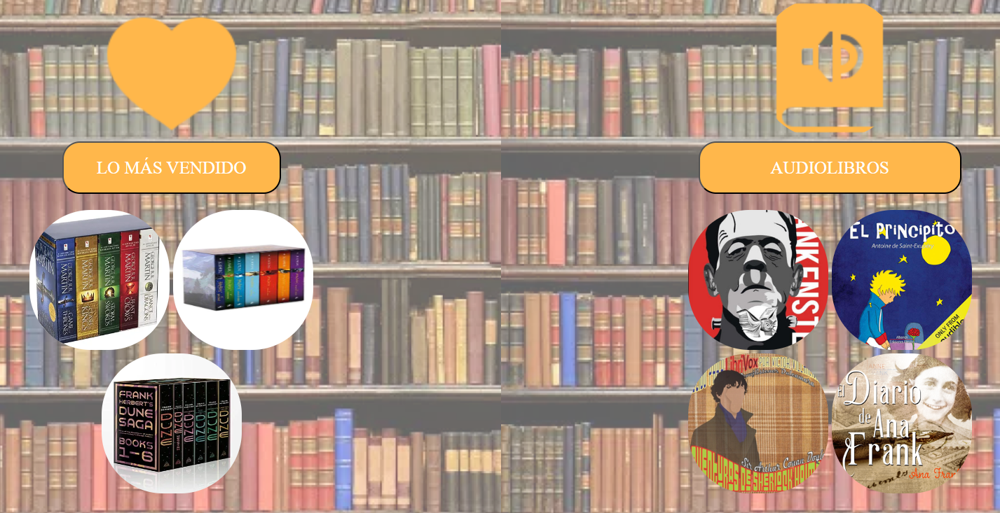

# COURSE PROJECT

    <strong>Universidad Peruana de Ciencias Aplicadas</strong> 
     </img> 
     
    <strong>Ingeniería de Software - 202401</strong> 
     
    <strong>SI729 - Desarrollo de Aplicaciones Open Source - SW54</strong>   
     
    <strong>Profesor: Elio Jefferrson Navarrete Vilca</strong> 
      <strong>INFORME DE TRABAJO FINAL - TB1 </strong> 

    <strong>Startup: ReadWell </strong> 
    <strong>Producto:  BookFlow </strong>

<h3 align="center" >Team Members:</h3>

    <table align="center">
        <tr>
            <th style="text-align:center;">Member</th>
            <th style="text-align:center;">Code</th>
        </tr>
        <tr>
            <td>Huamán Cataño, Miguel Ángel</td>
            <td>U202120615</td>
        </tr>
        <tr>
            <td>La Torre Valle, Franz Jair</td>
            <td>Uxxxxxxxxx</td>
        </tr>
        <tr>
            <td>Morales Calderón, Hernan Emilio</td>
            <td>Uxxxxxxxxx</td>
        </tr>
        <tr>
            <td>Párraga Gamarra, Paolo Gonzalo</td>
            <td>U202219186</td>
        </tr>
        <tr>
            <td>Rivadeneyra Ramos, Joaquin</td>
            <td>U202211846</td>
        </tr>
        <tr>
            <td>Zarate Caceres, Victor Ernesto</td>
            <td>U202112907</td>
        </tr>
    </table>

 

# Registro de Versiones del Informe

| Versión |   Fecha    | Autor | Descripción de modificación | 
|:-------:|:----------:|:-----:|:----------------------------| 
|TB1| 12/04/2024 |Todos los integrantes del equipo| Capítulo I, Capítulo II, Capítulo III,  Capítulo IV y Capítulo V| 
 

# Project Report Collaboration Insights
Informe: https://github.com/ReadWell-SW54-SI729/Informe/tree/main

# Contenido
## Tabla de Contenidos
### [Registro de versiones del informe](#registro-de-versiones-del-informe)
### [Project Report Collaboration Insights](#project-report-collaboration-insights)
### [Contenido](#contenido)
### [Student Outcome](#student-outcome-1)
### [Capítulo I: Introducción](#capítulo-i-introducción)
- [1.1. Startup Profile](#11-startup-profile)
    - [1.1.1. Descripción de la Startup](#111-description-de-la-startup)
    - [1.1.2. Perfiles de integrantes del equipo](#112-perfiles-de-integrantes-del-equipo)
- [1.2. Solution Profile](#12-solution-profile)
    - [1.2.1 Antecedentes y problemática](#121-antecedentes-y-problemática)
    - [1.2.2 Lean UX Process](#122-lean-ux-process)
        - [1.2.2.1. Lean UX Problem Statements](#1221-lean-ux-problem-statements)
        - [1.2.2.2. Lean UX Assumptions](#1222-lean-ux-assumptions)
        - [1.2.2.3. Lean UX Hypothesis Statements](#1223-lean-ux-hypothesis-statements)
        - [1.2.2.4. Lean UX Canvas](#1224-lean-ux-canvas)
- [1.3. Segmentos objetivo](#13-segmentos-objetivo)

### [Capítulo II: Requirements Elicitation & Analysis](#capitulo-ii-requirements-elicitation--analysis-1)
- [2.1. Competidores](#21-competidores)
    - [2.1.1. Análisis competitivo](#211-análisis-competitivo)
    - [2.1.2. Estrategias y tácticas frente a competidores](#212-estrategias-y-tácticas-frente-a-competidores)
- [2.2. Entrevistas](#22-entrevistas)
    - [2.2.1. Diseño de entrevistas](#221-diseño-de-entrevistas)
    - [2.2.2. Registro de entrevistas](#222-registro-de-entrevistas)
    - [2.2.3. Análisis de entrevistas](#223-análisis-de-entrevistas)
- [2.3. Needfinding](#23-needfinding)
    - [2.3.1. User Personas](#231-user-personas)
    - [2.3.2. User Task Matrix](#232-user-task-matrix)
    - [2.3.3. User Journey Mapping](#233-user-journey-mapping)
    - [2.3.4. Empathy Mapping](#234-empathy-mapping)
    - [2.3.5. As-is Scenario Mapping](#235-as-is-scenario-mapping)
- [2.4. Ubiquitous Language](#23-ubiquitous-language)
### [Capítulo III: Requirements Specification](#capitulo-iii-requirements-specification-1)
- [3.1. To-Be Scenario Mapping](#31-to-be-scenario-mapping)
- [3.2. User Stories](#32-user-stories)
- [3.3. Impact Mapping](#33-impact-mapping)
- [3.4. Product Backlog](#34-product-backlog)

### [Capítulo IV: Product Design](#capitulo-iv-product-design-1)
- [4.1. Style Guidelines](#41-style-guidelines)
    - [4.1.1. General Style Guidelines](#411-general-style-guidelines)
    - [4.1.2. Web Style Guidelines](#412-web-style-guidelines)
- [4.2. Information Architecture](#42-information-architecture)
    - [4.2.1. Organization Systems](#421-organization-systems)
    - [4.2.2. Labeling Systems](#422-labeling-systems)
    - [4.2.3. SEO Tags and Meta Tags](#423-seo-tags-and-meta-tags)
    - [4.2.4. Searching Systems](#424-searching-systems)
    - [4.2.5. Navigation Systems](#425-navigation-systems)
- [4.3. Landing Page UI Design](#43-landing-page-ui-design)
    - [4.3.1. Landing Page Wireframe](#431-landing-page-wireframe)
    - [4.3.2. Landing Page Mock-up](#432-landing-page-mock-up)
- [4.4. Web Applications UX/UI Design](#44-web-applications-uxui-design)
    - [4.4.1. Web Applications Wireframes](#441-web-applications-wireframes)
    - [4.4.2. Web Applications Wireflow Diagrams](#442-web-applications-wireflow-diagrams)
    - [4.4.3. Web Applications Mock-ups](#443-web-applications-mock-ups)
    - [4.4.4. Web Applications User Flow Diagrams](#444-web-applications-user-flow-diagrams)
- [4.5. Web Applications Prototyping](#45-web-applications-prototyping)
- [4.6. Domain-Driven Software Architecture](#46-domain-driven-software-architecture)
    - [4.6.1. Software Architecture Context Diagram](#461-software-architecture-context-diagram)
    - [4.6.2. Software Architecture Container Diagrams](#462-software-architecture-container-diagrams)
    - [4.6.3. Software Architecture Components Diagrams](#463-software-architecture-components-diagrams)
- [4.7. Software Object-Oriented Design](#47-software-object-oriented-design)
    - [4.7.1. Class Diagrams](#471-class-diagrams)
    - [4.7.2. Class Dictionary](#472-class-dictionary)
- [4.8. Database Design](#48-database-design)
    - [4.8.1. Database Diagram](#481-database-diagram)

### [Capítulo V: Product Implementation, Validation & Deployment](#capitulo-v-product-implementation-validation--deployment-1)
- [5.1. Software Configuration Management](#51-software-configuration-management)
    - [5.1.1. Software Development Environment Configuration](#511-software-development-environment-configuration)
    - [5.1.2. Source Code Management](#512-source-code-management)
    - [5.1.3. Source Code Style Guide & Conventions](#513-source-code-style-guide--conventions)
    - [5.1.4. Software Deployment Configuration](#514-software-deployment-configuration)
- [5.2. Landing Page, Services & Applications Implementation](#52-landing-page-services--applications-implementation)
    - [5.2.1. Sprint 1](#521-sprint-1)
        - [5.2.1.1. Sprint Planning 1](#5211-sprint-planning-1)
        - [5.2.1.2. Sprint Backlog 1](#5212-sprint-backlog-1)
        - [5.2.1.3. Development Evidence for Sprint Review](#5213-development-evidence-for-sprint-review)
        - [5.2.1.4. Testing Suite Evidence for Sprint Review](#5214-testing-suite-evidence-for-sprint-review)
        - [5.2.1.5. Execution Evidence for Sprint Review](#5215-execution-evidence-for-sprint-review)
        - [5.2.1.6. Services Documentation Evidence for Sprint Review](#5216-services-documentation-evidence-for-sprint-review)
        - [5.2.1.7. Software Deployment Evidence for Sprint Review](#5217-software-deployment-evidence-for-sprint-review)
        - [5.2.1.8. Team Collaboration Insights during Sprint](#5218-team-collaboration-insights-during-sprint)
### [Conclusiones](#conclusiones-1)
### [Bibliografía](#bibliografia-1)
### [Anexos](#anexos-1)
# Student Outcome
<table>
    <tr>
        <th>Criterio Especifico</th>
        <th>Acciones Realizadas</th>
        <th>Conclusiones</th>
    </tr>
    <tr>
        <td align="justify">
            2.c1. Diseñar soluciones en ingeniería de software (productos, procesos y/o servicios) que satisfagan necesidades específicas considerando el impacto en salud pública, seguridad, bienestar, así como 
            factores globales, culturales, sociales, ambientales y económicos
        </td>
        <td align="justify" rowspan=2>
            Huamán Cataño, Miguel Ángel 
            <em>TB1: </em> 
             La Torre Valle, Franz Jair 
            <em>TB1: </em> 
             Morales Calderón, Hernan Emilio 
            <em>TB1: </em> 
             Párraga Gamarra, Paolo Gonzalo 
            <em>TB1: </em>Lean Ux Canvas, User Persona, User Task Matrix, Web Applications Wireframes, Web Applications Wireflow Diagrams y Web Applications Mock-up. 
             Rivadeneyra Ramos, Joaquin 
            <em>TB1: </em>Lean UX Hypothesis statements, As-is Scenario Mapping., User Persona y Conclusiones. 
             Zárate Cáceres, Victor Ernesto  
            <em>TB1: </em>Antecedentes y problemática, Impact Mapping, Product Backlog, Class Diagrams, Class Dictionary. 
        </td>
        <td align="justify">
            Huamán Cataño, Miguel Ángel 
            <em>TB1: </em> 
             La Torre Valle, Franz Jair 
            <em>TB1: </em> 
             Morales Calderón, Hernan Emilio 
            <em>TB1: </em> 
             Párraga Gamarra, Paolo Gonzalo 
            <em>TB1: </em>Se diseñaron soluciones en base a la información dada por las historias de usuario. Además de las entrevistas. 
             Rivadeneyra Ramos, Joaquin 
            <em>TB1: </em>En mi caso diseñe el Lean UX Hypothesis statements, en el cual pusimos nuestras hipótesis con sus estadísticas para nuestra app. Además, el as-is en base de los user persona y las 
            conclusiones. 
             Zárate Cáceres, Victor Ernesto  
            <em>TB1: </em>Se identificó la problemática para idear una posible solución que se adapte a ella. Con ello se pudieron identificar las clases que la conforman. 
        </td>
    </tr>
    <tr>
        <td align="justify">
            2.c2. Validar que el diseño de la solución de software considere aspectos en salud pública, seguridad, bienestar, así como factores globales, culturales, sociales, ambientales y económicos.
        </td>
        <td align="justify">
            Huamán Cataño, Miguel Ángel 
            <em>TB1: </em> 
             La Torre Valle, Franz Jair 
            <em>TB1: </em> 
             Morales Calderón, Hernan Emilio 
            <em>TB1: </em> 
             Párraga Gamarra, Paolo Gonzalo 
            <em>TB1: </em>La realización de cada apartado conllevó una investigación para el segmento objetivo así como analizar los datos brindados por las historias de usuario. 
             Rivadeneyra Ramos, Joaquin 
            <em>TB1: </em>Para determinar este diseño de la solución se tuvieron que tomar en cuenta diversos factores globales como la problemática a solucionar para nuestros usuarios y gracias a los user 
            persona pudimos validar que estábamos en lo correcto. 
             Zárate Cáceres, Victor Ernesto  
            <em>TB1: </em>Se identificó el impacto que tendría la solución en la vida de los usuarios. Con ello, el proceso del diseño de la solución pudo organizarse por dificultad e importancia para 
            orientarse a recibir mejoras continuas. 
        </td>
    </tr>
</table>

# Capítulo I: Introducción
## 1.1. Startup Profile
### 1.1.1. Descripción de la Startup

    ReadWell es una empresa emergente innovadora dedicada a fomentar y motivar los hábitos de lectura a través de tecnología de vanguardia. Nuestro enfoque se centra en conectar a autores, editores y lectores 
    para crear una experiencia de lectura excepcionalmente atractiva y conveniente, Además, cuenta con funciones como recomendaciones personalizadas, clubes de lectura virtuales y eventos con autores. Ofrecemos
    una amplia gama de libros electrónicos, audiolibros y contenido exclusivo a través de nuestra suscripción premium y tienda integrada. Con un compromiso inquebrantable con la seguridad y la privacidad de los 
    usuarios, nuestro producto BookFlow podrá redefinir el mundo de la lectura digital. 
    <ul>
        <li>
            <b>Misión:</b>
        </li>
        En ReadWell, nuestra misión es inspirar y enriquecer la vida de las personas a través de la lectura. Buscamos brindar acceso conveniente a una amplia variedad de contenidos literarios mientras apoyamos a 
        autores emergentes y conectamos a los lectores con experiencias que enriquecen su amor por los libros.
        <li>
            <b>Visión:</b>
        </li>
        Aspiramos a ser la plataforma líder en lectura digital, proporcionando acceso a una amplia variedad de contenidos literarios de alta calidad. Queremos ser el destino preferido de los lectores para descubrir, 
        compartir y disfrutar de historias que los transporten a mundos nuevos y emocionantes.
    </ul>

### 1.1.2. Perfiles de integrantes del equipo
## 1.2. Solution Profile
### 1.2.1 Antecedentes y problemática

    Según el INEI, el 91,3% de las personas mayores de 6 años tienen acceso a internet desde un dispositivo celular. Esto coincide con los datos que señalan que son el medio más utilizado para la lectura (82,7 %) 
    seguido por los periódicos (63,4%), libros (47,3 %) y revistas (22,5%). La ENL 2022 estima que el 47.3 % de los ciudadanos leyó, al menos, un libro en el transcurso del último año. A su vez, se estima que 
    más del 90 % leyó en su casa o en privado, el 30.3 % en su centro de trabajo, y un 12.8 % en el transporte público. Finalmente, se menciona que, en nuestro país, la población adulta apenas lee 1.9 libros al año, 
    cantidad bastante baja en comparación a los demás países de Latinoamérica. De estos libros, se estima que seguido del 31,1 % libros leídos corresponden a textos escolares o universitarios y el 68,5%, elegidos de 
    acuerdo con el interés personal. Las investigaciones revelan que la falta de interés en la lectura se debe a dos factores: la falta de tiempo y por desinterés. Según la ENL, para los medios físicos, el 80 % de 
    la población señala la “falta de interés” como razón y solo el 7.4 % lo atribuye a cuestiones económicas. En el caso de los libros digitales, el 60 % aduce “falta de interés” y el 30 % indica que “jamás empleó el 
    espacio virtual” y, un 68,3% menciona no leer ninguno de estos medios por falta de tiempo.
    <ul>
        <li>
            Who (Quién): La problemática involucra a las personas que día a día presentan inconvenientes, excusas o un total desinterés por la lectura voluntaria.
        </li>
        <li>
            What (Qué): El desafío es crear una plataforma digital que conecte de manera directa y efectiva a los usuarios con bibliotecas en línea, para poder leer lo que les sea conveniente.
        </li>
        <li>
            Where (Dónde): La problemática es relevante a nivel mundial, pero el proceso inicial de prueba e implementación se realizará en la ciudad de Lima, Perú. 
        </li>
        <li>
            When (Cuándo): La necesidad de una solución más eficaz para el acceso a medios de lectura se ha visto incrementado con la llegada de la pandemia y ante el alto nivel de analfabetismo en nuestro país.
        </li>
        <li>
            Why (Por qué): Se aborda esta problemática para facilitar el acceso a la información, mejorar la educación en el país y fomentar la lectura en todo el país
        </li>
        <li>
            How (Cómo): La solución implica el desarrollo de una plataforma de lectura, en que los usuarios vean fomentados sus hábitos de lectura mediante el uso de tecnologías que facilitan el acceso, la distribución 
            y la creación de contenidos. Para garantizar su sostenibilidad a largo plazo, se han establecido estrategias clave, como una suscripción premium que brindará a los usuarios acceso a contenido exclusivo, 
            funciones avanzadas y una experiencia sin publicidad. 
        </li>
        <li>
            How Much (Cuánto): La solución afecta tanto de manera individual como de manera colectiva. Además, se establecerán acuerdos con editores y autores para ofrecer una amplia variedad de títulos a precios competitivos.
            Los ingresos generados por las ventas en la tienda contribuirán significativamente a la sostenibilidad financiera de la aplicación.
        </li>
    </ul>

### 1.2.2 Lean UX Process.
#### 1.2.2.1. Lean UX Problem Statements.
#### 1.2.2.2. Lean UX Assumptions.
#### 1.2.2.3. Lean UX Hypothesis Statements.
#### 1.2.2.4. Lean UX Canvas.
## 1.3. Segmentos objetivo
# Capítulo II: Requirements Elicitation & Analysis
## 2.1. Competidores
Algunos de los competidores a los que BookFlow podría enfrentarse son:
<ul>
    <li>
        <b>Goodreads: </b>Plataforma líder en la recomendación de libros, donde los usuarios pueden descubrir nuevos títulos, llevar un registro de los libros que han leído y conectarse con otros lectores. Ofrece funciones como 
        reseñas de libros, listas de lectura y grupos de discusión.
    </li>
    <li>
        <b>Scribd: </b>Plataforma de suscripción que ofrece acceso a una amplia variedad de libros electrónicos, audiolibros, revistas y documentos. Los usuarios pagan una tarifa mensual para acceder a contenido ilimitado, lo que
        les permite explorar de una amplia gama de material de lectura.
    </li>
    <li>
        <b>Audible: </b>Plataforma de audiolibros propiedad de Amazon, que ofrece una amplia selección de audiolibros narrados por profesionales. Los usuarios pueden comprar audiolibros individualmente o suscribirse a un plan 
        mensual. También ofrece contenido exclusivo y original.
    </li>
</ul>

### 2.1.1. Análisis competitivo
### 2.1.2. Estrategias y tácticas frente a competidores
## 2.2. Entrevistas
### 2.2.1. Diseño de entrevistas
### 2.2.2. Registro de entrevistas
#### 2.2.2.1 Lectores:

    <ul>
        <li>Entrevista 1: Joseph Huammani</li>
        <ul>
            <li>Sexo: Masculino</li>
            <li>Edad: 23 años</li>
            <li>Distrito en el que vive: Surquillo</li>
            <li>Nivel socioeconómico: Clase B</li>
        </ul>
        Entrevista:
        <ul>
            <li>Link: https://youtu.be/44kOELBy0ZU</li>
            <li>Momento en el que inicia: 0:00</li>
            <li>Duración: 4:20</li>
        </ul>
        Resumen: 
        El entrevistado, Joseph Huammani, de 23 años, expresó su preferencia por la novela y la ciencia ficción como género literario favorito. Además, dice que su mayor desafío a la hora de encontrar tiempo para leer es equilibrar
        sus muchas responsabilidades diarias. Enfatizó que historias interesantes, personajes bien desarrollados y giros argumentales consistentemente atractivos son los factores que lo motivan a continuar leyendo los libros. Además,
        aprecian funciones como la interfaz intuitiva, las recomendaciones personalizadas y el seguimiento del tiempo de lectura semanal en la aplicación de lectura. Además, también expresó interés en encontrar reseñas de libros, 
        recomendaciones de otros lectores y entrevistas a autores en la aplicación, y expresó su deseo de interactuar con otros lectores de otras audiencias a través de clubes de lectura virtuales y debates en línea. Para él, la
        seguridad y privacidad de los datos personales son importantes y considera que estrategias como establecer objetivos de lectura, programar momentos específicos para leer y llevar un diario de lectura serán útiles para mantener 
        un hábito de lectura constante. Prefiere comprar libros electrónicos o audiolibros en línea debido a descuentos, ofertas especiales y amplia gama de títulos. Joseph afirmó que dejaría de leer libros si la trama se volviera 
        aburrida o los personajes no estuvieran bien desarrollados. Como usuario leal de la aplicación, espera descuentos en compras futuras y acceso a contenido exclusivo, desea que la aplicación le recomiende libros según sus intereses
        anteriores y le permita descubrir nuevos géneros y autores.  
        <li>Entrevista 2: Anthony Tarrillo</li>
        <ul>
            <li>Sexo: Masculino</li>
            <li>Edad: 20 años</li>
            <li>Distrito en el que vive: San Martín de Porres</li>
            <li>Nivel socioeconómico: Clase B</li>
        </ul>
        Entrevista:
        <ul>
            <li>Link: https://drive.google.com/file/d/1DZM0FRAuKecq_ddy_g6qRVobYHKop5wo/view?usp=sharing</li>
            <li>Momento en el que inicia: 0:00</li>
            <li>Duración: 6:09</li>
        </ul>
        Resumen: 
        El entrevistado en esta ocasión es Anthony Tarrillo de unos 20 años que nos cuenta que tiene problemas al momento de hacer su tesis, ya que no está acostumbrado a textos tan densos y aburridos. Por otro lado, el desea desarrollar
        un hábito por la lectura para dejar de lado sus problemas de lectura. Su mayor desafío a la hora de leer son textos muy largos que no llegan a ningún punto, eso lo desanima a seguir leyendo, dejándolo de lado. Enfatizó en sus gustos
        por el drama y la ciencia ficción, así como los personajes bien desarrollados. Así mismo, para Anthony el aplicativo debería tener las medidas de seguridad estándar como la verificación de dos pasos, contraseña segura, etc.  
        <li>Entrevista 3:</li>
          <ul>
            <li>Sexo: ino</li>
            <li>Edad: años</li>
            <li>Distrito en el que vive: </li>
            <li>Nivel socioeconómico: Clase </li>
        </ul>
        Entrevista:
        <ul>
            <li>Link: </li>
            <li>Momento en el que inicia: 0:00</li>
            <li>Duración: </li>
        </ul>
        Resumen: 
         
    </ul>

#### 2.2.2.2 Autores:

    <ul>
        <li>Entrevista 1: Aleshka Fernandez</li>
         <ul>
            <li>Sexo: Femenino</li>
            <li>Edad: 24 años</li>
            <li>Distrito en el que vive: San Borja</li>
            <li>Nivel socioeconómico: Clase B</li>
        </ul>
        Entrevista:
        <ul>
            <li>Link: https://youtu.be/V8NYPikl5B8</li>
            <li>Momento en el que inicia: 0:00</li>
            <li>Duración: 10:45</li>
        </ul>
        Resumen: 
        Entrevistamos a Aleshka Fernández, de 24 años, quien se siente atraída principalmente por los géneros de fantasía y terror. Aleshka menciona que suele utilizar Google Docs para escribir y prefiere no tener distracciones digitales
        ni acceder a redes sociales durante ese tiempo. Destaca la importancia de la lectura para ampliar su vocabulario y encontrar referencias para sus personajes. Comenzó su trayectoria en Wattpad y luego llevó algunos de sus cuentos
        cortos a Webtoon. Para promocionar sus historias, utiliza Twitter e Instagram. Además, ha participado en talleres de autores, los cuales le resultaron muy útiles para conocer la experiencia de otros escritores y superar bloqueos
        creativos. Una de sus mayores dificultades es mantenerse relevante en el medio, ya que requiere mucha creatividad. Sus consejos para los aspirantes son leer mucho, buscar referentes y nutrirse de información sobre los temas que
        desean abordar. Considera que una aplicación útil debería tener una buena recepción de archivos, un espacio para publicar borradores, un foro de interacción y actividades recurrentes como charlas para discutir trabajos destacados.
        Espera que la aplicación le ayude a divulgar su trabajo, impulse a escritores nuevos, ofrezca sugerencias de búsqueda y brinde recomendaciones constantes.  
        <li>Entrevista 2:</li>
         <ul>
            <li>Sexo: ino</li>
            <li>Edad: años</li>
            <li>Distrito en el que vive: </li>
            <li>Nivel socioeconómico: Clase </li>
        </ul>
        Entrevista:
        <ul>
            <li>Link: </li>
            <li>Momento en el que inicia: 0:00</li>
            <li>Duración: </li>
        </ul>
        Resumen: 
          
        <li>Entrevista 3:</li>
         <ul>
            <li>Sexo: ino</li>
            <li>Edad: años</li>
            <li>Distrito en el que vive: </li>
            <li>Nivel socioeconómico: Clase </li>
        </ul>
        Entrevista:
        <ul>
            <li>Link: </li>
            <li>Momento en el que inicia: 0:00</li>
            <li>Duración: </li>
        </ul>
        Resumen: 
         
    </ul>

### 2.2.3. Análisis de entrevistas
#### 2.2.3.1 Lectores:

#### 2.2.3.2 Autores:

## 2.3. Needfinding
### 2.3.1. User Personas
### 2.3.2. User Task Matrix
### 2.3.3. User Journey Mapping
### 2.3.4. Empathy Mapping
### 2.3.5. As-is Scenario Mapping
## 2.4. Ubiquitous Language
# Capítulo III: Requirements Specification
## 3.1. To-Be Scenario Mapping
## 3.2. User Stories
## 3.3. Impact Mapping

## 3.4. Product Backlog
|    ID   |User Story|Story Points|Priority| 
|:-------:|:----------|:-----:|:----------------------------:| 
|US-01|Descubrimiento de la Aplicación|1|Alta|
|US-02|Exploración de la Biblioteca|3|Alta|
|US-03|Recomendaciones Personalizadas|5|Alta|
|US-04|Actualizar perfil|1|Media|
|US-05|Cuenta de respaldo|5|Alta|
|US-06|Unirse a un Club de Lectura Virtual|3|Baja|
|US-07|Asistir a Eventos con Autores|3|Baja|
|US-08|Compartir Experiencias en Redes Sociales|5|Media|
|US-09|Configurar Perfil y Preferencias|3|Alta|
|US-10|Leer Libros Electrónicos|3|Alta|
|US-11|Escuchar Audiolibros|2|Alta|
|US-12|Actualizar a Suscripción Premium|2|Media|
|US-13|Crear Lista de Lectura|3|Baja|
|US-14|Seguir a Autores Favoritos|3|Alta|
|US-15|Explorar Libros Populares|3|Alta|
|US-16|Copias de seguridad automática|5|Alta|
|US-17|Recibir Recomendaciones de Amigos|2|Media|
|US-18|Configurar Recordatorios de Lectura|2|Media|
|US-19|Actualizaciones de seguridad regulares|8|Alta|
|US-20|Explorar Libros por Temáticas|1|Alta|
|US-21|Obtener Resúmenes de Libros|2|Media|
|US-22|Notificaciones de Eventos de Autores Favoritos|3|Media|
|US-23|Realizar Comentarios y Discusiones en Libros|2|Alta|
|US-24|Crear Club de Lectura Privado|5|Baja|
|US-25|Configurar Modo Nocturno|3|Baja|
|US-26|Recomendar Libros a Grupos de Amigos|3|Media|
|US-27|Descubrir Libros por Ambientación|1|Alta|

# Capítulo IV: Product Design
## 4.1. Style Guidelines
### 4.1.1. General Style Guidelines
### 4.1.2. Web Style Guidelines
## 4.2. Information Architecture
### 4.2.1. Organization Systems
### 4.2.2. Labeling Systems
### 4.2.3. SEO Tags and Meta Tags
### 4.2.4. Searching Systems
### 4.2.5. Navigation Systems
## 4.3. Landing Page UI Design
### 4.3.1. Landing Page Wireframe
### 4.3.2. Landing Page Mock-up
## 4.4. Web Applications UX/UI Design
### 4.4.1. Web Applications Wireframes
### 4.4.2. Web Applications Wireflow Diagrams
### 4.4.3. Web Applications Mock-ups
### 4.4.4. Web Applications User Flow Diagrams
## 4.5. Web Applications Prototyping
## 4.6. Domain-Driven Software Architecture
### 4.6.1. Software Architecture Context Diagram
### 4.6.2. Software Architecture Container Diagrams
### 4.6.3. Software Architecture Components Diagrams
## 4.7. Software Object-Oriented Design
### 4.7.1. Class Diagrams

### 4.7.2. Class Dictionary
#### 4.7.2.1 Clase Libro:
<table>
    <tr>
        <td>Atributo</td>
        <td>Descripción</td>
        <td>Métodos</td>
    </tr>
    <tr>
        <td>titulo</td>
        <td>Título del libro.</td>
        <td rowspan="9">obt_detalles() anad_lista()</td>
    </tr>
    <tr>
        <td>genero</td>
        <td>Género o géneros del libro.</td>
    </tr>
    <tr>
        <td>sinopsis</td>
        <td>Descripción corta del contenido del libro.</td>
    </tr>
    <tr>
        <td>ISBN</td>
        <td>Descripción corta del contenido del libro.</td>
    </tr>
    <tr>
        <td>fec_publicacion</td>
        <td>Fecha de publicación original del libro.</td>
    </tr>
    <tr>
        <td>n_pags</td>
        <td>Número de páginas que tiene el libro.</td>
    </tr>
    <tr>
        <td>idioma</td>
        <td>Idiomas disponibles para leer el libro.</td>
    </tr>
    <tr>
        <td>precio</td>
        <td>Precio del libro</td>
    </tr>
    <tr>
        <td>disponibilidad</td>
        <td>Disponibilidad del libro para su lectura</td>
    </tr>
</table>

#### 4.7.2.2 Clase Autor:
<table>
    <tr>
        <td>Atributo</td>
        <td>Descripción</td>
    </tr>
    <tr>
        <td>biografía</td>
        <td>Biografía del autor.</td>
    </tr>
    <tr>
        <td>nacionalidad</td>
        <td>Nacionalidad de origen del autor. También sirve como indicador de idioma de los libros.</td>
    </tr>
    <tr>
        <td>obras</td>
        <td>Libros publicados por el autor.</td>
    </tr>
    <tr>
        <td>imagen</td>
        <td>Foto del autor.</td>
    </tr>
</table>

#### 4.7.2.3 Clase Usuario:
<table>
    <tr>
        <td>Atributo</td>
        <td>Descripción</td>
        <td>Métodos</td>
    </tr>
    <tr>
        <td>Nombre</td>
        <td>Nombre del usuario</td>
        <td rowspan="2">inc_sesion() registrar() camb_contrasena()</td>
    </tr>
    <tr>
        <td>Correo</td>
        <td>Correo usado para el registro del usuario.</td>
    </tr>
</table>

#### 4.7.2.4 Clase Comentario:
<table>
    <tr>
        <td>Atributo</td>
        <td>Descripción</td>
        <td>Métodos</td>
    </tr>
    <tr>
        <td>texto</td>
        <td>Texto del comentario publicado.</td>
        <td rowspan="4">anad_coment() elim_coment()</td>
    </tr>
    <tr>
        <td>fec_publicacion</td>
        <td>Fecha en que se publicó el comentario.</td>
    </tr>
    <tr>
        <td>user_coment</td>
        <td>Nombre del usuario que realizó el comentario.</td>
    </tr>
    <tr>
        <td>lib_coment</td>
        <td>Título del libro sobre el que va el comentario.</td>
    </tr>
</table>

#### 4.7.2.5 Clase Biblioteca:
<table>
    <tr>
        <td>Atributo</td>
        <td>Descripción</td>
        <td>Métodos</td>
    </tr>
    <tr>
        <td>libros_disp</td>
        <td>Lista de los libros disponibles en la biblioteca.</td>
        <td rowspan="3">buscar() 
            most_lib_pop() 
            rec_lib()</td>
    </tr>
    <tr>
        <td>list_autores</td>
        <td>Lista de los autores publicados en la biblioteca.</td>
    </tr>
    <tr>
        <td>libros_mas_vend</td>
        <td>Lista de los libro más vendidos de la biblioteca.</td>
    </tr>
</table>

#### 4.7.2.6 Clase Transacción:
<table>
    <tr>
        <td>Atributo</td>
        <td>Descripción</td>
        <td>Métodos</td>
    </tr>
    <tr>
        <td>ID_trans</td>
        <td>Identificador de la transacción.</td>
        <td rowspan="6">proc_pago() 
            gen_recibo()</td>
    </tr>
    <tr>
        <td>user_comp</td>
        <td>Nombre del usuario comprador.</td>
    </tr>
    <tr>
        <td>tit_libro_comp</td>
        <td>Título de el / los libros comprados.</td>
    </tr>
    <tr>
        <td>fec_comp</td>
        <td>Fecha en que se realiza la compra.</td>
    </tr>
    <tr>
        <td>metodo_pago</td>
        <td>Método del pago (tarjeta, transferencia, Yape, etc)</td>
    </tr>
    <tr>
        <td>estado_trans</td>
        <td>Estado de la transferencia (En proceso, Pagado)</td>
    </tr>
</table>

#### 4.7.2.7 Clase Configuración:
<table>
    <tr>
        <td>Atributo</td>
        <td>Descripción</td>
        <td>Métodos</td>
    </tr>
    <tr>
        <td>idioma</td>
        <td>Idioma en el que se verá la aplicación.</td>
        <td rowspan="4">camb_idioma() 
            camb_tema() 
            guardar_config()</td>
    </tr>
    <tr>
        <td>tema</td>
        <td>Tema de la aplicación, ya sea oscuro o claro.</td>
    </tr>
    <tr>
        <td>notificaciones</td>
        <td>Como se recibiran las distintas notificaciones</td>
    </tr>
    <tr>
        <td>pref_privacidad</td>
        <td>Preferencias sobre la privacidad del perfil.</td>
    </tr>
</table>

## 4.8. Database Design
### 4.8.1. Database Diagram
# Capítulo V: Product Implementation, Validation & Deployment
## 5.1. Software Configuration Management
### 5.1.1. Software Development Environment Configuration
### 5.1.2. Source Code Management
### 5.1.3. Source Code Style Guide & Conventions
### 5.1.4. Software Deployment Configuration
## 5.2. Landing Page, Services & Applications Implementation
### 5.2.1. Sprint 1
#### 5.2.1.1. Sprint Planning 1
#### 5.2.1.2. Sprint Backlog 1
#### 5.2.1.3. Development Evidence for Sprint Review
#### 5.2.1.4. Testing Suite Evidence for Sprint Review
#### 5.2.1.5. Execution Evidence for Sprint Review

    En el sprint 1 se diseñó de manera preliminar el primer modelo de la landing page. Esta cuenta con diferentes secciones para acceso de los usuarios. Algunas evidencias son:
    <ul>
        <li>
            <b>Inicio de sesión: </b>En esta sección el usuario crea una nueva cuenta o ingresa a una ya existente.
        </li>
        
        <li>
            <b>Catálogo: </b>El corazón de todo. Permite realizar la búsqueda de material de lectura usando distintos filtros.
        </li>
        
        <li>
            <b>Contáctanos:</b> En esta sección se le da la oprtunidad al usuario de comunicarse con nosotros, ya sea por ayuda o para informar de algún error.
        </li>
        
    </ul>

#### 5.2.1.6. Services Documentation Evidence for Sprint Review

    El desarrollo de este primer Sprint incluyo únicamente el diseño de la Landing Page. Dicha página fue creada con html estático de manera preliminar, unido todo en archivos conjuntos subidos simultáneamente. Por ello, al no contar con
    un back-end, no fue contemplada la evidencia de documentación de los servicios.

#### 5.2.1.7. Software Deployment Evidence for Sprint Review
#### 5.2.1.8. Team Collaboration Insights during Sprint
# Conclusiones
# Bibliografía
# Anexos
