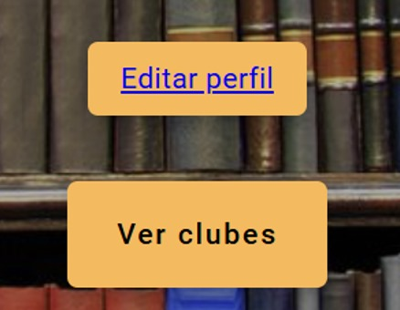

# COURSE PROJECT

    <strong>Universidad Peruana de Ciencias Aplicadas</strong> 
     </img> 
     
    <strong>Ingeniería de Software - 202401</strong> 
     
    <strong>SI729 - Desarrollo de Aplicaciones Open Source - SW54</strong>   
     
    <strong>Profesor: Elio Jefferrson Navarrete Vilca</strong> 
      <strong>INFORME DE TRABAJO FINAL - TB1 </strong> 

    <strong>Startup: ReadWell </strong> 
    <strong>Producto:  BookFlow </strong>

<h3 align="center" >Team Members:</h3>

    <table align="center">
        <tr>
            <th style="text-align:center;">Member</th>
            <th style="text-align:center;">Code</th>
        </tr>
        <tr>
            <td>Huamán Cataño, Miguel Ángel</td>
            <td>U202120615</td>
        </tr>
        <tr>
            <td>La Torre Valle, Franz Jair</td>
            <td>U202012378</td>
        </tr>
        <tr>
            <td>Morales Calderón, Hernan Emilio</td>
            <td>U202216263</td>
        </tr>
        <tr>
            <td>Párraga Gamarra, Paolo Gonzalo</td>
            <td>U202219186</td>
        </tr>
        <tr>
            <td>Rivadeneyra Ramos, Joaquin</td>
            <td>U202211846</td>
        </tr>
        <tr>
            <td>Zarate Caceres, Victor Ernesto</td>
            <td>U202112907</td>
        </tr>
    </table>

 

# Registro de Versiones del Informe

| Versión |   Fecha    | Autor | Descripción de modificación | 
|:-------:|:----------:|:-----:|:----------------------------| 
|TB1| 12/04/2024 |Todos los integrantes del equipo| Capítulo I, Capítulo II, Capítulo III,  Capítulo IV y Capítulo V|
|TP | 31/04/2024 |Todos los integrantes del equipo| Mejoras respecto a presentable anterior   Sprint 2| 
|TB2| 08/06/2024 |Todos los integrantes del equipo| Correcion del presentable anterior Versión definitiva de Landing Page Mejora de App Web Primera versión de Web Services Primera versión de Video About-The-Product. Primera versión de Video About-The-Team|
 

# Project Report Collaboration Insights
TB1, TP1 & TB2 :

Para el desarrollo del informe perteneciente a lsa entregas TB1, TP1 & TB2, se dividió la implementación de secciones de la siguiente forma para cada integrante del equipo:

| Integrantes       | Tareas designadas         |
| ------------- |:-------------:|
| Huamán Cataño, Miguel Ángel | User Journey Mapping, Empathy Mapping, Web Applications User Flow Diagrams y Web Application Prototyping       |
| La Torre Valle, Franz Jair  |As-is Scenario Mapping, Ubiquitous Language, Lean UX Assumptions, Organization Systems, Labeling Systems, SEO Tags and Meta Tags, Searching Systems, Navigation Systems, Landing, Page UI Design, Landing Page Wireframe, Landing Page Mock-up y Sprint n | 
| Morales Calderón, Hernan Emilio  | Lean UX Problem Statements, Segmentos objetivo, Competidores, Análisis competitivo, Estrategias y tácticas frente a competidores, Software Architecture Context Diagram, Software Architecture Container Diagrams, Software Architecture Components Diagrams, Software Configuration Management, Landing Page y Team Collaboration Insights during Sprint | 
| Párraga Gamarra, Paolo Gonzalo  |Lean Ux Canvas, User Persona, User Task Matrix, Web Applications Wireframes, Web Applications Wireflow Diagrams y Web Applications Mock-up. | 
| Rivadeneyra Ramos, Joaquin  | Startup Profile, Descripción de la Startup, To-Be Scenario Mapping, User Stories, Style Guidelines, General Style Guidelines, Web Style Guidelines, Information Architecture, Organization Systems, Labeling Systems, SEO Tags and Meta Tags, Searching Systems y Navigation Systems, Elaboración del sprint planning 2, sprint planning 2, Elaboración del sprint planning 3, sprint planning 3, colaboracion con Fronted y Backend del proyecto, Heuristicas, coordinación del grupo, aplicación de mejoras, aplicación de routeos y vista perfil. | 
| Zárate Cáceres, Victor Ernesto  |Antecedentes y problemática, Impact Mapping, Product Backlog, Class Diagrams, Class Dictionary.  | 

Evidencias del Insights Contributos de los commits del informe:

Informe: https://github.com/ReadWell-SW54-SI729/Informe/tree/main

# Contenido
## Tabla de Contenidos
### [Registro de versiones del informe](#registro-de-versiones-del-informe)
### [Project Report Collaboration Insights](#project-report-collaboration-insights)
### [Contenido](#contenido)
### [Student Outcome](#student-outcome-1)
### [Capítulo I: Introducción](#capítulo-i-introducción)
- [1.1. Startup Profile](#11-startup-profile)
    - [1.1.1. Descripción de la Startup](#111-description-de-la-startup)
    - [1.1.2. Perfiles de integrantes del equipo](#112-perfiles-de-integrantes-del-equipo)
- [1.2. Solution Profile](#12-solution-profile)
    - [1.2.1 Antecedentes y problemática](#121-antecedentes-y-problemática)
    - [1.2.2 Lean UX Process](#122-lean-ux-process)
        - [1.2.2.1. Lean UX Problem Statements](#1221-lean-ux-problem-statements)
        - [1.2.2.2. Lean UX Assumptions](#1222-lean-ux-assumptions)
        - [1.2.2.3. Lean UX Hypothesis Statements](#1223-lean-ux-hypothesis-statements)
        - [1.2.2.4. Lean UX Canvas](#1224-lean-ux-canvas)
- [1.3. Segmentos objetivo](#13-segmentos-objetivo)

### [Capítulo II: Requirements Elicitation & Analysis](#capitulo-ii-requirements-elicitation--analysis-1)
- [2.1. Competidores](#21-competidores)
    - [2.1.1. Análisis competitivo](#211-análisis-competitivo)
    - [2.1.2. Estrategias y tácticas frente a competidores](#212-estrategias-y-tácticas-frente-a-competidores)
- [2.2. Entrevistas](#22-entrevistas)
    - [2.2.1. Diseño de entrevistas](#221-diseño-de-entrevistas)
    - [2.2.2. Registro de entrevistas](#222-registro-de-entrevistas)
    - [2.2.3. Análisis de entrevistas](#223-análisis-de-entrevistas)
- [2.3. Needfinding](#23-needfinding)
    - [2.3.1. User Personas](#231-user-personas)
    - [2.3.2. User Task Matrix](#232-user-task-matrix)
    - [2.3.3. User Journey Mapping](#233-user-journey-mapping)
    - [2.3.4. Empathy Mapping](#234-empathy-mapping)
    - [2.3.5. As-is Scenario Mapping](#235-as-is-scenario-mapping)
- [2.4. Ubiquitous Language](#23-ubiquitous-language)
### [Capítulo III: Requirements Specification](#capitulo-iii-requirements-specification-1)
- [3.1. To-Be Scenario Mapping](#31-to-be-scenario-mapping)
- [3.2. User Stories](#32-user-stories)
- [3.3. Impact Mapping](#33-impact-mapping)
- [3.4. Product Backlog](#34-product-backlog)

### [Capítulo IV: Product Design](#capitulo-iv-product-design-1)
- [4.1. Style Guidelines](#41-style-guidelines)
    - [4.1.1. General Style Guidelines](#411-general-style-guidelines)
    - [4.1.2. Web Style Guidelines](#412-web-style-guidelines)
- [4.2. Information Architecture](#42-information-architecture)
    - [4.2.1. Organization Systems](#421-organization-systems)
    - [4.2.2. Labeling Systems](#422-labeling-systems)
    - [4.2.3. SEO Tags and Meta Tags](#423-seo-tags-and-meta-tags)
    - [4.2.4. Searching Systems](#424-searching-systems)
    - [4.2.5. Navigation Systems](#425-navigation-systems)
- [4.3. Landing Page UI Design](#43-landing-page-ui-design)
    - [4.3.1. Landing Page Wireframe](#431-landing-page-wireframe)
    - [4.3.2. Landing Page Mock-up](#432-landing-page-mock-up)
- [4.4. Web Applications UX/UI Design](#44-web-applications-uxui-design)
    - [4.4.1. Web Applications Wireframes](#441-web-applications-wireframes)
    - [4.4.2. Web Applications Wireflow Diagrams](#442-web-applications-wireflow-diagrams)
    - [4.4.3. Web Applications Mock-ups](#443-web-applications-mock-ups)
    - [4.4.4. Web Applications User Flow Diagrams](#444-web-applications-user-flow-diagrams)
- [4.5. Web Applications Prototyping](#45-web-applications-prototyping)
- [4.6. Domain-Driven Software Architecture](#46-domain-driven-software-architecture)
    - [4.6.1. Software Architecture Context Diagram](#461-software-architecture-context-diagram)
    - [4.6.2. Software Architecture Container Diagrams](#462-software-architecture-container-diagrams)
    - [4.6.3. Software Architecture Components Diagrams](#463-software-architecture-components-diagrams)
- [4.7. Software Object-Oriented Design](#47-software-object-oriented-design)
    - [4.7.1. Class Diagrams](#471-class-diagrams)
    - [4.7.2. Class Dictionary](#472-class-dictionary)
- [4.8. Database Design](#48-database-design)
    - [4.8.1. Database Diagram](#481-database-diagram)

### [Capítulo V: Product Implementation, Validation & Deployment](#capitulo-v-product-implementation-validation--deployment-1)
- [5.1. Software Configuration Management](#51-software-configuration-management)
    - [5.1.1. Software Development Environment Configuration](#511-software-development-environment-configuration)
    - [5.1.2. Source Code Management](#512-source-code-management)
    - [5.1.3. Source Code Style Guide & Conventions](#513-source-code-style-guide--conventions)
    - [5.1.4. Software Deployment Configuration](#514-software-deployment-configuration)
- [5.2. Landing Page, Services & Applications Implementation](#52-landing-page-services--applications-implementation)
    - [5.2.1. Sprint 1](#521-sprint-1)
        - [5.2.1.1. Sprint Planning 1](#5211-sprint-planning-1)
        - [5.2.1.2. Sprint Backlog 1](#5212-sprint-backlog-1)
        - [5.2.1.3. Development Evidence for Sprint Review](#5213-development-evidence-for-sprint-review)
        - [5.2.1.4. Testing Suite Evidence for Sprint Review](#5214-testing-suite-evidence-for-sprint-review)
        - [5.2.1.5. Execution Evidence for Sprint Review](#5215-execution-evidence-for-sprint-review)
        - [5.2.1.6. Services Documentation Evidence for Sprint Review](#5216-services-documentation-evidence-for-sprint-review)
        - [5.2.1.7. Software Deployment Evidence for Sprint Review](#5217-software-deployment-evidence-for-sprint-review)
        - [5.2.1.8. Team Collaboration Insights during Sprint](#5218-team-collaboration-insights-during-sprint)
    - [5.2.2. Sprint 2](#522-sprint-2)
        - [5.2.2.1. Sprint Planning 2](#5221-sprint-planning-2)
        - [5.2.2.2. Sprint Backlog 2](#5222-sprint-backlog-2)
        - [5.2.2.3. Development Evidence for Sprint Review](#5223-development-evidence-for-sprint-review)
        - [5.2.2.4. Testing Suite Evidence for Sprint Review](#5224-testing-suite-evidence-for-sprint-review)
        - [5.2.2.5. Execution Evidence for Sprint Review](#5225-execution-evidence-for-sprint-review)
        - [5.2.2.6. Services Documentation Evidence for Sprint Review](#5226-services-documentation-evidence-for-sprint-review)
        - [5.2.2.7. Software Deployment Evidence for Sprint Review](#5227-software-deployment-evidence-for-sprint-review)
        - [5.2.2.8. Team Collaboration Insights during Sprint](#5228-team-collaboration-insights-during-sprint)
    - [5.2.3. Sprint 3](#523-sprint-3)
    	- [5.2.3.1. Sprint Planning 3](#5231-sprint-planning-3)
    	- [5.2.3.2. Sprint Backlog 3](#5232-sprint-backlog-3)
    	- [5.2.3.3. Development Evidence for Sprint Review](#5233-development-evidence-for-sprint-review)
    	- [5.2.3.4. Testing Suite Evidence for Sprint Review](#5234-testing-suite-evidence-for-sprint-review)
    	- [5.2.3.5. Execution Evidence for Sprint Review](#5235-execution-evidence-for-sprint-review)
    	- [5.2.3.6. Services Documentation Evidence for Sprint Review](#5236-services-documentation-evidence-for-sprint-review)
    	- [5.2.3.7. Software Deployment Evidence for Sprint Review](#5237-software-deployment-evidence-for-sprint-review)
    	- [5.2.3.8. Team Collaboration Insights during Sprint](#5238-team-collaboration-insights-during-sprint)
- [5.3.Validation Interviews](#53-validation-interviews)
  - [Diseño de Entrevistas](#531-sprint-1)
  - [Registro de Entrevistas](#532-sprint-1)
  - [Evaluaciones según heurísticas](#533-sprint-1)
- [5.4.Video About-the-Product](#54-video-about-the-product)
### [Conclusiones](#conclusiones-1)
### [Bibliografía](#bibliografia-1)
### [Anexos](#anexos-1)
# Student Outcome
| Criterio Especifico | Acciones Realizadas | Conclusiones |
|---------------------|---------------------|--------------|
| Comunica oralmente sus ideas y/o resultados con objetividad a público de diferentes especialidades y niveles jerárquicos, en el marco del desarrollo de un proyecto en ingeniería.| TB1: Huamán Cataño, Miguel Ángel: User Journey Mapping, Empathy Mapping, Web Applications User Flow Diagrams y Web Application Prototyping.  La Torre Valle, Franz Jair: Lean UX Assumptions, AS-IS Scenario Mapping, Ubiquitous Language, SEO Tags and Meta Tags, Landing Page Wireframe, Landing Page Mock-up, Landing Page, Sprint Planning 1, Sprint Backlog 1.  Morales Calderón, Hernan Emilio: Segmentos objetivos, análisis competitivo, estrategias y tácticas frente a competidores, software architecture Context Diagram, Container Diagram, Component Diagram, software configuration management.  Párraga Gamarra, Paolo Gonzalo: Lean Ux Canvas, User Persona, User Task Matrix, Web Applications Wireframes, Web Applications Wireflow Diagrams y Web Applications Mock-up.  Rivadeneyra Ramos, Joaquin: Lean UX Hypothesis statements, As-is Scenario Mapping, User Persona y Conclusiones.  Zárate Cáceres, Victor Ernesto: Antecedentes y problemática, Impact Mapping, Product Backlog, Class Diagrams, Class Dictionary.  TP: Huamán Cataño, Miguel Ángel:  Se agrego una entrevista más al segmento de lectores y se trabajo el frontend de la lista lectores y lista autores  La Torre Valle, Franz Jair: Se cambió el análisis de entrevista enfocados a nuestros segmentos objetivos y su respectivos gráficos en base a los videos, se aplico mejoras en la distribución del informe y el testing suite evidence.  Morales Calderón, Hernan Emilio: Se realizó para el frontend las historias de usuarios correspondientes para Sprint 2, además modifique los styles de la mayoría de los componentes. Por otro lado se realizó el Software Deployment Evidence.   Párraga Gamarra, Paolo Gonzalo: Se añadió una entrvista más al segmento Autores. Además se realizó para el frontend las historias de usuario correspondientes para Sprint 2. Por otro lado, se realizó el testing suite evidence y Development Evidence.   Rivadeneyra Ramos, Joaquin: Realize la elaboración del sprint planning 2, sprint planning 2, coordinación del grupo, aplicación de mejoras, aplicación de routeos y vista perfil  Zarate Caceres, Victor Ernesto: Corrección de Class Diagram and Dictionary,Services Documentation Evidence for Sprint Review, Software Deployment Evidence for Sprint Review, Team Collaboration Insights during Sprint.  TB2: Huamán Cataño, Miguel Ángel:   La Torre Valle, Franz Jair:  Morales Calderón, Hernan Emilio:  Párraga Gamarra, Paolo Gonzalo:Se realizó el deployment de la versión final del front end, así como el despliegue de una primera versión del backend. Por otro lado, se añadió a los insight el gitflow para el repositorio del backend y frontend  Rivadeneyra Ramos, Joaquin:   Zárate Cáceres, Victor Ernesto: Desarrolo preliminar de Web Services: Servicio POST de Registro de Usuarios (incluída verificación de identidad)  |  TB1: Es de vital importancia reconocer la importancia crítica de utilizar un abanico diversificado de herramientas y metodologías, que abarquen desde el análisis profundo de las expectativas y emociones de los usuarios, hasta la minuciosa formulación de hipótesis y la identificación sistemática de problemas. Este enfoque multifacético es esencial para guiar con eficiencia el desarrollo de proyectos y startups, garantizando que la trayectoria seguida esté alineada con las necesidades y deseos del mercado objetivo. Además, es imperativo que este proceso sea iterativo, permitiendo una adaptación continua y una reevaluación de las estrategias a medida que se obtienen nuevos datos e insights. Implementar pruebas de usabilidad frecuentes y desarrollar prototipos funcionales puede proporcionar una retroalimentación invaluable que, cuando se integra de manera efectiva, resulta en soluciones altamente pertinentes y orientadas al usuario.  TP: Durante el desarrollo del proyecto de ingeniería, particularmente en las sesiones de sprint planning 2 y backlog 2, así como en la implementación del frontend, la habilidad para comunicar oralmente las ideas y resultados con claridad y objetividad fue crucial. Es importante destacar cómo se presentaron las tareas pendientes, los objetivos alcanzados y los desafíos enfrentados de manera que fuera comprensible para un público diverso, incluyendo miembros de diferentes especialidades y niveles jerárquicos. Esta capacidad de adaptar el discurso técnico para asegurar la comprensión y el engagement de todos los stakeholders no solo facilita la colaboración y el avance eficiente del proyecto, sino que también refuerza la importancia de una comunicación efectiva en la gestión de proyectos de ingeniería. Además, la efectividad en la comunicación no solo ayudó a mantener al equipo alineado con las metas del proyecto, sino que también aseguró que los intereses y preocupaciones de diferentes áreas se tomaran en cuenta para tomar decisiones informadas. Esto resultó en una mayor integración del equipo y en la optimización de los recursos y tiempos del proyecto.  TB2: En el marco del desarrollo de nuestro proyecto en ingeniería, hemos llevado a cabo una serie de actividades clave que demuestran nuestra capacidad para comunicar ideas y resultados de manera objetiva a un público diverso. Las entregas incluyeron la corrección del presentable anterior, lo que aseguró la precisión y claridad de nuestra comunicación visual. Además, completamos la versión definitiva de la Landing Page, que presenta nuestra propuesta de valor de manera concisa y atractiva para los usuarios.La mejora de la App Web refleja nuestro compromiso con la usabilidad y la experiencia del usuario, aspectos fundamentales en la ingeniería de software. La primera versión de los Web Services establece una base sólida para la interoperabilidad y la expansión futura de nuestras funcionalidades. La creación de videos sobre el producto y el equipo, en sus primeras versiones, no solo muestra nuestras capacidades técnicas sino también nuestra habilidad para narrar la historia de nuestro proyecto y el equipo que lo respalda.Estos logros evidencian nuestra capacidad para presentar y defender ideas y resultados de manera efectiva ante públicos de diferentes especialidades y niveles jerárquicos. Cada entrega ha sido cuidadosamente diseñada para comunicar aspectos técnicos y estratégicos del proyecto, asegurando que todos los involucrados comprendan su importancia y contribución al éxito del proyecto. En resumen, hemos demostrado que podemos articular nuestras ideas y resultados con claridad y objetividad, adaptándonos a las necesidades de nuestra audiencia y promoviendo un entendimiento común en el desarrollo de este proyecto en ingeniería.|
| Validar que el diseño de la solución de software considere aspectos en salud pública, seguridad, bienestar, así como factores globales, culturales, sociales, ambientales y económicos | TB1: Huamán Cataño, Miguel Ángel: Un mejor conocimiento sobre las expectativas y emociones de nuestros usuarios ayudó a que nuestra solución de software esté enfocado en la solución de las necesidades de nuestros segmentos objetivos.  La Torre Valle, Franz Jair: Al momento de integrar estos aspectos en el diseño de la solución de software, se puede contribuir de manera significativa a la creación de un entorno digital más seguro, saludable y equitativo para todos.  Morales Calderón, Hernan Emilio: Segmentos objetivos, análisis competitivo, software architecture Context Diagram, Container Diagram, Component Diagram, software configuration management.  Párraga Gamarra, Paolo Gonzalo: La realización de cada apartado conllevó una investigación para el segmento objetivo así como analizar los datos brindados por las historias de usuario.  Rivadeneyra Ramos, Joaquin: Para determinar este diseño de la solución se tuvieron que tomar en cuenta diversos factores globales como la problemática a solucionar para nuestros usuarios y gracias a los user persona pudimos validar que estábamos en lo correcto.  Zárate Cáceres, Victor Ernesto: Se identificó el impacto que tendría la solución en la vida de los usuarios. Con ello, el proceso del diseño de la solución pudo organizarse por dificultad e importancia para orientarse a recibir mejoras continuas.  TP: Huamán Cataño, Miguel Ángel:Se corrigieron algunos errores en el informe y se realizaron ajustes necesarios en el código para mejorar la funcionalidad del proyecto y garantizar una mejor experiencia de usuario.  La Torre Valle, Franz Jair: Hubo una mejora continua en el proyecto tomando en cuenta la retroalimentación brindada. Además, de la ejecución de un Front-end intuitivo que muestra poco a poco la finalidad de la web.  Morales Calderón, Hernan Emilio: Se corrigieron los errores existentes en el informe, como el tamaño de las imagenes, la tabla de los integrantes y la landing page.   Párraga Gamarra, Paolo Gonzalo: Se corrigieron los errores existentes en el informe, así como la landing page en base al feedback que dio el profesor en clase mejorando nuestro informe y landing.   Rivadeneyra Ramos, Joaquin: Se realizo las mejores del student outcome, los user stories y el formato del poyecto  Zarate Caceres, Victor Ernesto: Se corrigieron los errores existentes en nuestro informe y aplicaciones. Esto se vio reflejado en una mejora de las plataforma e informa, más apegados a lo que se espera en el curso.  TB2: Huamán Cataño, Miguel Ángel:   La Torre Valle, Franz Jair:  Morales Calderón, Hernan Emilio:  Párraga Gamarra, Paolo Gonzalo: Se añadieron nuevas funcionalidades al frontend en base a las historias de usuario elegidas para el sprint de este entregable. Así mismo, se corrigieron errores de la primera versión del front Rivadeneyra Ramos, Joaquin:   Zárate Cáceres, Victor Ernesto: Se rectificaron los errores existentes en nuestro informe y aplicaciones. Esto nos permitio desarrollar mejoras que orienten nuestro proyecto hacia su versión final.  | TB1: Es importante que el diseño de soluciones de software no solo se centre en la funcionalidad técnica, sino que también considere cuidadosamente los aspectos relacionados con la salud pública, seguridad, bienestar y los diversos factores globales, culturales, sociales, ambientales y económicos. Este enfoque integral garantiza que las soluciones tecnológicas contribuyan de manera positiva a la sociedad, abordando las necesidades de manera efectiva y promoviendo un impacto beneficioso en múltiples aspectos de la vida cotidiana y el entorno. Al profundizar en las dimensiones éticas y humanas del desarrollo tecnológico, los diseñadores y desarrolladores de software pueden anticipar y mitigar los posibles efectos negativos, como la exclusión digital, la brecha de género en la tecnología o los problemas de accesibilidad. Al incorporar estos valores, las startups y proyectos no solo se están posicionando para el éxito económico, sino que están cultivando la responsabilidad social y contribuyendo al desarrollo sostenible.  TP: Tras el desarrollo del proyecto, se puso especial atención en integrar y validar diversos aspectos críticos. En términos de salud pública y seguridad, el diseño del software incorporó características que aseguran la protección de datos y la integridad de la información, fundamentales especialmente si el software maneja información sensible o personal. En cuanto al bienestar, el diseño se enfocó en ser intuitivo y accesible, minimizando la carga cognitiva de los usuarios para mejorar la interacción general con el sistema. Esto no solo facilita su uso sino que también promueve una experiencia de usuario positiva. Además, se consideraron factores globales, culturales, sociales, ambientales y económicos para garantizar que el software sea relevante y sostenible en diversos contextos, adaptándose a necesidades y restricciones específicas según el entorno de implementación. Esta consideración holística del diseño contribuye significativamente a la relevancia y sostenibilidad del proyecto, asegurando que el software no solo cumpla con los requisitos técnicos sino que también responda a un espectro más amplio de expectativas y necesidades sociales. Se establecieron mecanismos para evaluar continuamente el impacto social y ambiental del software, lo cual es vital para proyectos que aspiran a tener un alcance global y multifacético. Esto asegura que, mientras el proyecto evoluciona, se mantenga alineado con los principios éticos y responsables que son esenciales en la industria actual.  TB2: En el diseño de nuestra solución de software, hemos incorporado múltiples aspectos que validan nuestro compromiso con la salud pública, seguridad, bienestar, y una variedad de factores globales, culturales, sociales, ambientales y económicos.Desde el principio, hemos priorizado la usabilidad y accesibilidad en nuestra App Web, asegurando que sea fácil de usar para todas las personas, independientemente de su nivel de experiencia técnica. Este enfoque promueve el bienestar al facilitar la inclusión digital y reducir las barreras de acceso a la tecnología. En términos de seguridad, nuestras versiones de Web Services han sido diseñadas con protocolos robustos para proteger la información de los usuarios y garantizar la privacidad de los datos. Este énfasis en la seguridad es fundamental para mantener la confianza de nuestros usuarios y cumplir con las normativas vigentes en salud pública.Además, hemos considerado factores globales y culturales al desarrollar contenido y funcionalidades que son relevantes y atractivos para una audiencia diversa. La creación de videos sobre el producto y el equipo, por ejemplo, refleja una narrativa inclusiva que resuena con personas de diferentes antecedentes culturales y sociales. Nuestro enfoque también ha incluido consideraciones ambientales, optando por tecnologías sostenibles y eficientes que minimizan el impacto ambiental. En términos económicos, hemos desarrollado una estructura de costos que asegura la viabilidad y accesibilidad económica de nuestro producto para una amplia gama de usuarios.|

# Capítulo I: Introducción
## 1.1. Startup Profile
### 1.1.1. Descripción de la Startup

    ReadWell es una empresa emergente innovadora dedicada a fomentar y motivar los hábitos de lectura a través de tecnología de vanguardia. Nuestro enfoque se centra en conectar a autores, editores y lectores 
    para crear una experiencia de lectura excepcionalmente atractiva y conveniente, Además, cuenta con funciones como recomendaciones personalizadas, clubes de lectura virtuales y eventos con autores. Ofrecemos
    una amplia gama de libros electrónicos, audiolibros y contenido exclusivo a través de nuestra suscripción premium y tienda integrada. Con un compromiso inquebrantable con la seguridad y la privacidad de los 
    usuarios, nuestro producto BookFlow podrá redefinir el mundo de la lectura digital. 
    <ul>
        <li>
            <b>Misión:</b>
        </li>
        En ReadWell, nuestra misión es inspirar y enriquecer la vida de las personas a través de la lectura. Buscamos brindar acceso conveniente a una amplia variedad de contenidos literarios mientras apoyamos a 
        autores emergentes y conectamos a los lectores con experiencias que enriquecen su amor por los libros.
        <li>
            <b>Visión:</b>
        </li>
        Aspiramos a ser la plataforma líder en lectura digital, proporcionando acceso a una amplia variedad de contenidos literarios de alta calidad. Queremos ser el destino preferido de los lectores para descubrir, 
        compartir y disfrutar de historias que los transporten a mundos nuevos y emocionantes.
    </ul>

### 1.1.2. Perfiles de integrantes del equipo

### Los integrantes que conforman parte de nuestro startup son:

| Integrante                | Perfil                                | Foto                                                |
|---------------------------|--------------------------------------------------|-------------------------------------|
| Morales Calderón Hernan Emilio (u202216263) | Soy Hernan Morales, tengo 19 años y actualmente estoy cursando el 5to ciclo de la carrera de Ingeniería de Software. Me considero una persona muy responsable y organizada especialmente cuando se trata de trabajos universitarios. Mi objetivo es culminar exitosamente el curso y nuestro proyecto junto a mi equipo . |                |
| La Torre Valle, Franz Jair (U202012378)    | Soy Franz Jair La Torre Valle, estudiante de Ingeniería de Software. En mis tiempos libres me gusta leer, ver películas, practicar deportes y experimentar con nuevas actividades. Mi compromiso con el equipo es ser participativo, estar al pendiente de las actividades, responder cualquier duda y aportar en lo que se pueda. |                |
| Rivadeneyra Ramos, Joaquin David (U202211846) | Soy Joaquin Rivadeneyra, tengo 19 años y actualmente estoy cursando el 5to ciclo de la carrera de Ingeniería de Software. Me considero una persona comunicativa y abierta a nuevas ideas, lo que me permite tener una buena relación con los demás miembros del equipo y fomentar un ambiente de trabajo colaborativo. |                |
| Párraga Gamarra Paolo Gonzalo (U202219186) | Soy Paolo Párraga, estudiante de ingeniería de software. Soy una persona que disfruta trabajar duro para lograr mis objetivos y nunca me rindo a pesar de los momentos difíciles. Haré todo lo posible para seguir mejorando en este largo camino de ser un buen ingeniero, persona y profesional. |                |
| Huamán Cataño Miguel Ángel (U202120615)   | Soy Miguel Ángel Huamán Cataño, tengo 20 años y soy estudiante de ingeniería de software. Disfruto trabajar con empeño para alcanzar mis objetivos y nunca me rindo a pesar de los momentos difíciles. Haré todo lo posible para seguir mejorando en este largo camino de ser un buen profesional. |                |
| Zarate Cáceres Víctor Ernesto (U202112907) | Soy Víctor Ernesto Zarate Cáceres, estudiante de Ingeniería de Software. Me considero una persona responsable, capaz de aportar distintas ideas y de organizar el trabajo para el desarrollo de nuevos proyectos. Tengo el compromiso de trabajar eficientemente y realizar las entregas en el plazo indicado. |                |

## 1.2. Solution Profile
### 1.2.1 Antecedentes y problemática

    Según el INEI, el 91,3% de las personas mayores de 6 años tienen acceso a internet desde un dispositivo celular. Esto coincide con los datos que señalan que son el medio más utilizado para la lectura (82,7 %) 
    seguido por los periódicos (63,4%), libros (47,3 %) y revistas (22,5%).(Ministerio de Cultura, 2022) La ENL 2022 estima que el 47.3 % de los ciudadanos leyó, al menos, un libro en el transcurso del último año. 
    A su vez, se estima que 
    más del 90 % leyó en su casa o en privado, el 30.3 % en su centro de trabajo, y un 12.8 % en el transporte público. Finalmente, se menciona que, en nuestro país, la población adulta apenas lee 1.9 libros al año, 
    cantidad bastante baja en comparación a los demás países de Latinoamérica. De estos libros, se estima que seguido del 31,1 % libros leídos corresponden a textos escolares o universitarios y el 68,5%, elegidos de 
    acuerdo con el interés personal. Segun Morales & Ramirez (2023), la falta de interés en la lectura se debe a dos factores: la falta de tiempo y por desinterés. Según la ENL, para los medios físicos, el 80 % de 
    la población señala la “falta de interés” como razón y solo el 7.4 % lo atribuye a cuestiones económicas. En el caso de los libros digitales, el 60 % aduce “falta de interés” y el 30 % indica que “jamás empleó el 
    espacio virtual” y, un 68,3% menciona no leer ninguno de estos medios por falta de tiempo.
    <ul>
        <li>
            Who (Quién): La problemática involucra a las personas que día a día presentan inconvenientes, excusas o un total desinterés por la lectura voluntaria.
        </li>
        <li>
            What (Qué): El desafío es crear una plataforma digital que conecte de manera directa y efectiva a los usuarios con bibliotecas en línea, para poder leer lo que les sea conveniente.
        </li>
        <li>
            Where (Dónde): La problemática es relevante a nivel mundial, pero el proceso inicial de prueba e implementación se realizará en la ciudad de Lima, Perú. 
        </li>
        <li>
            When (Cuándo): La necesidad de una solución más eficaz para el acceso a medios de lectura se ha visto incrementado con la llegada de la pandemia y ante el alto nivel de analfabetismo en nuestro país.
        </li>
        <li>
            Why (Por qué): Se aborda esta problemática para facilitar el acceso a la información, mejorar la educación en el país y fomentar la lectura en todo el país
        </li>
        <li>
            How (Cómo): La solución implica el desarrollo de una plataforma de lectura, en que los usuarios vean fomentados sus hábitos de lectura mediante el uso de tecnologías que facilitan el acceso, la distribución 
            y la creación de contenidos. Para garantizar su sostenibilidad a largo plazo, se han establecido estrategias clave, como una suscripción premium que brindará a los usuarios acceso a contenido exclusivo, 
            funciones avanzadas y una experiencia sin publicidad. 
        </li>
        <li>
            How Much (Cuánto): La solución afecta tanto de manera individual como de manera colectiva. Además, se establecerán acuerdos con editores y autores para ofrecer una amplia variedad de títulos a precios competitivos.
            Los ingresos generados por las ventas en la tienda contribuirán significativamente a la sostenibilidad financiera de la aplicación.
        </li>
    </ul>

Fuente: ( [Gestion](https://gestion.pe/blog/evidencia-para-la-gestion/2022/08/cuanto-leemos-los-peruanos.html/ "Gestion") )

### 1.2.2 Lean UX Process.
#### 1.2.2.1. Lean UX Problem Statements.
* A pesar del notable aumento en la popularidad de la lectura digital y la disponibilidad sin precedentes de una amplia diversidad de contenido, aún persisten numerosos obstáculos que dificultan que los lectores se comprometan con hábitos de lectura regulares y gratificantes. ¿Cómo podemos superar los desafíos que enfrentan los lectores en la era digital para fomentar hábitos de lectura consistentes y satisfactorios, aprovechando las ventajas de la tecnología y ofreciendo experiencias de lectura más atractivas y personalizadas?

* A pesar de la abundancia de opciones disponibles en el ámbito de la lectura digital, es común que muchos lectores experimenten una profunda frustración debido a la ausencia de interacción y comunidad que enriquezca su experiencia de lectura. ¿Cómo podemos mejorar la interacción y construir comunidad en la experiencia de lectura digital para satisfacer las necesidades de los lectores?

* A pesar del deseo de muchos lectores de interactuar directamente con sus autores favoritos, actualmente existe una brecha en la comunicación entre autores y lectores en el mundo digital. ¿Cómo podemos facilitar una conexión más significativa y directa entre autores y lectores a través de nuestra plataforma, ofreciendo funciones como sesiones de preguntas y respuestas en línea, eventos exclusivos y la posibilidad de enviar comentarios y preguntas directamente a los autores?

* Notamos que existen numerosas opciones de lectura digital disponibles, muchos lectores encuentran frustrante la falta de interacción y comunidad en torno a su experiencia de lectura. ¿Cómo podemos mejorar la participación y el compromiso de los lectores mediante la creación de una plataforma que facilite la formación de clubes de lectura virtuales, eventos con autores y discusiones en línea, todo mientras garantizamos la seguridad y privacidad de los usuarios?

#### 1.2.2.2. Lean UX Assumptions.
<b>Business Assumptions:</b>

    <ul>
        <li>
            Existe una necesidad en el mercado para una plataforma que fomente y motive los hábitos de lectura entre la población, lo que respalda la demanda de una plataforma como BookFlow.
        </li>
        <li>
            Los autores, editores y lectores están dispuestos y son capaces de participar activamente en la plataforma, contribuyendo con contenido, colaboración y retroalimentación para enriquecer la experiencia de lectura.
        </li>
        <li>
            Nuestros usuarios estarán dispuestos a pagar por una suscripción premium que les brinde acceso a contenido exclusivo y funciones avanzadas, lo que generará ingresos recurrentes y fomentará la lealtad de los usuarios.
        </li>
        <li>
            La plataforma será capaz de operar con éxito a través de una combinación de recursos humanos y tecnológicos.
        </li>
        <li>
            Los usuarios estarán dispuestos a comprar libros electrónicos, audiolibros y otros productos relacionados con la lectura a través de la tienda integrada de BookFlow, lo que contribuirá significativamente a la sostenibilidad financiera de la aplicación.
        </li>
        <li>
            Los usuarios valoran altamente la seguridad y privacidad de sus datos personales, es por lo que la implementación de medidas robustas de seguridad en la aplicación garantizará la confianza y satisfacción de los usuarios.
        </li>
        <li>
            BookFlow respetará la originalidad y legalidad de los trabajos ofrecidos. Esto implica garantizar que todos los contenidos sean legales y no infrinjan derechos de autor, así como también fomentar la creación de contenido original y respetar los derechos de propiedad intelectual de autores y editores.
        </li>
        <li>
            El modelo de negocio incluye ingresos provenientes de suscripciones premium y ventas en la tienda integrada, es viable y sostenible a largo plazo, a su vez permitirá el crecimiento y mantenimiento de la plataforma.
        </li>
        <li>
            Nuestra competencia principal en el mercado son otras plataformas y aplicativos existentes que brindan servicios similares al nuestro como “Goodreads”, “Scribd” y “Audible”.
        </li>
        <li>
            Nuestro mayor riesgo es el control de la calidad del contenido y la falta de apoyo continuo por parte de autores, editores y usuarios.
        </li>
        <li>
            Resolveremos esto estableciendo verificaciones adecuadas de calidad de contenido. Además, se realizarán campañas de marketing, se promoverán algún tipo de reconocimientos y se obtendrán alianzas estratégicas con la industria editorial.
        </li>
    </ul>

 
<b>User Assumptions:</b>

    <ul>
        <li><b>¿Quién es nuestro usuario?</b></li>
        Nuestro usuario principal es un amante de la lectura, que puede variar en edad, género y preferencias de lectura.
        <li><b>¿Dónde encaja mi producto en su trabajo o vida?</b></li>
        BookFlow encaja en la vida de nuestro usuario al proporcionarles una plataforma conveniente y accesible para descubrir, acceder y disfrutar de una amplia gama de contenido de lectura. Puede ser utilizado en su tiempo libre en casa, durante viajes, en pausas en el trabajo, o en cualquier momento en que deseen sumergirse en una buena lectura.
        <li><b>¿Qué problemas tiene nuestro cliente y cómo se puede resolver?</b></li>
        Algunos usuarios pueden experimentar interrupciones en su experiencia de lectura debido a problemas como la falta de sincronización entre dispositivos o la dificultad para encontrar nuevos libros que les interesen. Esto se puede solucionar con la sincronización del progreso de lectura entre dispositivos, recomendaciones personalizadas basadas en intereses de lectura y la capacidad de interactuar con autores y otros lectores, lo que mejora la experiencia de lectura y ayuda a mantener a los usuarios comprometidos y satisfechos.
        <li><b>¿Cuándo y cómo es nuestro producto usado?</b></li>
        Se podrá acceder a nuestra plataforma por medio de la web o por aplicación móvil a cualquier hora del día ofreciendo flexibilidad. Cada uno de los usuarios lo usará en momentos específicos, ya sea mientras viajan en transporte público, durante su tiempo libre en casa, o antes de ir a dormir.
        <li><b>¿Qué características son importantes?</b></li>
        En primer lugar, se debe priorizar la facilidad de uso de la plataforma. Luego, debemos garantizar su correcto funcionamiento para satisfacer a cada uno de los usuarios. Además, se debe enfocar la seguridad en cuanto a la información de usuarios, también se debe considerar su compatibilidad con diferentes sistemas y dispositivos. Finalmente, la plataforma debe ser escalable para manejar una amplia selección de títulos y a manera que crezca se expanda correctamente.
        <li><b>¿Cómo debe verse nuestro producto y cómo debe comportarse?</b></li>
        Nuestro producto debe tener una interfaz limpia y moderna, con un diseño atractivo y fácil de navegar. Además, debe comportarse de manera rápida y fluida evitando largos tiempos de espera. Igualmente, debe contar con medidas de seguridad y privacidad, guardando información de cada usuario.
    </ul>

 
<b>Business Outcomes:</b>

    <ul>
        <li>
            Generar un impacto positivo en hábitos de lectura y creatividad.
        </li>
        <li>
            Colaboraciones exitosas con autores y editores.
        </li>
        <li>
            Aumento del impacto social y usuarios suscritos.
        </li>
        <li>
            Fortalecimiento de alianzas con la industria editorial.
        </li>
        <li>
            Generar ingresos mediante publicidad y nuestros usuarios premium.
        </li>
        <li>
            Divulgar la plataforma para ser usada como la principal en este rubro.
        </li>
    </ul>

 
<b>User Outcomes & Benefits:</b>

    <ul>
        <li>
            Acceso conveniente a una amplia variedad de contenido de lectura.
        </li>
        <li>
            Ahorro de tiempo y esfuerzo al evitar la necesidad de visitar librerías físicas para comprar libros.
        </li>
        <li>
            Descubrimiento de nuevos títulos y autores.
        </li>
        <li>
            Interacción con la comunidad de lectores y autores.
        </li>
        <li>
            Flexibilidad y portabilidad de momentos y lugares en donde se puede acceder a la plataforma.
        </li>
    </ul>

#### 1.2.2.3. Lean UX Hypothesis Statements.

A continuación, se presentarán las hipótesis destinadas a ofrecer soluciones innovadoras con el propósito de abordar los desafíos dentro de las funcionalidades de la aplicación web, ofreciendo soluciones específicas y medibles. Esta metodología nos permite evaluar de manera objetiva el éxito de nuestras estrategias.

**Hipótesis 1:**

Creemos que los lectores necesitan una forma conveniente y atractiva de acceder a una amplia variedad de libros. Sabremos que hemos tenido éxito cuando nuestra aplicación se convierta en parte de su rutina diaria para descubrir y leer libros.

**Hipótesis 2:**

Creemos que los autores necesitan una plataforma que les permita alcanzar a una audiencia más amplia y aumentar las ventas de sus libros. Sabremos que hemos tenido éxito cuando los autores experimenten un aumento en las ventas y visibilidad de sus obras después de utilizar nuestra plataforma.

**Hipótesis 3:**

Creemos que los lectores necesitan una forma conveniente de comprar libros electrónicos y audiolibros. Sabremos que hemos tenido éxito cuando nuestra tienda integrada sea la principal opción para adquirir contenido de lectura digital.

**Hipótesis 4:**

Creemos que la privacidad y seguridad de los datos son fundamentales para los usuarios de BookFlow. Sabremos que hemos tenido éxito cuando implementamos medidas robustas de protección de datos y recibimos comentarios positivos sobre la seguridad de la plataforma.

**Hipótesis 5:**

Creemos que la suscripción premium será atractiva para los usuarios que buscan contenido exclusivo y una experiencia sin publicidad. Sabremos que hemos tenido éxito cuando una proporción significativa de usuarios opten por la suscripción premium.

#### 1.2.2.4. Lean UX Canvas.
  <table>
  <tr>
    <th>Lean UX Canvas</th>
    <th >Bookflow</th>
    <th>Fecha: 30/03/2004</th>
  </tr>
  <tr>
    <td>1. Problema de Negocio:
La comprensión lectora en el país ha ido en decadencia en los últimos años, afectando a chicos y grandes por igual, ya que los más chicos ven la lectura más como una obligación que una afición. Según el Banco Mundial (2021), en América Latina y el Caribe más del 60% de “niños de 10 años son incapaces de leer y comprender un relato simple”.
</td>
    <td rowspan=2>5. Ideas de Soluciones:
Implementación de un algoritmo que ayude a los usuarios a encontrar lecturas de su interés.
·         Añadir una opción de crear clubes de lectura virtuales para que nuestros usuarios puedan compartir sus gustos con los demás.
·         Diseñar una interfaz de usuario intuitiva y fácil de usar para la aplicación.
·         Establecer un modelo de negocio que incluya asociaciones con bibliotecas y escuelas.</td>
    <td>2. Resultados Comerciales:
Generar ingresos a través de asociaciones con bibliotecas, escuelas, editoriales y autores.
Gracias a las suscripciones se generarán recursos recurrentes, así como la implementación de una tienda virtual donde se podrán comprar libros electrónicos, audiolibros y otros productos relacionados con la lectura.

 </td>
  </tr>
  <tr>
    <td>3. Usuarios y Clientes:
Usuarios: Personas con ganas de fomentar un hábito de lectura o mejorar esos hábitos de lectura. Así como, estudiantes que necesitan lecturas para sus estudios.
Autores que quieran dar una visualización de sus trabajos o quieran llegar a una audiencia más amplia.
Clientes:
Instituciones que desean fomentar hábitos de lectura en sus estudiantes.
</td>
    <td>4. Beneficios del usuario:
·         Recomendación eficaz de lecturas ayudadas por los algoritmos.
·         Confianza en las recomendaciones de lecturas respaldadas por la aplicación.
·         Comodidad y flexibilidad.
·         Descubrimientos de nuevas lecturas y autores desconocidos.
·         Acceso a una amplia variedad de lecturas expandiendo su vocabulario.</td>
  </tr>
  <tr>
    <td>6. Hipótesis:
Creemos que, si nuestro aplicativo establece conexiones con bibliotecas importantes, proporcionaremos libros suficientes para empezar y así atraer a nuestros posibles usuarios de una gran variedad de edades.
</td>
    <td>7. ¿Qué es lo más importante que necesitamos aprender primero?
Lo más importante es establecer asociaciones con bibliotecas y escuelas para tener una cantidad decente de libros reconocidos y entretenidos de leer para todas las edades y así no infringir alguna ley de copyright.

</td>
    <td>8. ¿Cuál es la menor cantidad de trabajo que necesitamos hacer para resolver las dudas y para hacer lo siguiente más importante?
La menor cantidad de trabajo necesaria es definir nuestro problema principal y a qué apuntamos resolver y evaluar si es rentable nuestro modelo de negocio.
</td>
  </tr>
</table>

## 1.3. Segmentos objetivo

	Los segmentos de enfoque consisten en un conjunto particular de individuos que comparten rasgos y requerimientos afines, estableciéndolos como un público objetivo atractivo para una compañía o marca. Una vez reconocidos, estos segmentos pueden ser abordados de forma exitosa a través de tácticas de marketing y publicidad personalizadas, lo que capacita a las empresas para potenciar su efectividad y eficiencia en la adquisición y retención de clientes. A continuación, se han delimitado los próximos grupos de enfoque:

**Segmento objetivo #1:** Lectores

Aspectos demográficos:
* Sexo: Masculino y femenino
* Edades: Personas entre 18 - 50 años.
* Nivel socioeconómico: Clases A,B y C (Alta, Media Alta y Media)

Aspectos geográficos:

* Nacionalidad: Peruana
* Zona geográfica en la que vive: Urbana
* Departamento: Lima y Arequipa

Asppectos psicográficos:

* Buscan una aplicación eficiente de lectura
* Buscan tener comunicación con otros lectores
* Buscan tener comunicación con autores

**Segmento objetivo #2:** Autores

Aspectos demográficos:

* Sexo: Masculino y femenino
* Edades: Personas entre 25 - 50 años.
* Nivel socioeconómico: Clases A,B y C (Alta, Media Alta y Media)

Aspectos geográficos:

* Nacionalidad: Peruana
* Zona geográfica en la que vive: Urbana
* Departamento: Lima y Arequipa

Asppectos psicográficos:

* Buscan una aplicación para publicar sus libros
* Buscan tener comunicación con otros autores
* Buscan tener comunicación con sus lectores

# Capítulo II: Requirements Elicitation & Analysis
## 2.1. Competidores
Algunos de los competidores a los que BookFlow podría enfrentarse son:
<ul>
    <li>
        <b>Goodreads: </b>Plataforma líder en la recomendación de libros, donde los usuarios pueden descubrir nuevos títulos, llevar un registro de los libros que han leído y conectarse con otros lectores. Ofrece funciones como 
        reseñas de libros, listas de lectura y grupos de discusión.
    </li>
    <li>
        <b>Scribd: </b>Plataforma de suscripción que ofrece acceso a una amplia variedad de libros electrónicos, audiolibros, revistas y documentos. Los usuarios pagan una tarifa mensual para acceder a contenido ilimitado, lo que
        les permite explorar de una amplia gama de material de lectura.
    </li>
    <li>
        <b>Audible: </b>Plataforma de audiolibros propiedad de Amazon, que ofrece una amplia selección de audiolibros narrados por profesionales. Los usuarios pueden comprar audiolibros individualmente o suscribirse a un plan 
        mensual. También ofrece contenido exclusivo y original.
    </li>
</ul>

### 2.1.1. Análisis competitivo

<table><tr><th colspan="16" valign="top"><b>Competitive Analysis Landscape</b></th></tr>
<tr><td colspan="9" valign="top">¿Por qué llevar a cabo este análisis?  </td><td colspan="7" valign="top">Este análisis se lleva a cabo para poder investigar, analizar y comparar el comportamiento de los competidores directos o indirectos en el mercado.</td></tr>
<tr><td colspan="6" valign="top">
<b>Nombre</b>

</td><td colspan="3" valign="top"><b>BookFlow</b></td><td colspan="3" valign="top"><b>Goodreads</b></td><td colspan="3" valign="top"><b>Scribd</b></td><td valign="top"><b>Audible</b></td></tr>
<tr><td colspan="6" valign="top"><b>Logo</b> </td><td colspan="3" valign="top"></td><td colspan="3" valign="top"></td><td colspan="3" valign="top"><td valign="top"></tr>
<tr><td colspan="3" rowspan="4" valign="top"><b>Perfil</b></td><td colspan="3" rowspan="2" valign="top"><b>Overview</b></td><td colspan="3" rowspan="2" valign="top">Plataforma diseñada para</b> promover hábitos de lectura mediante tecnologías innovadoras que facilitan el acceso, distribución y creación de contenido. Su objetivo principal es fomentar la sostenibilidad a largo plazo. Además, cuenta con una tienda integrada donde los usuarios pueden comprar libros electrónicos, audiolibros y otros productos relacionados con la lectura. </td><td colspan="3" rowspan="2" valign="top">Plataforma diseñada para ayudar a los lectores a descubrir, seguir y compartir sus libros favoritos. Su objetivo principal es conectar a los lectores, permitiéndoles descubrir nuevos títulos, llevar un registro de lo que han leído y lo que desean leer, además de proporcionarles reseñas y recomendaciones de otros usuarios.</td><td colspan="3" rowspan="2" valign="top">Plataforma de suscripción que ofrece acceso ilimitado a una amplia variedad de libros electrónicos, audiolibros, revistas y documentos. Su objetivo principal es proporcionar a los usuarios una experiencia de lectura completa y personalizada, permitiéndoles explorar y disfrutar de una amplia gama de contenido bajo un modelo de suscripción mensual.</td><td rowspan="2" valign="top">Plataforma líder en audiolibros que ofrece a los usuarios acceso a una extensa biblioteca de títulos narrados por profesionales. Su objetivo principal es brindar una experiencia de lectura inmersiva y conveniente, permitiendo a los usuarios disfrutar de libros mientras realizan otras actividades, como conducir, hacer ejercicio o relajarse. </td></tr>
<tr></tr>
<tr><td colspan="3" rowspan="2" valign="top"><b>Ventaja competitiva ¿Qué valor ofrece a los clientes?</b></td><td colspan="3" rowspan="2" valign="top">Acceso conveniente a una amplia variedad de contenido de lectura, una experiencia premium sin publicidad y un entorno seguro para disfrutar de la lectura.</td><td colspan="3" rowspan="2" valign="top">Facilidad en el descubrimiento de libros, la interacción social entre los lectores y la personalización de recomendaciones.</td><td colspan="3" rowspan="2" valign="top">Amplia selección de contenido, conveniencia de acceso, recomendaciones personalizadas y un modelo de suscripción rentable.</td><td rowspan="2" valign="top">Amplia selección de audiolibros de alta calidad, narraciones profesionales, flexibilidad de acceso y funciones adicionales exclusivas.</td></tr>
<tr></tr>
<tr><td colspan="3" rowspan="2" valign="top"><b>Perfil de Marketing</b></td><td colspan="3" valign="top"><b>Mercado objetivo</b></td><td colspan="3" valign="top">Lectores apasionados, usuarios digitales, suscriptores de servicios de lectura y personas interesadas en participar en una comunidad de lectura en línea.</td><td colspan="3" valign="top">Lectores apasionados, profesionales del mundo editorial, grupos de lectura y clubes literarios, así como a personas interesadas en la crítica y el análisis literario.</td><td colspan="3" valign="top">lectores ávidos, personas ocupadas que valoran la conveniencia, una audiencia diversa con diferentes intereses de lectura, y aquellos que buscan material educativo y de aprendizaje.</td><td valign="top">Amantes de los audiolibros, personas que buscan multitarea, aquellos con discapacidades visuales o dificultades de lectura.</td></tr>
<tr><td colspan="3" valign="top"><b>Estrategias de Marketing</b></td><td colspan="3" valign="top">
Presencia en redes sociales. Landing page atractiva. Participación en consorcios de lectura.

Ofertas por nuevo lanzamiento.

Colaboraciones con influencers.
</td><td colspan="3" valign="top">
Construir una comunidad activa de lectores, ofreciendo características como grupos de lectura y reseñas.

Promocionar nuevos lanzamientos.
</td><td colspan="3" valign="top">Ofrece períodos de prueba gratuitos y promociones para destacar su amplia selección de contenido. Colaboraciones con influencers para aumentar su alcance entre el público objetivo.</td><td valign="top">
Patrocinios y asociaciones con eventos y celebridades.

Programas de recomendación para aumentar su base de usuarios y generar lealtad entre los clientes existentes.

</td></tr>
<tr><td colspan="3" rowspan="3" valign="top"><b>Perfil de producto</b></td><td colspan="3" valign="top"><b>Productos y Servicios</b></td><td colspan="3" valign="top">Una plataforma de lectura digital, una suscripción premium, una tienda integrada, funciones de comunidad y colaboraciones con autores y editores.</td><td colspan="3" valign="top">Ofrece una plataforma en línea integral que facilita el descubrimiento de libros, el seguimiento de la lectura y la interacción con una comunidad de lectores.</td><td colspan="3" valign="top">Ofrece una suscripción de contenido ilimitado que permite a los usuarios acceder a una amplia variedad de material de lectura en diferentes formatos.</td><td valign="top">ofrece una amplia gama de audiolibros y contenido adicional, con una suscripción mensual que permite a los usuarios acceder al contenido en múltiples plataformas</td></tr>
<tr><td colspan="3" valign="top"><b>Precios y Costos</b></td><td colspan="3" valign="top">Ofrece una suscripción mensual que brinda a los usuarios acceso a contenido exclusivo, funciones avanzadas y una experiencia sin publicidad a $8.95 USD al mes.</td><td colspan="3" valign="top">Ofrece opciones publicitarias pagadas para autores y editores que deseen promocionar sus libros de manera destacada por $19.95 USD.</td><td colspan="3" valign="top">Ofrece una suscripción mensual que proporciona acceso ilimitado a su biblioteca de libros electrónicos, audiolibros, revistas y documentos. Los precios de estas suscripciones pueden oscilar entre aproximadamente $8.99 a $9.99 USD por mes.</td><td valign="top">
La suscripción mensual a Audible generalmente cuesta alrededor de $14.95 por mes. Esta tarifa mensual incluye un crédito que puede canjearse por un audiolibro.

El costo de los audiolibros individuales varía según el título y la duración del libro. Los precios pueden oscilar entre $10 y $40 por audiolibro.
</td></tr>
<tr><td colspan="3" valign="top"><b>Canales de distribución</b></td><td colspan="3" valign="top">
- Página web

- Aplicaciones móviles en dispositivos iOS y Android.

</td><td colspan="3" valign="top">
- Página web

- Aplicaciones móviles en dispositivos iOS y Android.
</td><td colspan="3" valign="top">
- Página web

- Aplicaciones móviles en dispositivos iOS y Android.
</td><td valign="top">
- Página web

- Aplicaciones móviles en dispositivos iOS y Android.
</td></tr>
<tr><td colspan="3" rowspan="4" valign="top"><b>Análisis FODA</b></td><td colspan="3" valign="top"><b>Fortalezas</b></td><td colspan="3" valign="top">
- Plataforma integral

- Suscripción premium

- Tienda integrada

- Enfoque a la comunidad

- Interfaz de usuario llamativo
</td><td colspan="3" valign="top">
- Gran comunidad de lectores

- Funciones de descubrimiento

- Integración con otras plataformas

- Plataforma diversificada
</td><td colspan="3" valign="top">
- Amplia variedad de contenido

- Modelo de suscripción ilimitada

- Flexibilidad de acceso

- Funciones de personalización
</td><td valign="top">
- Gran selección de audiolibros

- Calidad de producción

- Flexibilidad de acceso

- Programas y contenido adicional
</td></tr>
<tr><td colspan="3" valign="top"><b>Debilidades</b></td><td colspan="3" valign="top">
- Competencia feroz

- Dependencia de la tecnología
</td><td colspan="3" valign="top">
- Interfaz de usuario

- Funcionalidades limitadas

- Calidad de las reseñas

- Competencia
</td><td colspan="3" valign="top">
- Limitaciones de disponibilidad

- Rotación de contenido

- Experiencia del usuario

- Competencia
</td><td valign="top">
- Modelo de suscripción

- Precios individuales

- Limitaciones regionales

- Competencia
</td></tr>
<tr><td colspan="3" valign="top"><b>Oportunidades</b></td><td colspan="3" valign="top">
- Expansión internacional

- Colaboraciones estratégicas

- Innovación tecnológica
</td><td colspan="3" valign="top">
- Expansión internacional

- Innovación en la experiencia del usuario

- Colaboraciones estratégicas
</td><td colspan="3" valign="top">
- Expansión internacional

- Colaboraciones con editores y autores

- Innovación tecnológica
</td><td valign="top">
- Expansión internacional

- Colaboraciones con autores y celebridades

- Innovación en la experiencia del usuario
</td></tr>
<tr><td colspan="3" valign="top"><b>Amenazas</b></td><td colspan="3" valign="top">
- Competencia de otras plataformas de suscripción

- Problemas legales de derechos de autor

- Limitaciones de catálogo

- Cambios en las preferencias de los usuarios
</td><td colspan="3" valign="top">
- Competencia de otras plataformas

- Cambios en los hábitos de lectura

- Problemas de privacidad y seguridad

- Cambios en las políticas de la empresa matriz
</td><td colspan="3" valign="top">
- Competencia de otras plataformas de suscripción

- Problemas legales de derechos de autor

- Limitaciones de catálogo

- Cambios en las preferencias de los usuarios
</td><td valign="top">
- Competencia de otras plataformas de audiolibros

- Cambios en el mercado editorial

- Precios de audiolibros

- Cambio en los hábitos de consumo
</td></tr>
</table>

### 2.1.2. Estrategias y tácticas frente a competidores

Hemos empleado un análisis FODA para identificar las posibilidades y desafíos en el mercado, así como para evaluar nuestras fortalezas y debilidades internas. Esta metodología nos ha permitido concebir estrategias y tácticas que se ajusten de manera coherente a nuestro entorno y a los recursos disponibles.

**Estrategia de distinción:**

Para destacarnos, hemos optado por organizar un club de lectura virtual donde los usuarios puedan discutir libros seleccionados con los propios autores. Estos eventos podrían incluir sesiones de preguntas y respuestas en vivo, paneles de discusión y oportunidades para interactuar directamente con los escritores. Además, ofreceremos talleres en línea dirigidos por escritores y profesionales de la industria editorial. Por último, implementaremos una inteligencia artificial para ofrecer a cada usuario recomendaciones de lectura altamente personalizadas, basadas en sus preferencias de lectura, historial de lectura y actividades en la plataforma.

**Estrategia de liderazgo en costos:**

Nos enfocaremos en minimizar los costos operativos y ofrecer precios competitivos para suscripciones premium y productos en la tienda integrada. Esto implicaría optimizar procesos internos, negociar acuerdos favorables con proveedores y utilizar tecnologías eficientes para reducir los gastos. Al mantener costos bajos, BookFlow podría ofrecer tarifas más atractivas para sus usuarios, lo que aumentaría su atractivo en el mercado y podría ayudar a capturar una mayor cuota de clientes.

**Estrategia de mercadotecnia:**

Implementamos una variedad de estrategias de mercadotecnia. Esto incluye llevar a cabo campañas publicitarias en línea dirigidas a audiencias específicas interesadas en la lectura y los libros electrónicos. Además, utilizamos plataformas de redes sociales como Instagram, Twitter, Facebook y LinkedIn para promover contenido, interactuar con la comunidad de lectores, responder preguntas y compartir noticias y actualizaciones sobre la plataforma. Asimismo, colaboramos con influencers en el ámbito de la literatura y la lectura para promocionar la plataforma. También lanzaremos ofertas promocionales, como períodos de prueba gratuitos para la suscripción premium o descuentos en la tienda integrada, para incentivar a nuevos usuarios a probar la plataforma.

**Tácticas:**

Nuestras tácticas incluyen la realización de investigaciones exhaustivas del mercado digital. Este proceso nos permite comprender a fondo las necesidades no satisfechas de los usuarios en el ámbito de la lectura. Utilizamos esta información para adaptar nuestro sistema de manera que pueda satisfacer de manera efectiva esas necesidades específicas de los usuarios. Este enfoque nos permite ofrecer soluciones que están perfectamente alineadas con las demandas del mercado y que brindan una experiencia de lectura más satisfactoria para nuestros usuarios.

## 2.2. Entrevistas
### 2.2.1. Diseño de entrevistas

Lectores
<ol>
    <li>¿Qué géneros literarios prefieres leer?
</li>
    <li>¿Cuál es tu mayor desafío al encontrar tiempo para leer?
</li>
    <li>¿Qué te motiva a seguir leyendo un libro hasta el final?
</li>
    <li>¿Qué tipo de funciones o características te resultan más atractivas en una aplicación de lectura?
</li>
    <li>¿Qué otros tipos de contenido relacionado con la lectura te interesaría encontrar en la aplicación?
</li>
    <li>¿Cómo te gustaría interactuar con otros lectores en la aplicación?
</li>
    <li>¿Qué medidas de seguridad y privacidad consideras más importantes al usar una aplicación de lectura?
</li>
    <li>¿Qué estrategias te ayudarían a mantener un hábito de lectura constante?
</li>
    <li>¿Qué aspectos te resultan más atractivos al comprar libros electrónicos o audiolibros en línea?
</li>
    <li>¿Qué te hace abandonar la lectura de un libro antes de terminarlo?
</li>
    <li>¿Qué tipo de recompensas o beneficios te gustaría obtener por ser un usuario leal de la aplicación?
</li>
    <li>¿Cómo te gustaría que la aplicación te ayudara a descubrir nuevos títulos y autores de interés?</li>
</ol>

Autores

<ol>
    <li>¿En qué géneros te especializas como escritor? ¿Qué te atrae de esos géneros?
    </li>
    <li>¿Podrías describir tu proceso creativo? ¿Cómo se te ocurren las ideas para tus historias?
    </li>
    <li>¿Qué herramientas o recursos utilizas para escribir? ¿Hay algún software o aplicación que te sea indispensable?
    </li>
    <li>¿Cómo te mantienes motivado y disciplinado para escribir con regularidad?
    </li>
    <li>¿Qué papel juega la lectura en tu vida como autor? ¿Cómo influyen tus lecturas en tu propia escritura?
    </li>
    <li>¿Has tenido la oportunidad de publicar tu trabajo? ¿En qué plataformas o formatos has publicado?
    </li>
    <li>¿Cómo te ha impactado la tecnología en tu experiencia como escritor? ¿Utilizas alguna herramienta digital para la escritura o la promoción de tu trabajo?
    </li>
    <li>¿Has participado en talleres de escritura o comunidades de autores? ¿Qué beneficios has obtenido de estas experiencias?
    </li>
    <li>¿Cuáles son tus principales desafíos como autor? ¿Qué obstáculos has enfrentado en tu carrera?
    </li>
    <li>¿Qué consejos le darías a un aspirante a escritor que está empezando su camino?
    </li>
    <li>¿Qué te parece la idea de una aplicación dedicada a fomentar la lectura? ¿Qué funcionalidades te gustaría que tuviera una aplicación así para ser útil a los autores?
    </li>
    <li>¿Cómo te gustaría que la aplicación te ayudara a mejorar tu experiencia como autor? ¿Qué beneficios esperas obtener de su uso?</li>
</ol>

### 2.2.2. Registro de entrevistas
### Lectores:

Entrevistado #1: 

Joseph Huammani

●	Sexo: Masculino

●	Edad: 23 años

●	Distrito en el que vive: Surquillo

●	Nivel socioeconómico: Clase B
Entrevista:

●	Link: [Click para ver entrevista](https://www.youtube.com/watch?v=44kOELBy0ZU)

●	Momento en el que inicia: 0:00

●	Duración: 4:20

●	Entrevistador: Morales Calderón, Hernan Emilio

Resumen:

El entrevistado, Joseph Huammani, de 23 años, expresó su preferencia por la novela y la ciencia ficción como género literario favorito. Además, dice que su mayor desafío a la hora de encontrar tiempo para leer es equilibrar sus muchas responsabilidades diarias. Enfatizó que historias interesantes, personajes bien desarrollados y giros argumentales consistentemente atractivos son los factores que lo motivan a continuar leyendo los libros. Además, aprecian funciones como la interfaz intuitiva, las recomendaciones personalizadas y el seguimiento del tiempo de lectura semanal en la aplicación de lectura. Además, también expresó interés en encontrar reseñas de libros, recomendaciones de otros lectores y entrevistas a autores en la aplicación, y expresó su deseo de interactuar con otros lectores de otras audiencias a través de clubes de lectura virtuales y debates en línea. Para él, la seguridad y privacidad de los datos personales son importantes y considera que estrategias como establecer objetivos de lectura, programar momentos específicos para leer y llevar un diario de lectura serán útiles para mantener un hábito de lectura constante. Prefiere comprar libros electrónicos o audiolibros en línea debido a descuentos, ofertas especiales y amplia gama de títulos. Joseph afirmó que dejaría de leer libros si la trama se volviera aburrida o los personajes no estuvieran bien desarrollados. Como usuario leal de la aplicación, espera descuentos en compras futuras y acceso a contenido exclusivo, desea que la aplicación le recomiende libros según sus intereses anteriores y le permita descubrir nuevos géneros y autores.

Entrevistado #2: 

Anthony Tarrillo

●	Sexo: Masculino

●	Edad: 20 años

●	Distrito en el que vive: San Martín de Porres

●	Nivel socioeconómico: Clase B

Entrevista:

●	Link: [Click para ver entrevista](https://drive.google.com/file/d/1DZM0FRAuKecq_ddy_g6qRVobYHKop5wo/view?usp=sharing)

●	Momento en el que inicia: 0:00

●	Duración: 6:09

●	Entrevistador: Párraga Gamarra, Paolo Gonzalo

Resumen:

El entrevistado en esta ocasión es Anthony Tarrillo de unos 20 años que nos cuenta que tiene problemas al momento de hacer su tesis, ya que no está acostumbrado a textos tan densos y aburridos. Por otro lado, el desea desarrollar un hábito por la lectura para dejar de lado sus problemas de lectura. Su mayor desafío a la hora de leer son textos muy largos que no llegan a ningún punto, eso lo desanima a seguir leyendo, dejándolo de lado. Enfatizó en sus gustos por el drama y la ciencia ficción, así como los personajes bien desarrollados. Así mismo, para Anthony el aplicativo debería tener las medidas de seguridad estándar como la verificación de dos pasos, contraseña segura, etc.

Entrevistado N°3: Piero Delgado

  

●	Nombre: Piero Delgado

●	Edad: 20

●	Sexo: Masculino

●	Residencia: Surco

●	Entrevista:

●	Link: [Click para ver entrevista](https://drive.google.com/file/d/1JR1mC21Be3IDkKMS_f5xYmoVWu9Z1rKg/view?usp=sharing)

●	Momento en el que inicia: 0:02

●	Duración: 6:10

●	Entrevistador: Rivadeneyra Ramos, Joaquin

Resumen:

Piero Delgado, un joven de 20 años, revela sus preferencias literarias que incluyen ficción contemporánea, ciencia ficción y literatura histórica. Destaca el desafío de encontrar tiempo para leer, buscando equilibrio entre sus responsabilidades laborales y personales. Piero se motiva a terminar un libro cuando la trama es intrigante y los personajes son complejos. En cuanto a aplicaciones de lectura, valora la sincronización entre dispositivos, las recomendaciones personalizadas y la posibilidad de interactuar con otros lectores. Además, destaca la importancia de la privacidad de datos al usar estas aplicaciones y sugiere que estrategias como establecer metas de lectura ayudan a mantener un hábito constante. Piero espera obtener descuentos en libros y acceso anticipado a nuevos lanzamientos como recompensas por su fidelidad, y desea que la aplicación le ayude a descubrir nuevos títulos a través de recomendaciones personalizadas y muestras gratuitas.

Entrevistado #4:

Nombre: Hector Jimenez Mamani

●	Sexo: Masculino

●	Edad: 16 años

●	Distrito en el que vive: Lima

●	Nivel socioeconómico: Clase B

Entrevista:

●	Link: [Click para ver entrevista](https://drive.google.com/file/d/1bGZPZzwplLhRTelMO3KdOLUCbJOvTXb1/view?usp=sharing)

●	Momento en el que inicia: 0:00

●	Duración: 4:26

Resumen:

Hector Jimenez Mamani, residente en Lima, disfruta de los libros de ficción, especialmente del drama y la aventura. Su libro favorito es "Los Miserables" de Víctor Hugo. Le motiva vivir nuevas experiencias a través de la lectura y le gustaría descubrir nuevos libros mediante recomendaciones personalizadas. En una aplicación de lectura para jóvenes, busca una interfaz sencilla, resúmenes de libros y la opción de seguir a autores favoritos. Además, le interesaría encontrar contenido adicional como artículos relacionados con libros y recomendaciones de películas o series basadas en libros. Le preocupa la privacidad de sus datos y le gustaría recibir ayuda para mejorar sus hábitos de lectura mediante recordatorios personalizados. Para mantenerse comprometido con la lectura a largo plazo, desea recibir recomendaciones basadas en su historial de lectura y participar en desafíos de lectura.

### Autores:
Entrevistada #1: Aleshka Fernandez

<ul>
    <li>
        Sexo: Femenino
    </li>
    <li>
        Edad: 24 años
    </li>
    <li>
        Distrito en el que vive: San Borja
    </li>
    <li>
        Nivel socioeconómico: Clase B
    </li>
</ul>
Entrevista:
<ul>
    <li>
        Link: <a href="https://www.youtube.com/watch?v=V8NYPikl5B8">Click para ver entrevista</a>
    </li>
    <li>
        Momento en el que inicia: 0:00
    </li>
    <li>
        Duración: 10:45
    </li>
      <li>
        Entrevistador: La Torre Valle, Franz Jair 
    </li>
</ul>

Resumen:

    Entrevistamos a Aleshka Fernández, de 24 años, quien se siente atraída principalmente por los géneros de fantasía y terror. Aleshka menciona que suele utilizar Google Docs para escribir y prefiere no tener distracciones digitales ni acceder a redes sociales durante ese tiempo. Destaca la importancia de la lectura para ampliar su vocabulario y encontrar referencias para sus personajes. Comenzó su trayectoria en Wattpad y luego llevó algunos de sus cuentos cortos a Webtoon. Para promocionar sus historias, utiliza Twitter e Instagram. Además, ha participado en talleres de autores, los cuales le resultaron muy útiles para conocer la experiencia de otros escritores y superar bloqueos creativos. Una de sus mayores dificultades es mantenerse relevante en el medio, ya que requiere mucha creatividad. Sus consejos para los aspirantes son leer mucho, buscar referentes y nutrirse de información sobre los temas que desean abordar. Considera que una aplicación útil debería tener una buena recepción de archivos, un espacio para publicar borradores, un foro de interacción y actividades recurrentes como charlas para discutir trabajos destacados. Espera que la aplicación le ayude a divulgar su trabajo, impulse a escritores nuevos, ofrezca sugerencias de búsqueda y brinde recomendaciones constantes.

Entrevistado #2:

        <li>Entrevista 2: Oscar Champi</li>
         <ul>
            <li>Sexo: Masculino</li>
            <li>Edad: 22 años</li>
            <li>Distrito en el que vive: Puente Piedra</li>
            <li>Nivel socioeconómico: Clase B</li>
        </ul>
        Entrevista:
        <ul>
            <li>Link: https://drive.google.com/file/d/13qrrITuOfy22VegfnJmAIa2izpRvj6IX/view?usp=sharing</li>
            <li>Momento en el que inicia: 0:00</li>
            <li>Duración: 8:24</li>
            <li>Entrevistador: Zárate Cáceres, Ernesto </li>
        </ul>
Resumen:

        Se entrevisto a Omar Champi Valencia, quien menciona tener un interés por la lectura. Él considera que leer le es fundamental para su desarrollo como autor. Piensa que le permite mejorar el lexico a su disposicion y le ayuda mucho 
        aprender al analizar tecnicas y estilos de autores que admira. Menciona que la lectura le ayuda a su inspiracion y a encontrar nuevas idea para escribir en ciencia ficción, un género que le agrada por la libertad que ofrece al creer
        nuevos personajes o mundos. Tambien menciona que le gustan los grupos de escritura, pues le permiten mejorar con apoyo mutuo. A su vez, recalca el uso de recompensas a su propio progreso.
        Al momento de escribir, suele utilizar software especializado como Scribdr o Ulises, que le ayudan a organizarse y seguir su progreso. A lo largo de su carrera, ha enfrentado ciertos bloqueos y dudas en su mente, como rechazo por parte
        de las demás personas. Por otro lado, recomienda a los novatos leer mucho, para que aprendan de sus ídolo, a quiens deben prestar atención en sus estilos y tecnicas. Menciona que es importante escribir con regularidad, para ganar practica
        al experimentar y que no deben rendirse. Finalmente, menciona estar de acuerdo con la creación de una aplicación que fomente la lectura. De esta espera que le ayude a organizar sus ideas, promover su trabajo, conocer nuevos autores y generos 
        y poder conectar con lectores para recibir retroalimentacion.  

Entrevistado #3: 

Gabriel Duran

●	Sexo: Masculino

●	Edad: 27 años

●	Distrito en el que vive: Lima

●	Nivel socioeconómico: Clase B

Entrevista:

●	Link: [Click para ver entrevista](https://drive.google.com/file/d/1olBsJ-0aJsyimzoHnPQgJQht124PKbN6/view?usp=sharing)

●	Momento en el que inicia: 0:00

●	Duración: 12:25

●	Enrevistador: Huamán Cataño, Miguel Ángel

Resumen:

Gabriel Duran, escritor residente en Lima, está explorando su pasión por la escritura, dedicando al menos una hora al día para desarrollar su estilo y voz narrativa. Disfruta de una amplia gama de géneros literarios, desde la historia hasta la ciencia ficción. Sus mayores desafíos incluyen conectar profundamente con los lectores y transmitir emociones de manera efectiva. Utiliza herramientas en línea para investigación y organización, y valora una interfaz intuitiva y funciones de edición. Está emocionado por la posibilidad de conectarse directamente con los lectores a través de la plataforma y consideraría publicar y promocionar sus libros si la aplicación ofrece una comunidad activa y herramientas robustas.

Entrevistado #4: 

Daniel Perez Mendoza

●	Sexo: Masculino

●	Edad: 50 años

●	Distrito en el que vive: Lima

●	Nivel socioeconómico: Clase B

Entrevista:

●	Link: [Click para ver entrevista](https://upcedupe-my.sharepoint.com/:v:/g/personal/u202219186_upc_edu_pe/EdqcvSlWi6RFpbOr0GisH6wBb1Gzc9PT19T7O1gyKwwF2w?e=LWStI7&nav=eyJyZWZlcnJhbEluZm8iOnsicmVmZXJyYWxBcHAiOiJTdHJlYW1XZWJBcHAiLCJyZWZlcnJhbFZpZXciOiJTaGFyZURpYWxvZy1MaW5rIiwicmVmZXJyYWxBcHBQbGF0Zm9ybSI6IldlYiIsInJlZmVycmFsTW9kZSI6InZpZXcifSwicGxheWJhY2tPcHRpb25zIjp7fX0%3D)

●	Momento en el que inicia: 0:00

●	Duración: 7:48

●	Enrevistador: Párraga Gamarra, Paolo Gonzalo

Resumen:

Daniel, escritor residente en Lima, con algo de experiencia publicando libros, ha concedido la entrevista para dar su punto de vista sobre cómo la tecnología tuvo un fecto en cómo escribia. Además, de comentarnos cómo hace para mantener una motivación y disciplina para escribir, así como las herramientas que usa para su trabajo, ya sea Word o un pequeño cuadernito de apuntes.

### 2.2.3. Análisis de entrevistas
Según las entrevistas realizadas y los resúmenes, hemos llevado a cabo un análisis de las entrevistas en el que destacamos las similitudes y hallazgos:

### Segmento Objetivo #1: Lectores

    Los lectores expresaron un fuerte deseo de formar parte de una comunidad literaria donde puedan interactuar con otros lectores, discutir libros, compartir experiencias de lectura y descubrir nuevas obras. Además, mostraron interés en participar en eventos virtuales con autores, como sesiones de preguntas y respuestas, charlas o lanzamientos de libros. La personalización de perfiles y recomendaciones basadas en gustos individuales, así como la posibilidad de compartir reseñas y recomendaciones con la comunidad, fueron aspectos destacados. En conclusión, los usuarios buscan una plataforma que fomente la interacción entre lectores, proporcione acceso a eventos con autores y ofrezca herramientas de personalización para mejorar su experiencia de lectura.

### Segmento Objetivo #2:  Autores

    Los autores buscan una plataforma que les permita interactuar con los lectores, promocionar sus libros y participar en eventos virtuales. Valorizan el feedback directo de los lectores y desean visibilidad, especialmente para autores emergentes, así como herramientas para el descubrimiento de sus obras. La posibilidad de participar en clubes de lectura virtuales y la seguridad de su información, junto con análisis de datos sobre el rendimiento de sus libros, también son aspectos importantes para ellos.

### Datos Estadísticos 

### Segmento Objetivo #1: Lectores

	A continuación, se presentan gráficos relacionados a nuestro análisis de las entrevistas del segmento objetivo lectores, considerando los géneros de su preferencia y su motivación para leer.

 

### Segmento Objetivo #2:  Autores

	A continuación, se presentan gráficos relacionados a nuestro análisis de las entrevistas del segmento objetivo autores, considerando los géneros en los que se especializan y los recursos que utilizan para escribir.

 

## 2.3. Needfinding

### 2.3.1. User Personas
Lectores:

Autores:

### 2.3.2. User Task Matrix
Segmento objetivo #1: Lector

Segmento objetivo #2: Autor

### 2.3.3. User Journey Mapping

Segmento Objetivo 1: Lectores 

Segmento Objetivo 2: Autores

### 2.3.4. Empathy Mapping

Segmento Objetivo 1: Lectores 

Segmento Objetivo 2: Autores

### 2.3.5. As-is Scenario Mapping
Segmento Lectores:

Segmento Autores:

## 2.4. Ubiquitous Language
Estos son los términos y conceptos comunes utilizados en nuestro proyecto:

    <ul>
        <li>
            <b>Lector:</b> Persona que utiliza la aplicación para leer libros electrónicos o escuchar audiolibros.
        </li>
        <li>
            <b>Autor:</b> Persona que escribe y publica libros electrónicos en la plataforma.
        </li>
        <li>
            <b>Perfil de usuario:</b> Página o sección que contiene información personal de un usuario, como nombre, preferencias de lectura y actividad en la plataforma.
        </li>
        <li>
            <b>Libros electrónicos:</b> Versiones digitales de libros que pueden leerse en dispositivos electrónicos.
        </li>
        <li>
            <b>Audiolibros:</b> Versiones de audio de libros que permiten a los usuarios escuchar narraciones en lugar de leer el texto.
        </li>
        <li>
            <b>Interacción en plataforma:</b> Actividades y comunicación realizadas por los usuarios dentro de la aplicación, como buscar, comprar o dejar reseñas.
        </li>
        <li>
            <b>Comunidad:</b> Conjunto de usuarios de BookFlow que comparten intereses comunes en la lectura y la cultura literaria.
        </li>
        <li>
            <b>Suscripción premium:</b> Nivel de membresía que ofrece a los usuarios acceso exclusivo a contenido y características avanzadas a cambio de una tarifa.
        </li>
        <li>
            <b>Acuerdos con editores y autores:</b> Contratos establecidos con editores y autores para ofrecer una amplia variedad de títulos en la tienda de BookFlow.
        </li>
        <li>
            <b>Tienda integrada:</b> Sección de la aplicación donde los usuarios pueden comprar libros electrónicos, audiolibros y otros productos relacionados con la lectura.
        </li>
        <li>
            <b>Transacción:</b> Acción de compra o intercambio de libros electrónicos, audiolibros u otros productos en la plataforma.
        </li>
    </ul>

# Capítulo III: Requirements Specification
## 3.1. To-Be Scenario Mapping

Segmento Objetivo #1: Lectores

Segmento Objetivo #2: Autores

## 3.2. User Stories
| User Story ID | Título                              | Descripción                                                  | Criterios de aceptación                                                                                                | Relación (EPIC ID) |
|---------------|-------------------------------------|--------------------------------------------------------------|----------------------------------------------------------------------------------------------------------------------|---------------------|
| US01          | Registro de la Aplicación           | Como nuevo usuario, quiero registrarme en BookFlow para acceder a todas las funciones y servicios, asegurando un proceso fácil y seguro que fomente una experiencia de usuario positiva desde el principio. | **Escenario 1: Registro Exitoso:** Dado: Soy un nuevo usuario que visita la página de registro de BookFlow. Cuando: Ingreso mi nombre, dirección de correo electrónico y contraseña. Entonces: El sistema verifica que la dirección de correo electrónico no esté en uso. Y el sistema crea una nueva cuenta para mí.  **Escenario 2: Verificación de Correo Electrónico:** Dado: Acabo de registrarme en BookFlow y cierro la página. Cuando: Abro mi correo electrónico asociado con mi cuenta. Entonces: Hago clic en el enlace de verificación. Y mi dirección de correo electrónico se verifica con éxito.  **Escenario 3: Completar Perfil Opcional:** Dado: He verificado mi dirección de correo electrónico en BookFlow. Cuando: Inicio sesión en mi nueva cuenta. Entonces: Veo opciones para completar mi perfil, como géneros literarios favoritos y foto de perfil. | EP01                |
| US02          | Iniciar sesión en la aplicación     | Como usuario registrado, quiero poder iniciar sesión en BookFlow para acceder a mi perfil y libros guardados, proporcionando una interfaz intuitiva que recuerda mis preferencias y mejora mi experiencia de usuario cada vez que vuelvo. | **Escenario 1: Inicio de Sesión Exitoso:** Dado: Soy un usuario registrado que visita la página de inicio de sesión de BookFlow. Cuando: Ingreso mi dirección de correo electrónico y contraseña correctas. Entonces: El sistema verifica que los detalles de inicio de sesión sean correctos. Y soy redirigido a mi perfil personalizado. Veo un mensaje de bienvenida confirmando mi inicio de sesión exitoso.  **Escenario 2: Recuperación de Contraseña:** Dado: Soy un usuario registrado que olvidó mi contraseña. Cuando: Selecciono "Olvidé mi contraseña" en la página de inicio de sesión. Entonces: El sistema me pide que ingrese mi dirección de correo electrónico asociada con mi cuenta. Y Recibo un correo electrónico de restablecimiento de contraseña con un enlace válido.  **Escenario 3: Cierre de Sesión Automático por Inactividad:** Dado: He iniciado sesión en mi cuenta de BookFlow pero no estoy activo. Cuando: Dejo la página abierta sin realizar ninguna acción durante un período de tiempo. Entonces: Después de 15 minutos de inactividad, el sistema cierra automáticamente mi sesión. Y esto garantiza la seguridad de mi cuenta en caso de que deje mi sesión abierta accidentalmente.  | EP01                |
| US03          | Recomendaciones Personalizadas     | Como usuario, quiero recibir recomendaciones personalizadas basadas en mis intereses de lectura para descubrir nuevos libros que coincidan con mis preferencias y explorar contenido que de otro modo podría no haber encontrado. | **Escenario 1: Recomendaciones Basadas en Preferencias:** Dado: He marcado mis géneros favoritos en mi perfil. Cuando: Inicio sesión en BookFlow. Entonces: Veo una sección de "Recomendaciones para ti" en la página principal.  **Escenario 2: Recomendaciones de Autor:** Dado: Leo varios libros de un autor específico. Cuando: Visito la página del autor en BookFlow. Entonces: Recibo recomendaciones de otros libros del mismo autor o género similar.  **Escenario 3: Recomendaciones de Nuevos Lanzamientos:** Dado: He leído varios libros populares recientemente. Cuando: Inicio sesión y voy a la página de recomendaciones. Entonces: Recibo sugerencias de nuevos lanzamientos basados en mis lecturas anteriores. | EP01                |
| US04          | Actualizar perfil                   | Como usuario, deseo tener la opción de actualizar mi perfil en la aplicación para mantener mi información personal actualizada y relevante, reflejando cambios en mis intereses y garantizando que las recomendaciones de contenido se ajusten a mi evolución como lector. | **Escenario 1: Acceso a Actualizar Perfil** Dado que, el usuario accede a la aplicación y navega hasta la sección de configuración o perfil. Cuando seleccione la opción "Actualizar perfil". Entonces aparece un formulario con campos editables que contienen información personal, como nombre, dirección de correo electrónico y número de teléfono.  **Escenario 2: Modificación de Información del Perfil** Dado que el usuario se encuentra dentro de “actualizar perfil”. Cuando realice los cambios necesarios en los campos relevantes de su información personal. Y guarde los cambios correspondientes. Entonces la aplicación actualiza la información del perfil con los nuevos datos proporcionados por el usuario.  **Escenario 3: Actualización de Intereses de Lectura** Dado: Estoy en la página de actualización de perfil. Cuando: Decido cambiar mis géneros literarios favoritos. Entonces: Actualizo mi selección y la aplicación ajusta las recomendaciones futuras para alinearse con mis nuevos intereses. | EP01                |
| US05          | Cuenta de respaldo                 | Como usuario, quiero tener la posibilidad de configurar una cuenta de respaldo en la aplicación para asegurar que mis datos estén respaldados y accesibles en caso de pérdida o cambio de dispositivo, garantizando la continuidad de mi experiencia sin interrupciones. | **Escenario 1: Configurar cuenta de respaldo:** Dado que el usuario abre la aplicación y accede a la sección de configuración o cuenta. Cuando seleccione la opción "Configurar cuenta de respaldo". Entonces se solicita ingresar la cuenta y contraseña de una cuenta de respaldo existente, como Google Drive o Dropbox.  **Escenario 2: Registro correcto de la cuenta de respaldo:** Dado que el usuario se encuentra dentro de la configuración de la cuenta de respaldo. Cuando ingrese la cuenta y contraseña, y acepte las condiciones. Entonces, la aplicación establece la conexión con la cuenta de respaldo y comienza a sincronizar automáticamente los datos relevantes, como configuraciones, contactos o fotos.  **Escenario 3: Validación de respaldo:** Dado que se ha configurado una cuenta de respaldo. Cuando el usuario desea verificar la integridad del respaldo. Entonces puede visualizar la última fecha de respaldo y confirmar que sus datos están seguros. | EP01                |
| US06          | Unirse a un Club de Lectura Virtual | Como usuario, quiero unirme a un club de lectura virtual en BookFlow para discutir libros con otros lectores y compartir experiencias de lectura en un entorno comunitario interactivo.   | **Escenario 1: Unirse a un club existente:** Dado: Exploro la sección de "Clubes de Lectura" en la aplicación. Cuando: Elijo un club con un libro que me interesa. Entonces: Puedo unirme al club y ver el calendario de reuniones.  **Escenario 2: Participación en una reunión de club:** Dado: Me uní a un club de lectura. Cuando: Llega la fecha de la reunión. Entonces: Recibo una notificación recordándome la reunión y un enlace para unirme a la discusión.  **Escenario 3: Crear un nuevo club de lectura:** Dado: No encuentro un club que se ajuste a mis intereses. Cuando: Elijo crear un nuevo club de lectura. Entonces: Configuro el nombre del club, selecciono libros y establezco una agenda de reuniones. | EP01                |
| US07          | Asistir a Eventos con Autores       | Como usuario, quiero participar en eventos virtuales con autores en BookFlow para conocer más sobre sus obras y obtener insights directos en sesiones interactivas.                          | **Escenario 1: Registrarse para un evento:** Dado: Voy a la sección de "Eventos con Autores" en la aplicación. Cuando: Veo un evento con un autor que admiro. Entonces: Puedo registrarme para el evento y recibir detalles de acceso.  **Escenario 2: Participar en un evento:** Dado: Asisto a un evento en vivo con un autor. Cuando: La sesión de preguntas y respuestas comienza. Entonces: Puedo enviar mis preguntas y participar en la discusión en tiempo real.  **Escenario 3: Acceso a grabaciones de eventos pasados:** Dado: Me perdí un evento en vivo. Cuando: Busco el evento en el archivo de eventos pasados. Entonces: Puedo ver la grabación completa y no perderme los insights compartidos durante el evento. | EP02                |
| US08          | Compartir Experiencias en Redes Sociales | Como usuario, quiero poder compartir mis experiencias y libros favoritos de BookFlow en redes sociales para fomentar la lectura entre mis amigos y seguidores.                          | **Escenario 1: Compartir un libro en redes sociales:** Dado: Termino de leer un libro que me encantó. Cuando: Voy a la página del libro en BookFlow. Entonces: Tengo la opción de compartir enlaces directos a mis redes sociales.  **Escenario 2: Recomendar la aplicación a amigos:** Dado: Veo una función para recomendar la aplicación a amigos. Cuando: Hago clic en "Recomendar a un Amigo". Entonces: Puedo enviar un mensaje personalizado con un enlace de descarga de la aplicación.  **Escenario 3: Publicar reseñas en mi perfil social:** Dado: Escribo una reseña de un libro en BookFlow. Cuando: Elijo compartir mi reseña en mi perfil social. Entonces: La reseña se publica automáticamente en mi línea de tiempo en redes sociales, permitiendo a otros ver mi opinión. | EP02                |
| US09          | Configurar Perfil y Preferencias     | Como usuario, quiero poder configurar mi perfil y ajustar mis preferencias de lectura en BookFlow para personalizar mi experiencia y recibir recomendaciones más afinadas a mis gustos.       | **Escenario 1: Editar información de perfil:** Dado: Accedo a la sección de "Perfil" en la aplicación. Cuando: Edito mi información personal, intereses y géneros favoritos. Entonces: Los cambios se guardan correctamente y se reflejan en mi experiencia de usuario.  **Escenario 2: Configuración de notificaciones:** Dado: Quiero recibir notificaciones sobre nuevos lanzamientos. Cuando: Activo la opción de recibir alertas para mis géneros favoritos. Entonces: Recibo notificaciones cuando se agregan nuevos libros relevantes a la biblioteca.  **Escenario 3: Privacidad y seguridad de datos:** Dado: Estoy revisando mis configuraciones de perfil. Cuando: Elijo ajustar mis configuraciones de privacidad. Entonces: Puedo seleccionar qué información personal es visible para otros usuarios y qué información se mantiene privada. | EP02                |
| US10          | Leer Libros Electrónicos            | Como usuario, quiero poder leer libros electrónicos en la aplicación BookFlow para disfrutar de una experiencia de lectura conveniente y accesible desde cualquier dispositivo.               | **Escenario 1: Leer un libro electrónico:** Dado: Encuentro un libro electrónico que quiero leer. Cuando: Selecciono "Leer Ahora" en la página del libro. Entonces: Se abre el lector integrado y puedo empezar a leer desde donde lo dejé.  **Escenario 2: Ajustar configuración de lectura:** Dado: Quiero cambiar el tamaño de la fuente mientras leo. Cuando: Accedo a las opciones de configuración del lector. Entonces: Puedo ajustar el tamaño de la fuente y el estilo según mis preferencias.  **Escenario 3: Acceder a marcadores y notas:** Dado: Necesito marcar páginas importantes y tomar notas. Cuando: Utilizo las funciones de marcadores y notas en el lector. Entonces: Puedo guardar fácilmente marcadores y notas dentro del libro, que estarán disponibles cada vez que abra el libro. | EP02                |
| US11          | Escuchar Audiolibros                | Como usuario, quiero poder escuchar audiolibros en la aplicación BookFlow para disfrutar de historias mientras estoy en movimiento, aprovechando una interfaz de usuario accesible y fácil de usar.  | **Escenario 1: Iniciar la reproducción de un audiolibro:** Dado que encuentro un audiolibro que me interesa en BookFlow. Cuando selecciono "Escuchar Ahora" en la página del audiolibro. Entonces se reproduce el audiolibro en la aplicación con controles de reproducción intuitivos.  **Escenario 2: Marcadores en audiolibros:** Dado que estoy escuchando un audiolibro y quiero marcar un punto importante. Cuando presiono el botón de marcador durante la reproducción. Entonces el audiolibro se marca en ese punto y puedo regresar a él fácilmente más tarde.  **Escenario 3: Ajustar velocidad de reproducción:** Dado que necesito ajustar la velocidad de reproducción del audiolibro para una escucha óptima. Cuando selecciono la opción de velocidad en el reproductor de audiolibros. Entonces puedo elegir entre varias velocidades de reproducción, permitiéndome personalizar cómo y a qué velocidad consumo el contenido.  | EP02                |
| US12          | Membresía de Usuario    | Como usuario, quiero tener la opción de suscribirme a diferentes planes de membresía para acceder a contenido exclusivo y beneficios adicionales. | **Escenario 1: Activación del Mes de Prueba Gratis:** Dado que soy un nuevo usuario registrado en BookFlow. Cuando selecciono la opción del "Plan de Prueba". Entonces el sistema activa un mes de prueba gratis para mí. Y recibo una confirmación de la activación del mes de prueba.  **Escenario 2: Notificación de Fin del Período de Prueba:** Dado que estoy utilizando mi mes de prueba gratuito. Cuando queda una semana para el final del período de prueba. Entonces recibo una notificación recordándome que mi período de prueba está por terminar.  **Escenario 3: Conversión a Suscripción Pagada:** Dado que he completado mi mes de prueba gratuito. Cuando llega el final del mes de prueba. Entonces el sistema me cobra $19.99 por el siguiente mes de suscripción al "Plan de Prueba". Y recibo una confirmación de pago y detalles de la renovación mensual.  **Escenario 4: Selección del Plan Gratuito:** Dado que soy un usuario que desea acceso limitado. Cuando selecciono la opción del "Plan Gratuito". Entonces tengo acceso limitado a contenido público sin ningún costo. Y no tengo acceso a contenido exclusivo.  **Escenario 5: Suscripción al Plan Premium:** Dado que deseo beneficios adicionales y acceso completo al contenido exclusivo. Cuando selecciono la opción del "Plan Premium". Entonces el sistema me cobra $29.99 por tres meses con un 25% de descuento. Y recibo una confirmación de pago, acceso anticipado a nuevos lanzamientos y eventos, y soporte prioritario al cliente. | EP03                |
| US13          | Crear Lista de Lectura              | Como usuario, quiero poder crear una lista de lectura personalizada en BookFlow para organizar los libros que deseo leer en el futuro, facilitando el seguimiento y la planificación de mi tiempo de lectura. | **Escenario 1: Agregar libro a la lista de lectura:** Dado que encuentro un libro que me interesa, pero no tengo tiempo para leer de inmediato. Cuando hago clic en "Agregar a Lista de Lectura". Entonces el libro se guarda en mi lista personal y puedo acceder a él más tarde.  **Escenario 2: Organizar libros en la lista de lectura:** Dado que quiero organizar mi lista de lectura en categorías. Cuando arrastro y suelto los libros para reorganizar el orden. Entonces los libros se reorganizan según mis preferencias y categorías.  **Escenario 3: Compartir lista de lectura:** Dado que quiero compartir mi lista de lectura con amigos. Cuando selecciono la opción "Compartir lista" y elijo con quién compartir. Entonces mi lista de lectura se comparte a través de un enlace, permitiendo a otros ver y comentar sobre mi selección de libros. | EP03                |
| US14          | Seguir a Autores Favoritos          | Como usuario, quiero poder seguir a mis autores favoritos en BookFlow para recibir actualizaciones sobre sus nuevos lanzamientos y eventos, manteniéndome conectado con mis intereses literarios.          | **Escenario 1: Seguir a un autor:** Dado que estoy en la página del autor que me gusta en BookFlow. Cuando hago clic en "Seguir" en su perfil. Entonces recibo notificaciones cuando el autor publica un nuevo libro o tiene un evento próximo.  **Escenario 2: Ver lista de autores seguidos:** Dado que quiero ver una lista de los autores que sigo. Cuando navego a mi perfil y selecciono "Autores Seguidos". Entonces se muestra una lista de los autores que sigo, con enlaces a sus perfiles.  **Escenario 3: Dejar de seguir a un autor:** Dado que ya no estoy interesado en las actualizaciones de un autor. Cuando selecciono "Dejar de seguir" en su perfil. Entonces dejo de seguir al autor y dejo de recibir notificaciones sobre sus actividades.  | EP03                |
| US15          | Explorar Libros Mejor Rankeados           | Como usuario, quiero tener una sección dedicada a los libros más rankeados y tendencias en BookFlow para descubrir lecturas populares y mantenerme al día con lo que es relevante en el mundo literario.      | **Escenario 1: Explorar libros rankeados:** Dado que accedo a la sección de "Libros mejor rankeados" en la aplicación. Cuando exploro la lista de libros con más descargas y altas calificaciones. Entonces puedo ver una variedad de libros populares en diferentes géneros.  **Escenario 2: Filtrar libros populares por género:** Dado que quiero ver los libros populares de un género específico. Cuando selecciono un género en la lista de libros populares. Entonces se muestra una lista de los libros mejor rankeados en ese género específico.  **Escenario 3: Recibir notificaciones sobre nuevos libros mejor rankeados:** Dado que estoy interesado en mantenerme actualizado con los nuevos lanzamientos populares. Cuando activo notificaciones para "Nuevos mejor rankeados". Entonces recibo alertas cada vez que un nuevo libro se convierte en popular en BookFlow. | EP03                |
| US16          | Copias de seguridad automática       | Como usuario, quiero que mi dispositivo realice copias de seguridad automáticas de manera regular para restaurar mis datos fácilmente en cualquier momento, garantizando así la seguridad y disponibilidad de mi información personal y de lectura. | **Escenario 1: Configuración de copias de seguridad automáticas:** Dado que soy un usuario con datos importantes en mi dispositivo. Cuando configuro la función de copias de seguridad automáticas en BookFlow. Entonces espero que se realicen copias de seguridad regulares sin intervención manual.  **Escenario 2: Restauración de datos desde una copia de seguridad:** Dado que he perdido mi dispositivo o se ha dañado irreparablemente. Cuando adquiero un nuevo dispositivo y accedo a restaurar los datos desde una copia de seguridad. Entonces espero que se restauren correctamente todos mis datos y configuraciones previas.  **Escenario 3: Verificar la integridad de la copia de seguridad:** Dado que tengo configurada una copia de seguridad automática en BookFlow. Cuando verifico el estado de la copia de seguridad. Entonces recibo notificaciones claras y actualizadas sobre el éxito o cualquier problema relacionado con la realización de la copia de seguridad. | EP04                |
| US17          | Recibir Recomendaciones de Amigos   | Como usuario, quiero poder recibir recomendaciones de libros de mis amigos en BookFlow para descubrir nuevas lecturas interesantes y compartir gustos literarios en un entorno social.                     | **Escenario 1: Recibir una recomendación de un amigo:** Dado que mi amigo me recomienda un libro en BookFlow. Cuando recibo una notificación o mensaje de mi amigo con el enlace del libro. Entonces puedo ver la recomendación de mi amigo y agregar el libro a mi lista de lectura.  **Escenario 2: Enviar una recomendación a un amigo:** Dado que encuentro un libro que creo que le gustará a mi amigo en BookFlow. Cuando envío un mensaje a mi amigo desde la aplicación con el enlace del libro. Entonces mi amigo recibe la recomendación y puede agregar el libro a su lista de lectura.  **Escenario 3: Discutir recomendaciones recibidas:** Dado que he recibido varias recomendaciones de libros de amigos. Cuando accedo a la sección "Recomendaciones de Amigos". Entonces puedo ver todas las recomendaciones y discutir sobre ellas en un foro dedicado o en un grupo de discusión. | EP04                |
| US18          | Configurar Recordatorios de Lectura  | Como usuario, quiero poder configurar recordatorios para mis lecturas en BookFlow para seguir mi progreso y establecer metas de lectura, ayudándome a mantener un hábito de lectura regular y enfocado.        | **Escenario 1: Establecer recordatorios de lectura:** Dado que comienzo a leer un libro y quiero establecer una meta de lectura diaria. Cuando abro el libro en la aplicación. Entonces puedo configurar un recordatorio diario para leer una cantidad específica de páginas.  **Escenario 2: Recibir recordatorios para terminar un libro:** Dado que quiero recibir un recordatorio cuando me acerco al final de un libro. Cuando llego al último 10% del libro. Entonces recibo una notificación recordándome terminar el libro y dejar una reseña.  **Escenario 3: Personalizar recordatorios según el horario:** Dado que tengo un horario específico cuando estoy más disponible para leer. Cuando configuro mis recordatorios de lectura. Entonces puedo seleccionar días y horas específicas para recibir recordatorios, adaptándolos a mi rutina diaria y asegurando que se ajusten a mi disponibilidad. | EP04                |
| US19          | Explorar Libros por Temáticas       | Como usuario, quiero poder explorar libros por temáticas específicas en BookFlow para encontrar lecturas que se ajusten a mis intereses actuales, facilitando el descubrimiento de nuevo contenido relevante.   | **Escenario 1: Buscar libros por tema:** Dado que estoy interesado en un tema particular, como "Historia Antigua". Cuando busco la categoría "Historia Antigua" en la aplicación. Entonces veo una lista de libros relacionados con esa temática.  **Escenario 2: Explorar best sellers por género:** Dado que quiero explorar libros que sean "Best Sellers" en un género específico. Cuando selecciono la opción de "Best Sellers" y elijo el género "Ficción". Entonces veo una lista de los libros más vendidos en la categoría de ficción.  **Escenario 3: Filtrar libros por calificaciones de usuarios:** Dado que deseo encontrar libros altamente recomendados por otros lectores. Cuando aplico un filtro para ver libros con altas calificaciones. Entonces obtengo una lista de libros que han recibido excelentes reseñas, ayudándome a elegir lecturas de calidad comprobada. | EP05                |
| US20          | Obtener Resúmenes de Libros         | Como usuario, quiero tener la opción de ver resúmenes y detalles clave de libros en BookFlow para tomar decisiones de lectura informadas y rápidas, especialmente cuando estoy explorando nuevos géneros o autores. | **Escenario 1: Acceder a resúmenes de libros:** Dado que estoy buscando un libro, pero quiero conocer más sobre su trama antes de comprometerme a leerlo. Cuando veo el libro en la lista de resultados de búsqueda. Entonces puedo desplegar un resumen breve de la trama y los personajes principales.  **Escenario 2: Consultar opiniones y reseñas de otros lectores:** Dado que quiero ver opiniones y reseñas de otros lectores antes de decidir leer un libro. Cuando navego a la página del libro. Entonces hay una sección de reseñas y calificaciones de otros usuarios que puedo consultar.  **Escenario 3: Recibir recomendaciones basadas en resúmenes leídos:** Dado que he leído varios resúmenes de libros en un género específico. Cuando vuelvo a la sección de recomendaciones. Entonces recibo sugerencias de libros similares basados en los resúmenes que he consultado previamente, ayudándome a explorar más en ese género. | EP05                |
| US21          | Notificaciones de Eventos de Autores Favoritos | Como usuario, quiero recibir notificaciones sobre eventos y lanzamientos de libros de mis autores favoritos en BookFlow para no perderme ninguna oportunidad de interactuar con el contenido que me interesa. | **Escenario 1: Recibir Notificaciones de Eventos:** Dado que estoy siguiendo a un autor en BookFlow. Cuando el autor anuncia un nuevo libro o evento. Entonces recibo una notificación en la aplicación y por correo electrónico.  **Escenario 2: Ver Lista de Próximos Eventos:** Dado que quiero ver una lista de próximos eventos de autores que sigo. Cuando navego a la sección de "Eventos con Autores". Entonces veo una lista de eventos próximos con los detalles de fecha, hora y autor.  **Escenario 3: Configuración de Preferencias de Notificación:** Dado que deseo personalizar las notificaciones que recibo sobre autores y eventos. Cuando accedo a la configuración de notificaciones en mi perfil. Entonces puedo seleccionar recibir notificaciones solo para ciertos autores o tipos de eventos, asegurando que solo reciba información relevante. | EP05                |
| US22          | Realizar Comentarios y Discusiones en Libros | Como usuario, quiero poder dejar comentarios y participar en discusiones sobre libros en BookFlow para interactuar con otros lectores y compartir perspectivas sobre lecturas comunes. | **Escenario 1: Publicar un Comentario:** Dado que estoy leyendo un libro y quiero compartir mis pensamientos. Cuando accedo al apartado de comentarios y discusiones del libro. Entonces puedo dejar un comentario y ver las respuestas de otros lectores.  **Escenario 2: Participar en una Discusión:** Dado que veo una discusión interesante sobre un libro en el que estoy interesado. Cuando quiero unirme a la conversación. Entonces puedo dejar un comentario y recibir notificaciones de nuevas respuestas.  **Escenario 3: Moderar Comentarios:** Dado que deseo mantener un ambiente respetuoso y constructivo en las discusiones. Cuando detecto un comentario inapropiado o spam. Entonces puedo reportarlo para que los moderadores de la comunidad lo revisen y tomen acción si es necesario, manteniendo así la calidad de las discusiones. | EP05                |
| US23          | Crear Club de Lectura Privado       | Como usuario, quiero poder crear un club de lectura privado en BookFlow para discutir libros con un grupo selecto de amigos y fomentar un espacio de intercambio literario íntimo y personalizado. | **Escenario 1: Crear un Nuevo Club de Lectura:** Dado que quiero crear un club de lectura con amigos específicos. Cuando accedo a la sección de "Mis Clubes de Lectura". Entonces puedo crear un nuevo club, agregar miembros y establecer reglas de discusión.  **Escenario 2: Programar Reuniones para el Club:** Dado que estoy en un club de lectura privado. Cuando quiero programar una reunión para discutir un libro. Entonces puedo crear un evento dentro del club, seleccionar la fecha y enviar invitaciones a los miembros.  **Escenario 3: Gestionar Miembros del Club:** Dado que necesito administrar la membresía de mi club de lectura. Cuando reviso la lista de miembros del club. Entonces puedo invitar nuevos miembros o remover miembros existentes según lo decida el grupo, asegurando que el club permanezca como un espacio cerrado y controlado. | EP06                |
| US24          | Visualizar una Landing Page Intuitiva | Como usuario de BookFlow, deseo encontrar una landing page intuitiva al visitar el sitio web, donde una clara y bien diseñada landing page facilitará mi navegación y comprensión de los servicios ofrecidos por BookFlow desde el primer momento. | **Escenario 1: Navegar en la Landing Page:** Dado que soy un visitante nuevo en la landing page de BookFlow. Cuando ingreso al sitio web. Entonces encuentro una página de inicio con un diseño limpio y organizado, y los elementos clave, como el menú de navegación y las secciones principales, son fáciles de identificar.  **Escenario 2: Explorar Contenido Destacado:** Dado que estoy en la landing page de BookFlow. Cuando exploro la página desplazándome hacia abajo. Entonces encuentro información destacada sobre las características clave de BookFlow, como recomendaciones personalizadas y clubes de lectura.  **Escenario 3: Acceso Rápido a Funciones Principales:** Dado que quiero acceder rápidamente a las funciones principales de BookFlow. Cuando busco enlaces o botones directos en la landing page. Entonces encuentro enlaces para registrarme, explorar el catálogo y conocer más sobre BookFlow, facilitando un acceso rápido y eficiente a las áreas de interés. | EP06                |
| US25          | Recomendar Libros a Grupos de Amigos | Como usuario, quiero tener la opción de recomendar libros a grupos de amigos específicos en BookFlow para compartir mis lecturas favoritas y fomentar el intercambio literario dentro de mi círculo social. | **Escenario 1: Enviar Recomendaciones a un Grupo:** Dado que leo un libro que sé que a un grupo de amigos les encantará. Cuando accedo al libro en BookFlow. Entonces puedo seleccionar la opción de "Recomendar a Grupo" y elegir el grupo destinatario.  **Escenario 2: Recibir una Recomendación de un Amigo:** Dado que un amigo me envía una recomendación de libro en un grupo. Cuando hago clic en el enlace de la recomendación. Entonces se abre la página del libro en BookFlow y puedo agregarlo a mi lista de lectura.  **Escenario 3: Discutir Recomendaciones en Grupo:** Dado que mi grupo de amigos ha recibido varias recomendaciones de libros. Cuando accedemos a nuestra sección de grupo en BookFlow. Entonces podemos discutir las recomendaciones recibidas, comentar sobre ellas y decidir cuáles libros leeremos juntos en nuestro próximo encuentro del club de lectura. | EP06                |
| US26          | Visualizar una Sección Sobre Nosotros | Como usuario curioso de BookFlow, deseo encontrar una sección dedicada a conocer más sobre la plataforma, su misión, valores y el equipo detrás de ella, para entender mejor la filosofía y compromiso de la compañía con sus usuarios. | **Escenario 1: Explorar la Sección 'Sobre Nosotros':** Dado que estoy en la sección "Sobre Nosotros" de BookFlow. Cuando exploro la página. Entonces encuentro una descripción clara de la misión y visión de BookFlow.  **Escenario 2: Conocer la Historia de la Plataforma:** Dado que estoy en la sección "Sobre Nosotros" de BookFlow. Cuando navego más en profundidad. Entonces encuentro la historia detrás de la creación de BookFlow, incluyendo eventos significativos y logros.  **Escenario 3: Conocer al Equipo:** Dado que estoy en la sección "Sobre Nosotros" de BookFlow. Cuando exploro la página buscando más detalles sobre el equipo. Entonces encuentro perfiles detallados de los miembros del equipo, incluyendo sus roles y responsabilidades, proporcionando una visión humana y cercana de las personas detrás de la plataforma. | EP06                |
| US27          | Visualizar una Sección de Catálogo   | Como usuario de BookFlow, quiero poder explorar fácilmente el extenso catálogo de libros disponibles en la plataforma, organizados de manera clara y con opciones de búsqueda y filtrado avanzadas para una mejor experiencia de usuario. | **Escenario 1: Navegar por Categorías de Libros:** Dado que estoy en la sección de catálogo de BookFlow. Cuando navego por las categorías disponibles, como "Ficción", "No Ficción", "Misterio", etc. Entonces encuentro una variedad de categorías que me permiten explorar diferentes géneros.  **Escenario 2: Buscar Libros Específicos:** Dado que estoy en la sección de catálogo de BookFlow. Cuando utilizo la barra de búsqueda para buscar un libro específico o autor. Entonces el sistema me muestra resultados relevantes mientras escribo, facilitando la búsqueda.  **Escenario 3: Filtrar Resultados por Preferencias:** Dado que estoy en la sección de catálogo de BookFlow. Cuando quiero filtrar los resultados por cosas como "Nuevos Lanzamientos", "Más Descargados", etc. Entonces encuentro opciones de filtrado que me permiten encontrar rápidamente los libros más relevantes para mí, adaptando la búsqueda a mis necesidades y preferencias. | EP06                |
| US28          | Visualizar Contenido Relevante      | Como usuario de BookFlow, quiero encontrar contenido relevante, como artículos, reseñas de libros, entrevistas a autores y recomendaciones, para enriquecer mi experiencia de lectura y descubrir nuevos títulos. | **Escenario 1: Acceder a Artículos Destacados:** Dado que estoy en la sección de contenido de BookFlow. Cuando exploro la página. Entonces encuentro artículos destacados sobre temas literarios, autores o tendencias actuales.  **Escenario 2: Explorar Reseñas y Recomendaciones:** Dado que estoy en la sección de contenido de BookFlow. Cuando navego por las reseñas y recomendaciones. Entonces encuentro reseñas detalladas de libros populares, con puntuaciones y comentarios de otros usuarios.  **Escenario 3: Participar en Discusiones de Contenido:** Dado que encuentro un artículo o reseña interesante. Cuando quiero discutir sobre el tema con otros usuarios. Entonces puedo participar en discusiones en línea y foros dentro de BookFlow, compartiendo mi opinión y leyendo las de otros, fomentando un diálogo enriquecedor. | EP06                |
| US29          | Visualizar una Sección de Contacto   | Como usuario de BookFlow, deseo tener acceso a una sección de Contacto donde pueda encontrar información para comunicarme con el equipo de soporte en caso de tener preguntas o problemas con la plataforma. | **Escenario 1: Enviar un Mensaje al Soporte:** Dado que estoy en la sección de Contacto de BookFlow. Cuando quiero enviar un mensaje al equipo de soporte. Entonces encuentro un formulario de contacto donde puedo ingresar mi consulta y recibir una respuesta por correo electrónico.  **Escenario 2: Llamar al Soporte al Cliente:** Dado que tengo una pregunta urgente y prefiero llamar. Cuando busco un número de teléfono de atención al cliente claramente visible en la sección de Contacto. Entonces encuentro un número de teléfono y puedo comunicarme de inmediato con un representante de soporte.  **Escenario 3: Acceder a Preguntas Frecuentes:** Dado que tengo dudas generales sobre el uso de BookFlow. Cuando accedo a la sección de Preguntas Frecuentes en Contacto. Entonces encuentro respuestas a las preguntas más comunes, lo cual me ayuda a resolver rápidamente mis inquietudes sin necesidad de contactar al soporte. | EP06                |
| US30          | Despliegue de la Landing Page        | Como miembro del equipo de desarrollo de BookFlow, quiero desplegar la landing page inicial como una startup para atraer a nuevos usuarios y presentar nuestra plataforma de manera atractiva y profesional.  | **Escenario 1: Diseño Moderno y Atractivo:** Dado que estamos listos para desplegar la landing page como una startup. Cuando los diseñadores finalizan el diseño con una estética moderna y atractiva. Entonces la landing page presenta un diseño innovador que refleja la naturaleza tecnológica de BookFlow.  **Escenario 2: Redacción de Mensajes Claves:** Dado que estamos preparando el contenido para la landing page. Cuando se redactan los mensajes principales que comunicarán la propuesta de valor de BookFlow. Entonces el mensaje principal de la landing page es claro, conciso y orientado a los beneficios para el usuario.  **Escenario 3: Lanzamiento Exitoso de la Landing Page:** Dado que todo está listo y probado para el lanzamiento. Cuando la landing page se despliega en el dominio principal de BookFlow. Entonces la landing page está accesible públicamente en el dominio principal de BookFlow, y comenzamos a monitorear la interacción del usuario y el tráfico web para optimizar futuras iteraciones. | EP06                |

## 3.3. Impact Mapping
Lectores:

Autores:

## 3.4. Product Backlog
| #Orden |   ID   | User Story | Story Points |
|:------|:------|:----------|:--------------|
|01|US-30|Despliegue de la Landing Page|3|
|02|US-01|Registro de la Aplicación|1|
|03|US-02|Iniciar sesión en la aplicación|3|
|04|US-28|Visalizar contenido relevante|2|
|05|US-29|Visalizar una sección de Contacto|1|
|06|US-26|Visalizar una sección sobre Nosotros|1|
|07|US-27|Visalizar una sección de catálogo|1|
|08|US-24|Visualizar una Landing Page Intuitiva|3|
|09|US-09|Configurar Perfil y Preferencias|3|
|10|US-10|Leer Libros Electrónicos|3|
|11|US-11|Escuchar Audiolibros|2|
|12|US-03|Recomendaciones Personalizadas|5|
|13|US-15|Explorar Libros Populares|3|
|14|US-19|Explorar Libros por Temáticas|1|
|15|US-22|Realizar Comentarios y Discusiones en Libros|2|
|16|US-14|Seguir a Autores Favoritos|3|
|17|US-05|Cuenta de respaldo|5|
|18|US-16|Copias de seguridad automática|5|
|29|US-04|Actualizar perfil|1|
|20|US-20|Obtener Resúmenes de Libros|2|
|21|US-18|Configurar Recordatorios de Lectura|2|
|22|US-12|Actualizar a Suscripción Premium|2|
|23|US-17|Recibir Recomendaciones de Amigos|2|
|24|US-25|Recomendar Libros a Grupos de Amigos|3|
|25|US-08|Compartir Experiencias en Redes Sociales|5|
|26|US-13|Crear Lista de Lectura|3|
|27|US-06|Unirse a un Club de Lectura Virtual|3|
|28|US-23|Crear Club de Lectura Privado|5|
|29|US-07|Asistir a Eventos con Autores|3|
|30|US-21|Notificaciones de Eventos de Autores Favoritos|3|

# Capítulo IV: Product Design
## 4.1. Style Guidelines
### 4.1.1. General Style Guidelines

Es de suma importancia considerar las decisiones y elementos visuales que respaldan los principios generales de diseño para BookFlow. Por esta razón, resulta esencial definir aspectos clave como la identidad de marca, la paleta de colores y la tipografía. Además, es necesario establecer el tono de comunicación y el lenguaje utilizado, que abarcan características como divertido o serio, formal o casual, respetuoso o irreverente, y entusiasta o sereno.

Branding: BookFlow personifica la innovación, la fiabilidad y la eficacia en el ámbito de la lectura digital. Nuestra esencia se fundamenta en ofrecer soluciones tecnológicas avanzadas que simplifican y agilizan la experiencia de descubrir y disfrutar de libros en línea. Nuestra marca representa precisión, seguridad y una experiencia de lectura confiable en un mundo impulsado por la tecnología.

Logotipo: El logotipo de BookFlow está diseñado con una paleta de colores principal que destaca el vibrante y enérgico tono naranja. Este color encarna la pasión por la lectura, la creatividad y la vitalidad que BookFlow busca transmitir a sus usuarios. El logo representa la eficiencia, elegancia, la precisión y la tecnología avanzada que caracterizan a nuestra app

Colores:

Se ha utilizado el color naranja como color principal para el diseño de nuestro producto. 

Naranja (#FFB74B): El color naranja se utiliza como color principal del logo, aportando vitalidad, energía y optimismo. Representa la creatividad y la innovación que caracterizan a BookFlow en su enfoque hacia soluciones tecnológicas avanzadas.

Tipografía:

La tipografía de BookFlow es contemporánea y fácil de leer, con líneas nítidas y definidas. Se ha seleccionado una fuente que encapsula la esencia tecnológica y seria de la marca, al mismo tiempo que conserva un estilo actual y moderno.

Tonos de Comunicación:

-Formal/Confianza: En BookFlow adoptamos un enfoque formal que refleja nuestra seriedad en la promoción de la lectura digital, sin embargo, mantenemos un toque de accesibilidad y cercanía en nuestra comunicación con los usuarios.

-Respetuoso/Irreverente: Nos caracterizamos por ser siempre respetuosos y considerados en nuestra comunicación, mostrando empatía hacia las necesidades y preocupaciones de nuestros lectores.

-Entusiasta/Sereno: En BookFlow transmitimos entusiasmo al ofrecer una variedad de libros y experiencias literarias, al mismo tiempo que mantenemos un tono sereno para transmitir confianza y estabilidad en nuestra plataforma de lectura.

### 4.1.2. Web Style Guidelines

Fuentes:
Se hizo uso de la fuente Bold con variantes en el tamaño:

    
Para títulos se usó: 40px
Para subtítulos se usó: 36px 
Para textos se usó: 24px

Colores:

Estos son los colores principales utilizados para el diseño web y Mobile, el naranja como color principal es utilizado para el fondo, el plateado es utilizado para el contorno. Además, el color de los títulos y textos son de color negro y blanco.

Gráficos:

-	Logo de la aplicación 
-	Imágenes de los más vendidos 
-	Imágenes de los audiolibros
-	Imágenes de los miembros
-	Iconos de redes sociales

Componentes:

-	Botones  
-	Deslizador Desplegables 
-	Campos de texto 
-	Cuadro de miembros
-	Botón de redes sociales 

## 4.2. Information Architecture
### 4.2.1. Organization Systems

Los usuarios podrán percibir la interfaz de forma lógica e intuitiva gracias a la estructura organizativa prevista para BookFlow.

### 4.2.2. Labeling Systems

El conjunto de información " BookFlow " será representado por el sistema mediante las etiquetas siguientes.

### 4.2.3. SEO Tags and Meta Tags

    Nuestra estrategia de SEO implica el uso de etiquetas y meta etiquetas específicas para ayudar a los motores de búsqueda a comprender mejor el contenido de nuestro sitio web, lo que facilita su categorización y clasificación. De esta manera, podemos aumentar la visibilidad de nuestro sitio web y atraer más tráfico orgánico, lo que puede conducir a una mayor participación, más conversiones y, en última instancia, a mayores ingresos.

 
Etiquetas SEO principales utilizadas:

    <ol>
        <li>
            <b>Title Tag (etiqueta de título):</b> Cada página de nuestro sitio web cuenta con un título único y descriptivo que captura la esencia del contenido de esa página y cambia de color según se va seleccionando.
        </li>
        <li>
            <b>Meta Keywords Tag (etiqueta de palabras clave meta):</b> Las utilizamos de manera estratégica para identificar las palabras clave principales relacionadas con el contenido de la página. Esto ayuda a los motores de búsqueda a comprender mejor el tema y la relevancia del contenido.
        </li>
        <li>
            <b>Canonical Tag (etiqueta canónica):</b> En casos donde tenemos múltiples URL que muestran el mismo contenido o contenido similar.
        </li>
    </ol>

Otros aspectos relevantes:

    <ul>
        <li>
            <b>Etiquetas Alt en Imágenes:</b> Cada imagen en nuestro sitio web incluye una etiqueta alt descriptiva que ayuda a los motores de búsqueda a comprender el contenido de la imagen.
        </li>
        <li>
            <b>Etiquetas Heading (H1, H2, H3, etc.):</b> Se utiliza para dar forma a nuestro contenido de manera lógica y estructurada, lo que facilita la lectura y la comprensión para los usuarios. Al mismo tiempo, estas etiquetas proporcionan información adicional a los motores de búsqueda sobre la jerarquía y la importancia del contenido, lo que puede ayudar a mejorar su clasificación y relevancia en los resultados de búsqueda.
        </li>
    </ul>

### 4.2.4. Searching Systems

Este sistema de búsqueda agilizará el tiempo con el objetivo de ofrecer una mejor experiencia para “BookFlow”.

### 4.2.5. Navigation Systems

Los procedimientos técnicos permitirán a los usuarios de " BookFlow " elegir cualquier detalle que deseen sobre un producto o aplicación en una ventana web.

## 4.3. Landing Page UI Design
### 4.3.1. Landing Page Wireframe

### 4.3.2. Landing Page Mock-up

## 4.4. Web Applications UX/UI Design
### 4.4.1. Web Applications Wireframes
Página de inicio

La página de inicio presentará el logotipo de la aplicación BookFlow y una barra de navegación con las opciones "Inicio", "Nosotros", "Catálogo" y "Contacto". Una imagen de fondo de una estantería llena de libros. Un título principal invita a los usuarios a unirse a BookFlow y embarcarse en una aventura literaria sin límites. Un subtítulo dice "Lee, descubre, disfruta". Un botón de llamada a la acción anima a los usuarios a unirse. Una breve descripción explica la aplicación y sus beneficios. Finalmente, la sección inferior presenta enlaces a las redes sociales de la aplicación y la información de copyright.

Acceso a funcionalidades destacadas: La pantalla de inicio ofrece acceso directo a funcionalidades destacadas, permitiendo una navegación ágil y eficiente a través de la aplicación. Estas funcionalidades incluyen:

●	Nosotros: Un acceso directo a información sobre los creadores del aplicativo junto a una foto de cada integrante, así como mostrar la visión de la Startup.

●	Catálogo: Este enlace permite explorar por diferentes categorías de libros y filtrar por género, autor, precio, etc. Se mostrarán apartados donde aparezcan "Los más vendidos", así como audiolibros. Cada libro presenta su portada, título, autor, sinopsis, precio y valoraciones. 

●	Contacto: Esta página ofrece un formulario de contacto donde los usuarios pueden escribir su nombre, correo, un asunto y mandar un mensaje. También se incluyen un teléfono de contacto y las redes sociales del aplicativo.

●	Únete Aquí: Una sección donde podrás registrarte con un nombre de usuario, correo, número de celular y una contraseña. También se podrá logear con el nombre de usuario y contraseña, así como tener un botón para cambiar la contraseña.

Mejora Continua: Aprovechando la implementación de un algoritmo de recomendaciones que aprende y se adapta a las interacciones del usuario. A medida que el usuario utiliza el aplicativo y proporciona información sobre sus preferencias, las recomendaciones se vuelven cada vez más precisas. De esta manera, se asegura que el usuario reciba sugerencias que sean relevantes para sus intereses, lo que mejora su experiencia con el aplicativo.

●	Búsqueda de Lecturas: Al solicitar la búsqueda de lecturas, nuestro sistema utiliza. Los filtros que se hayan utilizado, así como los libros más populares del tema buscado para dar al usuario los mejores resultados disponibles.

●	Calificaciones y Reseñas Transparentes: Cada lectura recomendada viene acompañada de calificaciones y reseñas auténticas proporcionadas por otros usuarios, permitiendo a los nuevos lectores evaluar la reputación y calidad del libro antes de tomar una decisión.

●	Reporte de problemas: Cada inconveniente que se tenga con el aplicativo como errores o problemas con las compras, el usuario tiene la posibilidad de contactarnos por teléfono o nuestras redes sociales.

Registro:

 Aprovechando los datos ingresados, se validarán las contraseñas que vayan a ser usadas para proteger los datos personales del usuario en caso intenten entrar a su cuenta sin permiso.

 

### 4.4.2. Web Applications Wireflow Diagrams
Descripción de  Registro:

El usuario registra sus datos en el sistema dando click en el botón Registrarse.
Cuando se registré aparecerá la opción de iniciar sesión con el usuario y contraseña para ser introducidos.

Desktop:

Mobile:

Descripción de Nosotros:

Desde la página inicial el usuario podrá entrar a el apartado “Nosotros” y visualizar los creadores de “Bookflow” junto a la visión de negocio y unas fotos de los integrantes.

Desktop:

Mobile:

Descripción de Catálogo: 

El usuario podrá acceder a catálogo desde cualquier parte, aquí podrá visualizar los libros más vendidos, así  como recomendaciones de lecturas que puedan interesarle al usuario.

Desktop:

Mobile:

Descripción de calificaciones:
En la pantalla de catálogo cuando se seleccione un libro, el usuario observará la calificación de la lectura, así como unos comentarios con respecto al libro.

Escribir comentario:
Si el usuario desea publicar un comentario solo deberá elegir la opción de nuevo comentario y podrá escribir lo que desea.

Calificar el libro:
En la misma parte del comentario, el usuario podrá calificar la experiencia leyendo el libro, esta valoración será por medio de estrellas de 1 a 5 estrellas.

Desktop:

Mobile:

Descripción del servicio de contacto:

En la pantalla de contacto, el usuario podrá comunicarse con nosotros para notificar algún inconveniente colocando nombre, correo, asunto y un mensaje, así como poder llamar por medio del número de teléfono proporcionado.

Uso de redes sociales:
Adicionalmente el usuario podrá entrar en nuestras redes sociales para que pueda comunicarse por ahí con nosotros, entre esas están Twitter, Facebook e Instagram.

Desktop:

Mobile:

### 4.4.3. Web Applications Mock-ups

Página de inicio:

Inicio de sesión:

Registro:

Nosotros:

Catálogo:

Valoraciones:

Contacto:

### 4.4.4. Web Applications User Flow Diagrams

En este segmento, expondremos los User Flows, ilustrando tanto las trayectorias happy como las unhappy que los usuarios podrían experimentar al interactuar con la plataforma en línea. Es importante destacar que las rutas exitosas se señalan con flechas verdes, mientras que las desfavorables se indican mediante flechas rojas.

**User Goal:** Realizar la compra de un libro

**Task Flow:**
- Primero el usuario debe estar en la sección “Catálogo”
- Navega por las diferentes categorías de libros o utiliza la función de búsqueda y selecciona el libro que le interese
- Se mostrará información del libro, su precio y valoraciones
- El usuario presiona el botón de comprar
- El usuario puede seleccionar el método de pago y confirmar la compra, o cancelarla

---

**User Goal:** Leer un libro comprado

**Task Flow:**
- Primero el usuario debe estar en la pantalla de Inicio, dirigirse a su perfil y seleccionar la opción “Mi biblioteca”
- En la siguiente pantalla se mostrarán los libros comprados por el usuario
- El usuario selecciona el libro que desee leer
- Si el usuario no desea leer, puede retroceder a la pantalla de Inicio

---

**User Goal:** Ver valoraciones de los libros leídos
 
**Task Flow:**
- Primero el usuario debe estar en la sección “Catalogo”
- Navega por las diferentes categorías de libros o utiliza la función de búsqueda y selecciona el libro que le interese
- Se mostrará información del libro, su precio, comentarios y valoraciones
- El usuario presiona el botón de “Ver valoraciones”
- El usuario puede ver las valoraciones o retroceder a la pantalla de Inicio

---

**User Goal:** Publicar un libro para la venta
 
**Task Flow:**
- Primero el usuario debe estar en la pantalla de Inicio, dirigirse a su perfil y seleccionar la opción “Agregar libro a la venta”
- Completa los detalles del libro (título, sinopsis, categoría, portada) y establece el precio y los métodos de pago.
- Si el usuario no desea publicar el libro seleccionar el botón de “Cancelar”

---

**User Goal:** Gestionar los libros publicados
 
**Task Flow:**
- Primero el usuario debe estar en la pantalla de Inicio, dirigirse a su perfil y seleccionar la opción “Libros publicados”
- Selecciona el libro que desee y elige la opción de editar
- El usuario edita la información o precio del libro
- Si el usuario desea puede guardar los cambios o seleccionar el botón de “Cancelar”

---

## 4.5. Web Applications Prototyping

Para el proyecto de BookFlow, que se centra en la venta y lectura de libros, en este segmento se puede acceder al prototipo de la aplicación en Figma, así como se puede evidenciar la aplicación de principios de arquitectura de información para optimizar la experiencia del usuario.

Principio de Divulgación: La información dentro de BookFlow se organiza de manera que facilita a los usuarios la búsqueda y descubrimiento de contenido relevante. Ello mediante las 4 secciones en la parte superior

Principio de Control del Usuario: BookFlow empodera a los usuarios al permitirles personalizar su experiencia en la plataforma y permitirles acceder con facilidad a las diversas secciones que tiene la aplicación 

Link: [Click para ver el video](https://upcedupe-my.sharepoint.com/:v:/g/personal/u202120615_upc_edu_pe/EUYr5Zp4-P5PrHN-e1zsq_QBCYJMd3IJAc3WB_c8PgD-dg?e=m21EaS&nav=eyJyZWZlcnJhbEluZm8iOnsicmVmZXJyYWxBcHAiOiJTdHJlYW1XZWJBcHAiLCJyZWZlcnJhbFZpZXciOiJTaGFyZURpYWxvZy1MaW5rIiwicmVmZXJyYWxBcHBQbGF0Zm9ybSI6IldlYiIsInJlZmVycmFsTW9kZSI6InZpZXcifX0%3D)

## 4.6. Domain-Driven Software Architecture

La Arquitectura de Software Orientada al Dominio (Domain-Driven Software Architecture) es un enfoque que combina los principios de diseño de software con un profundo entendimiento del dominio del problema. Se centra en la creación de sistemas de software que reflejen con precisión el vocabulario, las reglas y las relaciones del negocio o dominio específico en el que operan. Este enfoque promueve la colaboración entre expertos en el dominio y desarrolladores de software para construir sistemas más efectivos y adaptados a las necesidades del negocio.

### 4.6.1. Software Architecture Context Diagram

### 4.6.2. Software Architecture Container Diagrams

* Container Diagram elaborado para Lectores

* Container Diagram elaborado para Autores

### 4.6.3. Software Architecture Components Diagrams

## 4.7. Software Object-Oriented Design
### 4.7.1. Class Diagrams
#### User Bounded Context

#### Content Bounded Context

### 4.7.2. Class Dictionary
#### 4.7.2.1 User Bounded Context
##### 4.7.2.1.1 Clase Author:
<table>
    <tr>
		<td colspan="2">Clase representativa de los usuarios Autor en la aplicación.</td>
	</tr>
    <tr>
        <td>Atributo</td>
        <td>Descripción</td>
    </tr>
    <tr>
        <td>biografía</td>
        <td>Biografía del autor.</td>
    </tr>
    <tr>
        <td>nacionalidad</td>
        <td>Nacionalidad de origen del autor. También sirve como indicador de idioma de los libros.</td>
    </tr>
    <tr>
        <td>obras</td>
        <td>Libros publicados por el autor.</td>
    </tr>
    <tr>
        <td>imagen</td>
        <td>Foto del autor.</td>
    </tr>
</table>

##### 4.7.2.1.2 Clase AuthorFactory
<table>
    <tr>
        <td>Descripción</td>
        <td>Métodos</td>
    </tr>
    <tr>
        <td>AuthorFactory es una clase hija de UserFactory. Se encarga de crear a los usuarios Autor en la aplicación. Tiene una relación de asociación con Author.</td>
        <td>createAuthor()</td>
    </tr>
</table>

##### 4.7.2.1.3 Clase Reader
<table>
	<tr>
		<td>Descripción</td>
	</tr>
	<tr>
		<td>Clase representativa de los usuarios Reader en la aplicación.</td>
	</tr>
</table>

##### 4.7.2.1.4 Clase ReaderFactory
<table>
    <tr>
        <td>Descripción</td>
        <td>Métodos</td>
    </tr>
    <tr>
        <td>ReaderFactory es una clase hija de UserFactory. Se encarga de crear a los usuarios Reader en la aplicación. Tiene una relación de asociación con Reader.</td>
        <td>createReader()</td>
    </tr>
</table>

##### 4.7.2.1.5 Clase User
<table>
	<tr>
		<td>Descripción</td>
	</tr>
	<tr>
		<td>User es una clase abstracta que representa a los usuarios de la aplicación. Tiene una relación de asociación con UserFactory y Account.</td>
	</tr>
</table>

##### 4.7.2.1.6 Clase UserFactory
<table>
    <tr>
		<td colspan="3">La clase UserFactory define la creación de los usuarios del sistema. Tiene una relación de asociación con User.</td>
	</tr>
    <tr>
        <td>Atributo</td>
        <td>Descripción</td>
        <td>Métodos</td>
    </tr>
    <tr>
        <td>Nombre</td>
        <td>Nombre del usuario</td>
        <td rowspan="2">createUser() inc_sesion() registrar() camb_contrasena() actualizar()</td>
    </tr>
    <tr>
        <td>Correo</td>
        <td>Correo usado para el registro del usuario.</td>
    </tr>
</table>

##### 4.7.2.1.7 Clase Configuracion
<table>
    <tr>
		<td colspan="3">La clase Configuracion representa los aspectos configurables de la aplicación.</td>
	</tr>
    <tr>
        <td>Atributo</td>
        <td>Descripción</td>
        <td>Métodos</td>
    </tr>
      <tr>
        <td>Instance</td>
        <td>Lorem Ipsum per cara des martir et lara</td>
          <td rowspan="5">getInstance() 
        camb_idioma() 
            camb_tema() 
            guardar_config()</td>
    </tr>
    <tr>
        <td>idioma</td>
        <td>Idioma en el que se verá la aplicación.</td>
    </tr>
    <tr>
        <td>tema</td>
        <td>Tema de la aplicación, ya sea oscuro o claro.</td>
    </tr>
    <tr>
        <td>notificaciones</td>
        <td>Como se recibiran las distintas notificaciones</td>
    </tr>
    <tr>
        <td>pref_privacidad</td>
        <td>Preferencias sobre la privacidad del perfil.</td>
    </tr>
</table>

##### 4.7.2.1.8 Clase Account
<table>
	<tr>
		<td>Descripción</td>
	</tr>
	<tr>
		<td>Representa la cuenta personal de los usuarios. Tiene una relación de asociación con Subscription y User.</td>
	</tr>
</table>

##### 4.7.2.1.9 Clase Subscription
<table>
	<tr>
		<td>Descripción</td>
	</tr>
	<tr>
		<td>Representa el plan de suscripción en la aplicación. Tiene una relación de asociación con Account.</td>
	</tr>
</table>

##### 4.7.2.1.10 Clase Observer
<table>
    <tr>
        <td>Descripción</td>
        <td>Métodos</td>
    </tr>
    <tr>
        <td>Una clase abstracta que define el comportamiento de SuscriptionObserver, con quien tiene una relación de herencia.</td>
        <td>update()</td>
    </tr>
</table>

##### 4.7.2.1.11 Clase SubscriptionObserver
<table>
    <tr>
        <td>Descripción</td>
        <td>Métodos</td>
    </tr>
    <tr>
        <td>Clase hija de Observer, asociada a Subscription. Gestiona el estado de las suscripciones.</td>
        <td>update()</td>
    </tr>
</table>

#### 4.7.2.2 Content Bounded Context
##### 4.7.2.2.1 Clase Libro
<table>
    <tr>
        <td>Descripción</td>
        <td>Métodos</td>
    </tr>
    <tr>
        <td>Representa los libros en la aplicación. Tiene una relación de asociación con BookFactory.</td>
        <td>obt_detalles() anad_lista()</td>
    </tr>
</table>

##### 4.7.2.2.2 Clase LibroFactory
<table>
	<tr>
		<td colspan="3">Hija de ContentFactory. Crea nuevos libros en la plataforma. Tiene una relación de asociación con Libro.</td>
	</tr>
    <tr>
        <td>Atributo</td>
        <td>Descripción</td>
        <td>Métodos</td>
    </tr>
    <tr>
        <td>titulo</td>
        <td>Título del libro.</td>
        <td rowspan="9">createLibro()</td>
    </tr>
    <tr>
        <td>genero</td>
        <td>Género o géneros del libro.</td>
    </tr>
    <tr>
        <td>sinopsis</td>
        <td>Descripción corta del contenido del libro.</td>
    </tr>
    <tr>
        <td>ISBN</td>
        <td>Descripción corta del contenido del libro.</td>
    </tr>
    <tr>
        <td>fec_publicacion</td>
        <td>Fecha de publicación original del libro.</td>
    </tr>
    <tr>
        <td>n_pags</td>
        <td>Número de páginas que tiene el libro.</td>
    </tr>
    <tr>
        <td>idioma</td>
        <td>Idiomas disponibles para leer el libro.</td>
    </tr>
    <tr>
        <td>precio</td>
        <td>Precio del libro</td>
    </tr>
    <tr>
        <td>disponibilidad</td>
        <td>Disponibilidad del libro para su lectura</td>
    </tr>
</table>

##### 4.7.2.2.3 Interface Lectura
<table>
    <tr>
        <td>Descripción</td>
        <td>Métodos</td>
    </tr>
    <tr>
        <td>La interface encargada de desplegar el Libro que desee al usuario.</td>
        <td>notificarLectores()</td>
    </tr>
</table>

##### 4.7.2.2.4 Clase ContentFactory
<table>
    <tr>
        <td>Descripción</td>
        <td>Métodos</td>
    </tr>
    <tr>
        <td>Clase abstracta, padre de BookFactory. Se encarga de definir la creación de Libro y Bibliotecas en la aplicación.</td>
        <td>createContent()</td>
    </tr>
</table>

##### 4.7.2.2.5 Clase Biblioteca
<table>
    <tr>
        <td>Descripción</td>
        <td>Métodos</td>
    </tr>
    <tr>
        <td>Sistema de almacenamiento y búsqueda de los libros en la plataforma.</td>
        <td>buscar() most_lib_pop() rec_lib()</td>
    </tr>
</table>

##### 4.7.2.2.6 Clase BibliotecaFactory
<table>
    <tr>
		<td colspan="3">Define la creación de las bibliotecas del sistema. Tiene una relación de asociación con Biblioteca.</td>
	</tr>
    <tr>
        <td>Atributo</td>
        <td>Descripción</td>
        <td>Métodos</td>
    </tr>
    <tr>
        <td>libros_disp</td>
        <td>Lista de los libros disponibles en la biblioteca.</td>
        <td rowspan="3">createBiblioteca()</td>
    </tr>
    <tr>
        <td>list_autores</td>
        <td>Lista de los autores publicados en la biblioteca.</td>
    </tr>
    <tr>
        <td>libros_mas_vend</td>
        <td>Lista de los libro más vendidos de la biblioteca.</td>
    </tr>
</table>

##### 4.7.2.2.7 Clase Transacción
<table>
	<tr>
		<td colspan="3">La clase Transacción representa las compras de libros en la plataforma.</td>
	</tr>
    <tr>
        <td>Atributo</td>
        <td>Descripción</td>
        <td>Métodos</td>
    </tr>
    <tr>
        <td>ID_trans</td>
        <td>Identificador de la transacción.</td>
        <td rowspan="6">proc_pago() 
            gen_recibo()</td>
    </tr>
    <tr>
        <td>user_comp</td>
        <td>Nombre del usuario comprador.</td>
    </tr>
    <tr>
        <td>tit_libro_comp</td>
        <td>Título de el / los libros comprados.</td>
    </tr>
    <tr>
        <td>fec_comp</td>
        <td>Fecha en que se realiza la compra.</td>
    </tr>
    <tr>
        <td>metodo_pago</td>
        <td>Método del pago (tarjeta, transferencia, Yape, etc)</td>
    </tr>
    <tr>
        <td>estado_trans</td>
        <td>Estado de la transferencia (En proceso, Pagado)</td>
    </tr>
</table>

##### 4.7.2.2.8 Clase Comentario
<table>
	<tr>
		<td colspan="3">La clase Comentario representa los comentarios dejados por los libros en la plataforma.</td>
	</tr>
    <tr>
        <td>Atributo</td>
        <td>Descripción</td>
        <td>Métodos</td>
    </tr>
    <tr>
        <td>texto</td>
        <td>Texto del comentario publicado.</td>
        <td rowspan="4">anad_coment() elim_coment()</td>
    </tr>
    <tr>
        <td>fec_publicacion</td>
        <td>Fecha en que se publicó el comentario.</td>
    </tr>
    <tr>
        <td>user_coment</td>
        <td>Nombre del usuario que realizó el comentario.</td>
    </tr>
    <tr>
        <td>lib_coment</td>
        <td>Título del libro sobre el que va el comentario.</td>
    </tr>
</table>

## 4.8. Database Design
### 4.8.1. Database Diagram

# Capítulo V: Product Implementation, Validation & Deployment
## 5.1. Software Configuration Management
### 5.1.1. Software Development Environment Configuration

**Project Management:**

* Discord: Utilizamos Discord como plataforma principal de comunicación y colaboración entre los miembros del equipo de desarrollo y gestión del proyecto. Discord proporcionó canales de comunicación en tiempo real para discusiones, reuniones y actualizaciones del proyecto. 

 

 * WhatsApp: Se utilizó WhatsApp como una herramienta de comunicación para mantener el contacto con los miembros del equipo, mandar recordatorios, realizar encuestas y colaborar en cierta medida.

  

 * GitFlow:Utilizamos GitFlow para mejorar la eficiencia y organización en el desarrollo de software. GitFlow proporciona una estructura clara para manejar ramas, facilita la colaboración en equipo, mejora el control de versiones, y asegura la calidad del código. Al separar las ramas de desarrollo y producción, GitFlow permite realizar pruebas exhaustivas y gestionar versiones estables, reduciendo el riesgo de errores en producción.

 
* Landing Page: Para dar vida a la primera impresión de nuestra landing page, decidimos usar HTML, CSS y JavaScrip que son ampliamente conocidas y utilizadas en la creación de páginas web. Estas tecnologías permitieron crear una página atractiva, funcional y adaptada a las necesidades del proyecto.

  

**Requirements Management:**

Miro: Utilizamos Miro como herramienta principal para la gestión de requisitos. En Miro, creamos mapas mentales y diagramas que ayudaron a visualizar y organizar los requisitos del proyecto, incluyendo características, funcionalidades y objetivos clave.

 
Lucidchart: Además, utilizamos Lucidchart como herramienta para realizar diagramas y documentación. 

**Product UX/UI Design:**  

Figma: Empleamos Figma para el diseño de la interfaz de usuario (UI) y la experiencia de usuario (UX) de la aplicación BookFlow. Figma permitió la creación de prototipos, wireframes y diseños visuales que guiarán el desarrollo del producto final.  

UXPressia: Utilizamos UXPressia como herramienta especializada en la creación de mapas de experiencia de usuario, perfiles de clientes y otros elementos relacionados con el diseño de UX. UXPressia nos permitió visualizar y comprender la experiencia del usuario en profundidad, ayudando a mejorar la usabilidad y el diseño de la aplicación. 

Canva: Incorporamos Canva en la etapa de diseño para la creación de recursos gráficos adicionales, como imágenes, gráficos y presentaciones, que mejoró la estética y la presentación del producto. 

**Software Development:** 

IDE (Entorno de Desarrollo Integrado): Utilizamos Visual Studio Code como nuestro IDE principal debido a su capacidad para facilitar el desarrollo web moderno y eficiente. Visual Studio Code ofrece soporte robusto para los lenguajes y tecnologías clave que utilizamos, como HTML, CSS, JavaScript y frameworks como Angular o Vue.js. Además, su interfaz intuitiva y extensibilidad mediante plugins nos permitió trabajar de manera más productiva, asegurando una codificación de calidad y una depuración eficaz. 

 HTML5: HyperText Markup Language, o por sus siglas HTML, es un lenguaje de etiquetado para páginas web. Será
 empleado en el desarrollo del proyecto para la presentación del contenido en la aplicación.

 

 CSS: Cascading Style Sheets es un lenguaje que maneja el diseño y presentación de las páginas web, el cual va de la mano con HTML.

 

 JavaScript: Es un lenguaje de programación interpretado, dialecto del estándar ECMAScript. Se define como orientado a objetos, basado en prototipos, imperativo, débilmente tipado y dinámico. Se utilizará para elaborar la interfaz de usuario dentro de la aplicación

  

Control de Versiones: Git será fundamental para el control de versiones del código fuente. La integración nativa con sistemas de control de versiones como Git también es crucial para nuestra gestión de proyectos, lo cual, nos permitió un control preciso de nuestro código fuente y facilitando la colaboración entre el equipo de desarrollo. 

Gestión de Dependencias: Usamos npm (Node Package Manager) para gestionar las dependencias del proyecto, incluyendo bibliotecas y paquetes necesarios para el desarrollo.

**Software Documentation:** 

GitHub: Empleamos GitHub como plataforma principal para la documentación del código y la colaboración en el desarrollo. Utilizamos el README.md para documentar el proceso de desarrollo. 

### 5.1.2. Source Code Management

Para garantizar la eficiencia y evitar conflictos en el desarrollo de soluciones, los proyectos de BookFlow se gestionaron en una organización de GitHub. Dentro de esta organización, se encuentran los repositorios correspondientes a cada proyecto. Aquí están los enlaces a los repositorios: 
 
Landing page: https://github.com/ReadWell-SW54-SI729/Landingpage-BookFlow
 
Tests de Aceptación: https://github.com/ReadWell-SW54-SI729/Informe
 
 
En cuanto al manejo del Gitflow, fue de la siguiente forma: 
 
En el desarrollo de ‘BookFlow’, cada cambio que se realizó en los archivos se marcó con un mensaje con el formato “Conventional Commits”. Esta práctica facilitó la identificación de los cambios realizados en cada commit, permitió un seguimiento más eficiente del proyecto. Además, este modelo incluye la rama main, que contuvo las versiones finales y estables del proyecto. Para mantener una organización clara del proyecto, se creó una rama específica para cada integrante del equipo. Esto permitió un seguimiento más detallado y una mejor organización del código."

### 5.1.3. Source Code Style Guide & Conventions

Nuestro equipo adoptó las siguientes convenciones y guías de estilo para garantizar un código fuente coherente, legible y mantenible en los diferentes lenguajes y tecnologías utilizados en nuestra solución

**HTML:** 

Para el lenguaje HTML, nos planteamos utilizar las convenciones descritas en la guía “HTML Style Guide and Coding Conventions”:

* Usar nombres de elementos en minúsculas
* Cerrar todos los elementos HTML
* Usar nombres de atributos en minúsculas
* Usar atributos en imágenes
* Evitar líneas de código largas
* Usar sintaxis simple para los enlaces para las hojas de estilo y para cargar script externos

**CSS:** 

Para el lenguaje CSS, utilizaremos las siguientes prácticas para alcanzar un código coherente, sostenible y ordenado:

* Utilizar minúsculas y guiones para los nombres de propiedades
* Utilizar un espacio después de los dos puntos y un punto y coma para separar pares propiedad-valor.
* Agrupar reglas CSS relacionadas y separarlas con una línea en blanco.
* Utilizar nombres de clases que sean descriptivos y reflejen el propósito del elemento.
* Separar los nombres de las clases y ID con un guión

**JavaScript:**

Para el lenguaje JavaScript, seguimos las siguientes prácticas para escribir un código legible, eficiente y mantenible:

* Las declaraciones de variables se realizaron al principio de su ámbito. 
* Se prefirió el uso de const y let sobre var. 
* Se incluyó comentarios descriptivos para explicar la funcionalidad de componentes, servicios y secciones complejas. 
* Se aplicaron principios de programación reactiva y patrones de diseño adecuados para la construcción de la aplicación web.

### 5.1.4. Software Deployment Configuration

Utilizamos el servicio GitHub Pages para desplegar la landing page de HormonalCare. Este servicio nos permitió hospedar nuestra landing page directamente desde nuestro repositorio de GitHub. Los pasos que seguimos: 
 

1. Después de haber integrado los cambios y nuevas versiones de la landing page en el repositorio, y de asegurarnos de que las ramas estén actualizadas, ingresaremos a la plataforma de GitHub y nos dirigiremos a nuestro repositorio del proyecto. 

2. Dentro del repositorio, accedimos a la pestaña de "Settings" y buscamos la sección denominada "Pages" en el menú lateral. 

3. En la sección "Pages", seleccionamos la rama main desde la cual se desplegará la landing page. 

4. Después de haber seleccionado la rama, confirmamos los cambios realizados, y GitHub realizo el proceso de despliegue de la landing page. 

5. Una vez que el proceso de despliegue finalizó, GitHub nos proporcionó el enlace para ver nuestra landing page publicada.
## 5.2. Landing Page, Services & Applications Implementation
### 5.2.1. Sprint 1
En este primer sprint se desarrolló y desplegó el landing page. 

#### 5.2.1.1. Sprint Planning 1
<table>
    <tr align="center">
        <td><strong>Sprint #</strong></td>
        <td><strong>Sprint 1</strong></td>
    </tr>
    <tr>
        <td colspan="2" align="center"><strong>Sprint Planning Background</strong></td>
    </tr>
    <tr align="center">
        <td>Date</td>
        <td>26/03/2024</td>
    </tr>
    <tr align="center">
        <td>Time</td>
        <td>10:00 PM</td>
    </tr>
    <tr align="center">
        <td>Location</td>
        <td>Meet</td>
    </tr>
    <tr align="center">
        <td>Prepared by</td>
        <td>Franz La Torre</td>
    </tr>
    <tr align="center">
        <td>Attendess (to planning meeting)</td>
        <td>Hernan Emilio Morales Calderón - U202216263 
        Joaquin David Rivadeneyra Ramos - U202211846 
        Paolo Gonzalo Párraga Gamarra - U202219186 
        Miguel Ángel Huamán Cataño - U202120615 
        Víctor Ernesto Zarate Cáceres - U202112907 
        Franz Jair La Torre Valle - U202012378</td>
    </tr>
    <tr align="center">
        <td>Sprint 0 Review Summary</td>
        <td>No hubo sprint previo</td>
    </tr>
    <tr align="center">
        <td>Sprint 0 Retrospective Summary</td>
        <td>No hubo sprint previo</td>
    </tr>
    <tr>
        <td colspan="2" align="center"><strong>Sprint Goal & User Stories</strong></td>
    </tr>
    <tr align="center">
        <td>Sprint 1 Goal</td>
        <td>Desarrollar y desplegar el landing page para agregar a repositorio grupal</td>
    </tr>
    <tr align="center">
        <td>Sprint 1 Velocity</td>
        <td>19</td>
    </tr>
    <tr align="center">
        <td>Sum of Story Point</td>
        <td>19</td>
    </tr>
</table>

#### 5.2.1.2. Sprint Backlog 1
<table>
    <tr align="center">
        <td colspan="2"><strong>Sprint #</strong></td>
        <td colspan="6"><strong>Sprint 1</strong></td>
    </tr>
    <tr align="center">
        <td colspan="2"><strong>User Story</strong></td>
        <td colspan="6"><strong>Work-Item / Task</strong></td>
    </tr>
    <tr align="center">
        <td><strong>Id</strong></td>
        <td><strong>Title</strong></td>
        <td><strong>Id</strong></td>
        <td><strong>Title</strong></td>
        <td><strong>Description</strong></td>
        <td><strong>Estimation (Hours)</strong></td>
        <td><strong>Assigned to</strong></td>
        <td><strong>Status (To do / In process / To review / Done)</strong></td>
    </tr>
    <tr align="center">
        <td>US-24</td>
        <td>Visualizar landing page intuitivo</td>
        <td>W-01</td>
        <td>Diseño</td>
        <td>Como usuario quiero ver una landing page intuitiva, clara y atractiva para entender el propósito del sitio web</td>
        <td>5 hours</td>
        <td>Franz</td>
        <td>Done</td>
    </tr>
    <tr align="center">
        <td>US-26</td>
        <td>Visualizar una sección sobre nosotros</td>
        <td>W-02</td>
        <td>Sección nosotros</td>
        <td>Como usuario quiero ver una sección del landing page que hable del startup y de los miembros del equipo para saber los objetivos</td>
        <td>2 hours</td>
        <td>Paolo</td>
        <td>Done</td>
    </tr>
    <tr align="center">
        <td>US-27</td>
        <td>Visualizar una sección de catálogo</td>
        <td>W-03</td>
        <td>Sección catálogo</td>
        <td>Como usuario quiero ver una sección del landing page con el catálogo de productos disponibles para saber si son de mi interés</td>
        <td>3 hours</td>
        <td>Joaquin</td>
        <td>Done</td>
    </tr>
    <tr align="center">
        <td>US-29</td>
        <td>Visualizar una sección de contactos</td>
        <td>W-04</td>
        <td>Sección contactos</td>
        <td>Como usuario quiero ver una sección del landing page de contactos para poder comunicarme con el startup</td>
        <td>2 hours</td>
        <td>Miguel</td>
        <td>Done</td>
    </tr>
    <tr align="center">
        <td>US-28</td>
        <td>Visualizar contenido relevante</td>
        <td>W-05</td>
        <td>Contenido</td>
        <td>Como usuario quiero que la landing page contenga información relevante para tomar una decisión informada</td>
        <td>2 hours</td>
        <td>Ernesto </td>
        <td>In process</td>
    </tr>
    <tr align="center">
        <td>US-30</td>
        <td>Desplegar landing page</td>
        <td>W-06</td>
        <td>Desplegar</td>
        <td>Como startup quiero desplegar la landing page para dar a conocer nuestra aplicación</td>
        <td>1 hour</td>
        <td>Hernán</td>
        <td>In process</td>
    </tr>
</table>

#### 5.2.1.3. Development Evidence for Sprint Review
En esta sección se presenta un resumen de los avances en la implementación de los productos de la solución, de acuerdo al alcance definido para el Sprint 1. Se incluye una tabla que resume los commits relacionados con la implementación de las historias de usuario.

#### Tabla de resumen de commits
<table>
    <tr>
        <td>Repository</td>
        <td>Branch</td>
        <td>Commit Id</td>
        <td>Commit Message</td>
        <td>Commit Message Body</td>
        <td>Commited on (Date)</td>
    </tr>
    <tr>
        <td>Landingpage-BookFlow</td>
        <td>main</td>
        <td>a81e54e</td>
        <td>
Implementación index</td>
        <td>Se implementa cada sección pedida en el sprint 1, como Catalogo, Inicio, etc.</td>
        <td>13/04/2024</td>
    </tr>
    <tr>
        <td>Landingpage-BookFlow</td>
        <td>main</td>
        <td>16d83db</td>
        <td>
Implementacion Inicio Sesión</td>
        <td>Se creo el apartado de inicio de sesión para la landing page</td>
        <td>13/04/2024</td>
    </tr>
    <tr>
        <td>Landingpage-BookFlow</td>
        <td>main</td>
        <td>c1884ef</td>
        <td>implementación de registro</td>
        <td>Se agrega la implementación del apartado de registro para la landing page</td>
        <td>13/03/2024</td>
    </tr>
</table>

#### 5.2.1.4. Testing Suite Evidence for Sprint Review

    En esta sección se explicará una serie de pruebas que demuestren la implementación de funcionalidades definidas en este sprint. El Sprint 1 se enfocó en la implementación de las siguientes User Stories utilizadas para el Sprint 1.

###

Unit tests:

En esta parte todavía no se implmentaron las clases definidas en el diagrama de clases, este sprint solo fue para la implementación de apartados y tener una base donde empezar.

Integration Tests:

Esta parte se han utilizado archivos .feature en lenguaje Gherkin para describir el comportamiento esperado. A continuación se presentan los archivos .feature y su relación con las Historias de Usuario:

Relacionado a US-24

    Feature: Visualizar landing page intuitivo
        Como usuario
        Quiero ver una landing page intuitiva, clara y
        atractiva
        Para entender el propósito del sitio web

    Scenario: 
        Given es un visitante nuevo en la landing page de BookFlow
        When ingresa al sitio web.
        Then encuentra una página de inicio con un diseño limpio y organizado.
        And  los elementos clave, como el menú de navegación y las secciones principales, son fáciles de identificar.

    Scenario: 
        Given el usuario está en la landing page de BookFlow
        When explora la página desplazándome hacia abajo.
        Then Encuentro información destacada sobre las características clave de BookFlow, 
        como recomendaciones personalizadas y clubes de lectura.

    Scenario: 
        Given el usuario está en la landing page de BookFlow
        When quiere acceder rápidamente a las funciones principales.
        Then encuentra botones o enlaces directos para registrarme, explorar el catálogo y conocer más sobre BookFlow.

Relacionado a US-26

    Feature: Visualizar una sección Sobre Nosotros

        Como usuario curioso de BookFlow
        Deseo encontrar una sección dedicada a conocer más sobre la plataforma, su misión, valores y el equipo detrás de ella

    Scenario: 1
        Given que estoy en la sección "Sobre Nosotros" de BookFlow
        When exploro la página
        Then encuentro una descripción clara de la misión y visión de BookFlow

    Scenario: 2
        Given que estoy en la sección "Sobre Nosotros" de BookFlow
        When navego más en profundidad
        Then encuentro la historia detrás de la creación de BookFlow, incluyendo eventos significativos y logros

    Scenario: 3
        Given que estoy en la sección "Sobre Nosotros" de BookFlow
        When busco más detalles sobre el equipo
        Then encuentro perfiles detallados de los miembros del equipo, incluyendo sus roles y responsabilidades

Relacionado a US-27

    Feature: Visualizar una sección de catálogo

        Como usuario de BookFlow
        Quiero poder explorar fácilmente el extenso catálogo de libros disponibles en la plataforma, organizados de manera clara y con opciones de búsqueda y filtrado

    Scenario: 1
        Given estoy en la sección de catálogo de BookFlow
        When navego por las categorías disponibles, como "Ficción", "No Ficción", "Misterio", etc.
        Then encuentro una variedad de categorías que me permiten explorar diferentes géneros

    Scenario: 2
        Given estoy en la sección de catálogo de BookFlow
        When utilizo la barra de búsqueda para buscar un libro específico o autor
        Then el sistema me muestra resultados relevantes mientras escribo, facilitando la búsqueda

    Scenario: 3
        Given estoy en la sección de catálogo de BookFlow
        When quiero filtrar los resultados por cosas como "Nuevos Lanzamientos", "Más Descargados", etc.
        Then encuentro opciones de filtrado que me permiten encontrar rápidamente los libros más relevantes para mí

Relacionado a US-39

    Feature: Visualizar una sección de Contacto en BookFlow

        Como usuario de BookFlow
        Deseo tener acceso a una sección de Contacto donde pueda encontrar información para comunicarme con el equipo de soporte en caso de tener preguntas o problemas

    Scenario: 1
        Given estoy en la sección de Contacto de BookFlow
        When quiero enviar un mensaje al equipo de soporte
        Then encuentro un formulario de contacto donde puedo ingresar mi consulta y recibir una respuesta por correo electrónico

    Scenario: 2
        Given estoy en la sección de Contacto de BookFlow
        When tengo una pregunta urgente y prefiero llamar
        Then encuentro un número de teléfono de atención al cliente claramente visible para comunicarme de inmediato

Relacionado a US-28

    Feature: Visualizar contenido relevante en BookFlow

        Como usuario de BookFlow
        Quiero encontrar contenido relevante, como artículos, reseñas de libros, entrevistas a autores y recomendaciones, para enriquecer mi experiencia de lectura y descubrir nuevos títulos

    Scenario: 1
        Given estoy en la sección de contenido de BookFlow
        When exploro la página
        Then encuentro artículos destacados sobre temas literarios, autores o tendencias actuales

    Scenario: 2
        Given estoy en la sección de contenido de BookFlow
        When navego por las reseñas y recomendaciones
        Then encuentro reseñas detalladas de libros populares, con puntuaciones y comentarios de otros usuarios

Relacionado a US-30

    Feature: Despliegue de la landing page de BookFlow como una startup

        Como miembro del equipo de desarrollo de BookFlow
        Quiero desplegar la landing page inicial como una startup para atraer a nuevos usuarios

    Scenario: 1
        Given estamos listos para desplegar la landing page como una startup
        When los diseñadores finalizan el diseño con una estética moderna y atractiva
        Then la landing page presenta un diseño innovador que refleja la naturaleza tecnológica de BookFlow

    Scenario: 2
        Given estamos preparando el contenido para la landing page
        When se redactan los mensajes principales que comunicarán la propuesta de valor de BookFlow
        Then el mensaje principal de la landing page es claro, conciso y orientado a los beneficios para el usuario

    Scenario: 3
        Given todo está listo y probado para el lanzamiento
        When la landing page se despliega en el dominio principal de BookFlow
        Then la landing page está accesible públicamente en el dominio principal de BookFlow

Acceptance Tests:
<table>
    <tr>
        <td>User Story</td>
        <td>Caso de prueba</td>
        <td>Descripción</td>
    </tr>
    <tr>
        <td>US-25</td>
        <td>Visualizar el landing Page</td>
        <td>Verificar que la landing page sea atractiva a la vista y fácil de interactuar</td>
    </tr>
    <tr>
        <td>US-27</td>
        <td>Direccionar a Nosotros</td>
        <td>Verificar que el botón de nosotros del menú principal lleve al usuario a la sección Nosotros</td>
    </tr>
    <tr>
        <td>US-28</td>
        <td>Direccionar a Catálogo</td>
        <td>Verificar que el botón de catálogo del menú principal lleve al usuario a la sección Catálogo</td>
    </tr>
    <tr>
        <td>US-29</td>
        <td>Direccionar a Contactos</td>
        <td>Verificar que el botón de contactos del menú principal lleve al usuario a la sección Contactos</td>
    </tr>
    <tr>
        <td>US-30</td>
        <td>Llevar a contenido de relevancia</td>
        <td>Verificar que al entrar al catálogo se puedan apreciar los libros más relevantes.</td>
    </tr>
    <tr>
        <td>US-31</td>
        <td>Desplegar Landing Page</td>
        <td>Verificar la landing Page haya sido levantada de forma correcta</td>
    </tr>
</table>

#### Enlace al repositorio de control de versiones

●	Link: [Click para ver el repositorio](https://github.com/ReadWell-SW54-SI729/Landingpage-BookFlow )

#### Tabla para commits relacionados con el testing
<table>
    <tr>
        <td>Repository</td>
        <td>Branch</td>
        <td>Commit Id</td>
        <td>Commit Message</td>
        <td>Commit Message Body</td>
        <td>Commited on (Date)</td>
    </tr>
    <tr>
        <td>Landingpage-BookFlow</td>
        <td>main</td>
        <td>a81e54e</td>
        <td>
Implementación index</td>
        <td>Se implementa cada sección pedida en el sprint 1, como Catalogo, Inicio, etc.</td>
        <td>13/04/2024</td>
    </tr>
    <tr>
        <td>Landingpage-BookFlow</td>
        <td>main</td>
        <td>16d83db</td>
        <td>
Implementacion Inicio Sesión</td>
        <td>Se creo el apartado de inicio de sesión para la landing page</td>
        <td>13/04/2024</td>
    </tr>
    <tr>
        <td>Landingpage-BookFlow</td>
        <td>main</td>
        <td>c1884ef</td>
        <td>implementación de registro</td>
        <td>Se agrega la implementación del apartado de registro para la landing page</td>
        <td>13/03/2024</td>
    </tr>
</table>
<table>

#### 5.2.1.5. Execution Evidence for Sprint Review

    En el sprint 1 se diseñó de manera preliminar el primer modelo de la landing page. Esta cuenta con diferentes secciones para acceso de los usuarios. Algunas evidencias son:
    <ul>
        <li>
            <b>Inicio de sesión: </b>En esta sección el usuario crea una nueva cuenta o ingresa a una ya existente.
        </li>
        
        <li>
            <b>Catálogo: </b>El corazón de todo. Permite realizar la búsqueda de material de lectura usando distintos filtros.
        </li>
        
        <li>
            <b>Contáctanos:</b> En esta sección se le da la oprtunidad al usuario de comunicarse con nosotros, ya sea por ayuda o para informar de algún error.
        </li>
        
    </ul>

#### 5.2.1.6. Services Documentation Evidence for Sprint Review

    El desarrollo de este primer Sprint incluyo únicamente el diseño de la Landing Page. Dicha página fue creada con html estático de manera preliminar, unido todo en archivos conjuntos subidos simultáneamente. Por ello, al no contar con
    un back-end, no fue contemplada la evidencia de documentación de los servicios.

#### 5.2.1.7. Software Deployment Evidence for Sprint Review

Durante el último Sprint, nos enfocamos intensamente en asegurar un proceso de Deployment eficiente y efectivo, tanto para nuestra aplicación principal como para la Landing Page asociada y los Web Services que soportan la infraestructura de la aplicación. Este enfoque no solo buscó mejorar la experiencia de usuario final, sino también optimizar nuestro flujo de trabajo de desarrollo y despliegue continuo.

#### 5.2.1.8. Team Collaboration Insights during Sprint

Durante el Sprint actual, nos propusimos abordar las diferentes secciones de la Landing Page de BookFlow de manera colaborativa y organizada. Dividimos las tareas según las secciones acordadas durante las reuniones de planificación, ello nos permitió trabajar de manera eficiente y centrarnos en áreas específicas para optimizar el tiempo y los recursos. Dicha participación de los miembros del equipo se ve reflejado en los commits realizados en el repositorio de trabajo.

Hemos desarrollado en conjunto un total de 6 commits para el desarrollo de nuestra landing page, tanto en creación de secciones, corrección de bugs, entre otras cosas.

Tabla para poder identificarnos:

|  UserName (Github)   | Nombre         |
| -------------------- |:-------------:|
| hernancit0           | Hernan Emilio Morales Calderon|
| PaoloParragaGamarra  | Paolo Gonzalo Párraga Gamarra | 

### 5.2.2. Sprint 2
#### 5.2.2.1.Sprint Planning 2.

| Sprint # | Sprint 2 |
|---------------------|-------------------------------------------|
| Date                | 2024/04/23                                |
| Time                | 09:00 PM                                  |
| Location            | Videoconferencia Zoom                     |
| Prepared By         | Joaquin Rivadeneyra Ramos                 |
| Attendees (to planning meeting) | Hernan Emilio Morales Calderón - U202216263 |
|                      | Joaquin David Rivadeneyra Ramos - U202211846 |
|                      | Paolo Gonzalo Párraga Gamarra - U202219186 |
|                      | Miguel Ángel Huamán Cataño - U202120615   |
|                      | Víctor Ernesto Zarate Cáceres - U202112907 |
|                      | Franz Jair La Torre Valle - U202012378    |
| Sprint 1 Review Summary | Se completaron los 7 de 7 user stories establecidos en el sprint anterior, mejoramos la experiencia de usuario en la landing page. Hubo retrasos con su elaboración, lo cual nos sirvió para dividirnos mejor en las siguientes entregas. |
| Sprint 1 Retrospective Summary | El equipo acordó mejorar las estimaciones de tiempo y colaborar más estrechamente con el equipo. Además, de mejorar cuantiosamente la landing page de la aplicación |
| **Sprint Goal & User Stories** | |
| Sprint 2 Goal        | El objetivo primordial para este sprint es implementar funcionalidades esenciales para el front-end de la aplicación, buscando enriquecer la personalización de la experiencia del usuario y mejorar sustancialmente la gestión de contenido. Nos enfocaremos en desarrollar una interfaz de usuario intuitiva y responsiva que permita a los usuarios interactuar de manera más efectiva con nuestras características principales. |
| Sprint 2 Velocity    | 21 Story Points                           |
| Sum of Story Points  | 21 Story Points                           |

#### 5.2.2.2.Sprint Backlog 2.

| Sprint # | Sprint 2 | | | | | | |
|----------|----------|---|------------------------|-------------------------------------------|--------------|-------------------|--------|
| **User Story ID** | **Title** | **Work-Item / Task ID** | **Title** | **Description** | **Estimation (Hours)** | **Assigned To** | **Status** |
| US09 | Configurar Perfil y Preferencias | W01 | Perfil | Implementar funcionalidad de edición de perfil para la conformidad del usuario | 2 horas | Joaquin Rivadeneyra  | Done |
| US13 | Crear Lista de Lectura | W02 | Lista de Lectura | Diseñar interfaz para listas de lectura | 3 horas | Paolo Párraga | Done |
| US14 | Seguir a Autores Favoritos | W03 | Autores | Implementar sistema de seguimiento de autores para que el usuario siga a sus autores favoritos | 2 horas | Paolo Gonzalo Párraga  | Done |
| US15 | Explorar Libros mejor rankeados | W04 | Libros Mejor Rankeados | Desarrollar sección de libros mejor rankeados para que el usuario este al tanto de las tendencias | 3 horas | Miguel Huamán | Done |
| US19 | Explorar Libros por Temáticas | W05 | Temáticas | Implementar filtros de búsqueda por temática para los usuarios | 5 horas | Joaquin Rivadeneyra | Done |
| US20 | Obtener Resúmenes de Libros | W06 | Resúmenes | Desarrollar funcionalidad para mostrar resúmenes de libros | 2.5 horas |  Franz La Torre | Done |
| US22 | Realizar Comentarios y Discusiones en Libros | W07 | Comentarios | Implementar sección de comentarios en los detalles del libro | 2 horas | Víctor Zarate | Done |

#### 5.2.2.3.Development Evidence for Sprint Review.

En esta sección se presenta un resumen de los avances en la implementación de los productos de la solución, de acuerdo al alcance definido para el Sprint 2. Se incluye una tabla que resume los commits relacionados con la implementación.
#### Tabla de resumen de commits
<table>
    <tr>
        <td>Repository</td>
        <td>Branch</td>
        <td>Commit Id</td>
        <td>Commit Message</td>
        <td>Commit Message Body</td>
        <td>Commited on (Date)</td>
    </tr>
    <tr>
        <td>FRONT_END</td>
        <td>master</td>
        <td>2009129</td>
        <td>

git commit feat: First version</td>
        <td>La primera versión del front end para que todos puedan implementar sus HU</td>
        <td>29/04/2024</td>
    </tr>
    <tr>
        <td>FRONT_END</td>
        <td>master</td>
        <td>2b7dfe2</td>
        <td>
git commit fix: imagen</td>
        <td>Se arregló la imagen de fondo de la bienvenido, así como hacer esponsive algunas partes. Sin embargo la toolbar fue afectada</td>
        <td>30/04/2024</td>
    </tr>
        <tr>
        <td>FRONT_END</td>
        <td>master</td>
        <td>14ebcff</td>
        <td>Change: Fix books-component/bookhome_component and style</td>
        <td>Se arregló el componente de BookHome</td>
        <td>30/04/2024</td>
    </tr>
        <tr>
        <td>FRONT_END</td>
        <td>master</td>
        <td>6103d33</td>
        <td>Change: Fix book-card/comment/detail component</td>
        <td>Se arregló el componente de BookCard</td>
        <td>30/04/2024</td>
    </tr>
      </tr>
        <tr>
        <td>FRONT_END</td>
        <td>master</td>
        <td>149fbea</td>
        <td>Feat: add home/Catalogue to header</td>
        <td>Se agrego una ruta a catálogo</td>
        <td>30/04/2024</td>
    </tr>
      </tr>
        <tr>
        <td>FRONT_END</td>
        <td>master</td>
        <td>4baf263</td>
        <td>Feat: add iniciosesion and register components</td>
        <td>Se agregó la vista de Login</td>
        <td>01/05/2024</td>
    </tr>
          </tr>
        <tr>
        <td>FRONT_END</td>
        <td>master</td>
        <td>88b6af1</td>
        <td>
Feat: add iniciosesion and register routes</td>
        <td>Se agregó el botón comenzar para ingresar a la vista de Login</td>
        <td>01/05/2024</td>
    </tr>
          </tr>
        <tr>
        <td>FRONT_END</td>
        <td>master</td>
        <td>77e0b9f</td>
        <td>
Fix: Router button "Comenzar"</td>
        <td>Se arreglo la ruta para la vista de Login</td>
        <td>01/05/2024</td>
    </tr>
          </tr>
        <tr>
        <td>FRONT_END</td>
        <td>master</td>
        <td>1eb6134</td>
        <td>Fix: Change design "Ver más" button</td>
        <td>Se agregó el botón para ingresar al Catálogo y visualizar los libros disponbiles</td>
        <td>01/05/2024</td>
    </tr>
           </tr>
        <tr>
        <td>FRONT_END</td>
        <td>master</td>
        <td>6bc4891</td>
        <td>
feat: Foto perfil</td>
        <td>Se agregó una foto para mostrarla en el perfil de usuario</td>
        <td>01/05/2024</td>
    </tr>
           </tr>
        <tr>
        <td>FRONT_END</td>
        <td>master</td>
        <td>86f8e33</td>
        <td>
Fix: Change design comment and review</td>
        <td>Se arreglaron los estilos para los comentarios y reseñas</td>
        <td>01/05/2024</td>
    </tr>
          <tr>
        <td>FRONT_END</td>
        <td>master</td>
        <td>e8fe698</td>
        <td>
git commit fix : Autores y Apifake</td>
        <td>Se agregó un elemento más para el ApiFake que se trata de las imágenes de los autores. Además se modifico el baseUrl para que tenga la versión 1 definida en routes.json</td>
        <td>01/05/2024</td>
    </tr>
</table>

#### 5.2.2.4.Testing Suite Evidence for Sprint Review.

### Unit tests:

Se han diseñado y ejecutado pruebas unitarias para las siguientes clases y comportamientos:

1. BookCardComponent: Se probaron los métodos getBooks, getDetails, getBooksByName, y ApplyFilter.

2. BookDetailComponent: Se evaluaron los métodos getBooksByISbn y agregarComentario.

3. BookCommentComponent: enviarMensaje y mostrarSnackBar.

4. BookHomeComponent: getBooks, goCatalogue y getDetails.

5. AutorComponent: getBooks,enviarMensaje y mostrarSnackBar.

6. BookTendenciaComponent: getBooks, isDesiredBook y getDetails

### Integration Tests & Acceptance Tests (BDD):

Se han desarrollado archivos .feature utilizando Gherkin para las siguientes User Stories:

Relacionado a US-09

    Feature: Gestión de Perfil y Configuración

    Como usuario, 
    Quiero poder configurar mi perfil y ajustar mis preferencias de lectura en BookFlow 
    Para personalizar mi experiencia y recibir recomendaciones más afinadas a mis gustos.

    Scenario: Editar información de perfil
        Given Accedo a la sección de "Perfil" en la aplicación
        When Edito mi información personal, intereses y géneros favoritos
        Then Los cambios se guardan correctamente y se reflejan en mi experiencia de usuario

    Scenario: Configuración de notificaciones
        Given Quiero recibir notificaciones sobre nuevos lanzamientos
        When Activo la opción de recibir alertas para mis géneros favoritos
        Then Recibo notificaciones cuando se agregan nuevos libros relevantes a la biblioteca

    Scenario: Privacidad y seguridad de datos
        Given Estoy revisando mis configuraciones de perfil
        When Elijo ajustar mis configuraciones de privacidad
        Then Puedo seleccionar qué información personal es visible para otros usuarios y qué información se mantiene privada

 Relacionado a US-13

    Feature: Crear Lista de Lectura

    Como usuario, 
    Quiero poder crear una lista de lectura personalizada en BookFlow 
    Para organizar los libros que deseo leer en el futuro, facilitando el seguimiento y la planificación de mi tiempo de lectura.

    Scenario: Agregar libro a la lista de lectura
        Given Que encuentro un libro que me interesa, pero no tengo tiempo para leer de inmediato
        When Hago clic en "Agregar a Lista de Lectura"
        Then El libro se guarda en mi lista personal y puedo acceder a él más tarde

    Scenario: Organizar libros en la lista de lectura
        Given Que quiero organizar mi lista de lectura en categorías
        When Arrastro y suelto los libros para reorganizar el orden
        Then Los libros se reorganizan según mis preferencias y categorías

    Scenario: Compartir lista de lectura
        Given Que quiero compartir mi lista de lectura con amigos
        When Selecciono la opción "Compartir lista" y elijo con quién compartir
        Then Mi lista de lectura se comparte a través de un enlace, permitiendo a otros ver y comentar sobre mi selección de libros

  Relacionado a US-14

    Feature: Seguir a Autores Favoritos

    Como usuario, 
    Quiero poder seguir a mis autores favoritos en BookFlow 
    Para recibir actualizaciones sobre sus nuevos lanzamientos y eventos, manteniéndome conectado con mis intereses literarios.

    Scenario: Seguir a un autor
        Given Estoy en la página del autor que me gusta en BookFlow
        When Hago clic en "Seguir" en su perfil
        Then Recibo notificaciones cuando el autor publica un nuevo libro o tiene un evento próximo

    Scenario: Ver lista de autores seguidos
        Given Quiero ver una lista de los autores que sigo
        When Navego a mi perfil y selecciono "Autores Seguidos"
        Then Se muestra una lista de los autores que sigo, con enlaces a sus perfiles

    Scenario: Dejar de seguir a un autor
        Given Ya no estoy interesado en las actualizaciones de un autor
        When Selecciono "Dejar de seguir" en su perfil
        Then Dejo de seguir al autor y dejo de recibir notificaciones sobre sus actividades

Relacionado a US-15

    Feature: Explorar Libros Populares
    
    Como usuario, 
    Quiero tener una sección dedicada a los libros más populares y tendencias en BookFlow 
    Para descubrir lecturas populares y mantenerme al día con lo que es relevante en el mundo literario.

    Scenario: Explorar libros populares
        Given Accedo a la sección de "Libros Populares" en la aplicación
        When Exploro la lista de libros con más descargas y altas calificaciones
        Then Puedo ver una variedad de libros populares en diferentes géneros

    Scenario: Filtrar libros populares por género
        Given Quiero ver los libros populares de un género específico
        When Selecciono un género en la lista de libros populares
        Then Se muestra una lista de los libros más populares en ese género específico

    Scenario: Recibir notificaciones sobre nuevos libros populares
        Given Estoy interesado en mantenerme actualizado con los nuevos lanzamientos populares
        When Activo notificaciones para "Nuevos Populares"
        Then Recibo alertas cada vez que un nuevo libro se convierte en popular en BookFlow

Relacionado a US-19

    Feature: Exploración de Libros

    Como usuario, 
    Quiero poder explorar libros por temáticas específicas en BookFlow 
    Para encontrar lecturas que se ajusten a mis intereses actuales, facilitando el descubrimiento de nuevo contenido relevante.

    Scenario: Buscar libros por tema
        Given Estoy interesado en un tema particular, como "Historia Antigua"
        When Busco la categoría "Historia Antigua" en la aplicación
        Then Veo una lista de libros relacionados con esa temática

    Scenario: Explorar best sellers por género
        Given Quiero explorar libros que sean "Best Sellers" en un género específico
        When Selecciono la opción de "Best Sellers" y elijo el género "Ficción"
        Then Veo una lista de los libros más vendidos en la categoría de ficción

    Scenario: Filtrar libros por calificaciones de usuarios
        Given Deseo encontrar libros altamente recomendados por otros lectores
        When Aplico un filtro para ver libros con altas calificaciones
        Then Obtengo una lista de libros que han recibido excelentes reseñas, ayudándome a elegir lecturas de calidad comprobada

 Relacionado a US-20

    Feature: Información de Libros

    Como usuario, 
    Quiero tener la opción de ver resúmenes y detalles clave de libros en BookFlow 
    Para tomar decisiones de lectura informadas y rápidas, especialmente cuando estoy explorando nuevos géneros o autores.

    Scenario: Acceder a resúmenes de libros
        Given Estoy buscando un libro, pero quiero conocer más sobre su trama antes de comprometerme a leerlo
        When Veo el libro en la lista de resultados de búsqueda
        Then Puedo desplegar un resumen breve de la trama y los personajes principales

    Scenario: Consultar opiniones y reseñas de otros lectores
        Given Quiero ver opiniones y reseñas de otros lectores antes de decidir leer un libro
        When Navego a la página del libro
        Then Hay una sección de reseñas y calificaciones de otros usuarios que puedo consultar

    Scenario: Recibir recomendaciones basadas en resúmenes leídos
        Given He leído varios resúmenes de libros en un género específico
        When Vuelvo a la sección de recomendaciones
        Then Recibo sugerencias de libros similares basados en los resúmenes que he consultado previamente, ayudándome a explorar más en ese género

 Relacionado a US-22

    Feature: Realizar Comentarios y Discusiones en Libros

    Como usuario, 
    Quiero poder dejar comentarios y participar en discusiones sobre libros en BookFlow 
    Para interactuar con otros lectores y compartir perspectivas sobre lecturas comunes.

    Scenario: Publicar un Comentario
        Given Estoy leyendo un libro y quiero compartir mis pensamientos
        When Accedo al apartado de comentarios y discusiones del libro
        Then Puedo dejar un comentario y ver las respuestas de otros lectores

    Scenario: Participar en una Discusión
        Given Veo una discusión interesante sobre un libro en el que estoy interesado
        When Quiero unirme a la conversación
        Then Puedo dejar un comentario y recibir notificaciones de nuevas respuestas

    Scenario: Moderar Comentarios
        Given Deseo mantener un ambiente respetuoso y constructivo en las discusiones
        When Detecto un comentario inapropiado o spam
        Then Puedo reportarlo para que los moderadores de la comunidad lo revisen y tomen acción si es necesario, manteniendo así la calidad de las discusiones
       
#### Enlace al repositorio de control de versiones

●	Link: [Click para ver el repositorio](https://github.com/ReadWell-SW54-SI729/FRONT_END/tree/master)

#### Tabla para commits relacionados con el testing
<table>
    <tr>
        <td>Repository</td>
        <td>Branch</td>
        <td>Commit Id</td>
        <td>Commit Message</td>
        <td>Commit Message Body</td>
        <td>Commited on (Date)</td>
    </tr>
    <tr>
        <td>FRONT_END</td>
        <td>master</td>
        <td>2009129</td>
        <td>

git commit feat: First version</td>
        <td>La primera versión del front end para que todos puedan implementar sus HU</td>
        <td>29/04/2024</td>
    </tr>
    <tr>
        <td>FRONT_END</td>
        <td>master</td>
        <td>2b7dfe2</td>
        <td>
git commit fix: imagen</td>
        <td>Se arregló la imagen de fondo de la bienvenido, así como hacer esponsive algunas partes. Sin embargo la toolbar fue afectada</td>
        <td>30/04/2024</td>
    </tr>
        <tr>
        <td>FRONT_END</td>
        <td>master</td>
        <td>14ebcff</td>
        <td>Change: Fix books-component/bookhome_component and style</td>
        <td>Se arregló el componente de BookHome</td>
        <td>30/04/2024</td>
    </tr>
        <tr>
        <td>FRONT_END</td>
        <td>master</td>
        <td>6103d33</td>
        <td>Change: Fix book-card/comment/detail component</td>
        <td>Se arregló el componente de BookCard</td>
        <td>30/04/2024</td>
    </tr>
      </tr>
        <tr>
        <td>FRONT_END</td>
        <td>master</td>
        <td>149fbea</td>
        <td>Feat: add home/Catalogue to header</td>
        <td>Se agrego una ruta a catálogo</td>
        <td>30/04/2024</td>
    </tr>
      </tr>
        <tr>
        <td>FRONT_END</td>
        <td>master</td>
        <td>4baf263</td>
        <td>Feat: add iniciosesion and register components</td>
        <td>Se agregó la vista de Login</td>
        <td>01/05/2024</td>
    </tr>
          </tr>
        <tr>
        <td>FRONT_END</td>
        <td>master</td>
        <td>88b6af1</td>
        <td>
Feat: add iniciosesion and register routes</td>
        <td>Se agregó el botón comenzar para ingresar a la vista de Login</td>
        <td>01/05/2024</td>
    </tr>
          </tr>
        <tr>
        <td>FRONT_END</td>
        <td>master</td>
        <td>77e0b9f</td>
        <td>
Fix: Router button "Comenzar"</td>
        <td>Se arreglo la ruta para la vista de Login</td>
        <td>01/05/2024</td>
    </tr>
          </tr>
        <tr>
        <td>FRONT_END</td>
        <td>master</td>
        <td>1eb6134</td>
        <td>Fix: Change design "Ver más" button</td>
        <td>Se agregó el botón para ingresar al Catálogo y visualizar los libros disponbiles</td>
        <td>01/05/2024</td>
    </tr>
           </tr>
        <tr>
        <td>FRONT_END</td>
        <td>master</td>
        <td>6bc4891</td>
        <td>
feat: Foto perfil</td>
        <td>Se agregó una foto para mostrarla en el perfil de usuario</td>
        <td>01/05/2024</td>
    </tr>
           </tr>
        <tr>
        <td>FRONT_END</td>
        <td>master</td>
        <td>86f8e33</td>
        <td>
Fix: Change design comment and review</td>
        <td>Se arreglaron los estilos para los comentarios y reseñas</td>
        <td>01/05/2024</td>
    </tr>
          <tr>
        <td>FRONT_END</td>
        <td>master</td>
        <td>e8fe698</td>
        <td>
git commit fix : Autores y Apifake</td>
        <td>Se agregó un elemento más para el ApiFake que se trata de las imágenes de los autores. Además se modifico el baseUrl para que tenga la versión 1 definida en routes.json</td>
        <td>01/05/2024</td>
    </tr>
</table>

#### 5.2.2.5.Execution Evidence for Sprint Review.

	Para el presente sprint, se desplego la primer versión de la web application completamente funcional, cumpliendo los user stories correspondientes.
	<ul>
		<li>Web Application</li>
		
		
		
		
		
		
		
		
		
		
        
        
        
        
	</ul>

#### 5.2.2.6.Services Documentation Evidence for Sprint Review.

	Para el Sprint 2 se planifico abarcar las mejoras de la landing page y la creación del front-end. Para probar las principales funcionalidades de esta última,
	se utilizó un fake-api. Inicialmente se utilizó un json server de forma local, pero luego se implemento un servidor adecuado para ser utilizado por el front 
	End desplegada.
	<table>
		<tr>
			<td>Repository</td>
			<td>Branch</td>
			<td>Commit ID</td>
			<td>Commit message</td>
			<td>Commit message body</td>
			<td>Commited on (Date)</td>
		</tr>
		<tr>
			<td>FRONT_END</td>
			<td>master</td>
			<td>2009129f2f237f5b021cbab447796d9ef5716c69</td>
			<td>git commit feat: First version</td>
			<td>La primera versión del front end para que todos puedan implementar sus HU</td>
			<td>29/04/2024</td>
		</tr>
		<tr>
			<td>FRONT_END</td>
			<td>master</td>
			<td>e8fe698d8b316e179829e14ff0a283189f1982c6</td>
			<td>git commit fix : Autores y Apifake</td>
			<td>Se agregó un elemento más para el ApiFake que se trata de las imágenes de los autores. Además se modifico el baseUrl para que tenga la versión 1 definida en routes.json</td>
			<td>01/05/2024</td>
		</tr>
		<tr>
			<td>FRONT_END</td>
			<td>master</td>
			<td>59d657446f1e8844ec7e7bda5119c7f597281eb1</td>
			<td>git commit feat: Filtro</td>
			<td>Se agregó un filtro de libro dependiendo del género del libro. Además de un apartado para buscar el nombre del libro</td>
			<td>01/05/2024</td>
		</tr>
	</table>

#### 5.2.2.7.Software Deployment Evidence for Sprint Review.

Este comando instalará y configurará la biblioteca angular-cli-ghpages en tu proyecto Angular. Una vez completada la instalación, podremos utilizarla para implementar nuestra aplicación en GitHub Pages ejecutando el comando:

Este comando implementará nuestra aplicación Angular en la URL proporcionada en GitHub Pages. 
	

#### 5.2.2.8.Team Collaboration Insights during Sprint.

	Durante el Sprint actual, nos dispusimos a abordar las distintas mejoras para la Landing Page de BookFlow, para llevarla a su versión definitiva, donde se completamnte responsive.
	A su vez se dio inicio a la creación de la plataforma principal. Para ello, dividimos las tareas para trabajar de manera eficiente y centrarnos en áreas específicas, con el fin  
	de optimizar el tiempo y los recursos. Finalmente, la participación de los miembros del equipo se ve reflejado en los xxx commits realizados en el repositorio de trabajo.  
	Tabla para poder identificarnos:

### 5.2.3. Sprint 3

### Sprint Planning 3

| Sprint #              | Sprint 3                          |
|-----------------------|-----------------------------------|
| Date                  | 2024/05/25                        |
| Time                  | 10:00 PM                          |
| Location              | Videoconferencia Zoom             |
| Prepared By           | Joaquin Rivadeneyra Ramos         |
| Attendees (to planning meeting) | Hernan Emilio Morales Calderón - U202216263 |
|                       | Joaquin David Rivadeneyra Ramos - U202211846 |
|                       | Paolo Gonzalo Párraga Gamarra - U202219186 |
|                       | Miguel Ángel Huamán Cataño - U202120615   |
|                       | Víctor Ernesto Zarate Cáceres - U202112907 |
|                       | Franz Jair La Torre Valle - U202012378    |
| Sprint 2 Review Summary | El sprint 2 se centró en poder completar las historias de usuario acordadas por el equipo. Como parte de los resultados se finalizó con los ítems planificados que corresponde al diseño de las interfaces de la aplicación. |
| Sprint 2 Retrospective Summary | El equipo se reunió al finalizar el primer sprint para realizar una retroalimentación retrospectiva. Durante la reunión, se discutieron los aspectos positivos y negativos del sprint y se identificaron oportunidades de mejora para futuras iteraciones. |
| **Sprint Goal & User Stories** | |
| Sprint 3 Goal        | Culminación del FrontEnd y primera implementación del backend del proyecto. |
| Sprint 3 Velocity    | 30 Story Points                   |
| Sum of Story Points  | 30 Story Points                   |

#### 5.2.3.2.Sprint Backlog 3.

### Sprint Backlog 3

| Sprint #  | Sprint 3 |  |  |  |  |  |  |
|----------|----------|---|------------------------|-------------------------------------------|--------------|-------------------|--------|
| **User Story ID** | **Title** | **Work-Item / Task ID** | **Title** | **Description** | **Estimation (Hours)** | **Assigned To** | **Status** |
| US06 | Unirse a un Club de Lectura Virtual | WO1 | Club de Lectura Virtual | Diseñar y desarrollar la opción para que los usuarios puedan unirse a clubes de lectura virtuales, gestionar sus participaciones y recibir notificaciones de reuniones | 3 horas | Joaquin Rivadeneyra Ramos | Done |
| US10 | Leer Libros Electrónicos | WO2 | Libros Electrónicos | Diseñar y desarrollar el lector de libros electrónicos integrado en la aplicación, incluyendo opciones de ajuste de fuente y marcadores | 3 horas | Paolo Gonzalo Párraga  | Done |
| US12 | Membresía Premium de Usuario | WO3 | Membresía Premium | Implementar la opción de suscripción premium, incluyendo un mes de prueba gratis y notificaciones de fin de período de prueba | 3.5 horas  | Hernan Emilio Morales Calderón | Done |
| US21 | Notificaciones de Eventos de Autores Favoritos | WO4 | Notificaciones de Eventos | Implementar el sistema de notificaciones para eventos y lanzamientos de libros de autores favoritos | 2 horas | Hernan Emilio Morales Calderón | Done |
| US23 | Crear Club de Lectura Privado | WO5 | Club de Lectura Privado | Diseñar y desarrollar la funcionalidad para crear y gestionar clubes de lectura privados, incluyendo la programación de reuniones y gestión de miembros | 2.5 horas| Miguel Ángel Huamán Cataño | Done |
| US25 | Recomendar Libros a Grupos de Amigos | WO6 | Recomendar Libros | Implementar la opción de recomendar libros a grupos de amigos y gestionar discusiones sobre las recomendaciones en la aplicación | 2 horas | Miguel Ángel Huamán Cataño | Done |
| US05 | Implementación del servicio Post | W07 | Servicio Post | Desarrollar el servicio que corresponde a las publicaciones de propiedades para acceder al servicio en el frontend | 3 horas | Víctor Ernesto Zarate Cáceres | Done |
| TS01 | Registro de Usuario | WO8 | Registro de Usuario | Crear endpoint que permita la comunicación para registrar un nuevo usuario en BookFlow | 3 horas | Víctor Ernesto Zarate Cáceres | Done |
|  |  | WO9 | Validar correo | Recorrer los correos existentes para validar que no exista el mismo ingresado actualmente | 2 horas | Víctor Ernesto Zarate Cáceres | Done |
| TS02 | Iniciar Sesión | W10 | Iniciar Sesión | Crear endpoint que permita a los usuarios registrados iniciar sesión en BookFlow | 2 horas | Franz Jair La Torre Valle | Done |
|  |  | W11 | Validar contraseñas | Validar que la combinación de correo electrónico y contraseña ingresada sea correcta | 2 horas | Franz Jair La Torre Valle | Done |
| TS03 | Membresía de Usuario | W12 | Suscripción Premium | Crear endpoint que permita la suscripción premium con un mes de prueba gratuito y luego $19.99 mensuales | 2 horas | Franz Jair La Torre Valle | Done |
|  |  | W13 | Notificación de Fin de Período de Prueba | Crear endpoint para enviar notificaciones a los usuarios una semana antes de que termine su período de prueba gratuito | 2 horas | Franz Jair La Torre Valle | Done |

#### 5.2.3.3. Development Evidence for Sprint Review.

	Para la entrega del Sprint 3 se busco mejorar el diseño y funcionamiento de los entregables anteriores. También se diseño y desplego la primera versión de los Web Services.
	<table>
	    	<tr>
	        	<td>Repository</td>
	        	<td>Branch</td>
	        	<td>Commit Id</td>
	        	<td>Commit Message</td>
	        	<td>Commit Message Body</td>
	        	<td>Commited on (Date)</td>
		</tr>
		<tr>
		        <td>BACK_END</td>
		        <td>feature/mail-validation</td>
		        <td>77e55e53ba6ee4fa4f0b8ba08e2a9d18b3f5cc4b</td>
		        <td>Add Comments</td>
		        <td>Added comments to improve code readability and maintainability.</td>
		        <td>03/06/2024</td>
		</tr>
		<tr>
		        <td>BACK_END</td>
		        <td>feature/mail-validation</td>
		        <td>7f13fdbfff41db34409f7f5c7bfa093a430ba990</td>
		        <td>feature POST</td>
		        <td>Metod POST for creating accounts and verifying email have been added.</td>
		        <td>03/06/2024</td>
		</tr>
		<tr>
		        <td>BACK_END</td>
		        <td>feature/mail-validation</td>
		        <td>77bc00e3f3de31f8e6d0e01c662055c3702b3b49</td>
		        <td>feature POST v1</td>
		        <td>Initial implementation of the POST method for account creation and email verification.</td>
		        <td>03/06/2024</td>
		</tr>
		<tr>
		        <td>BACK_END</td>
		        <td>feature/mail-validation</td>
		        <td>60d8265033e3511db089a6c6b50c74b0745b6578</td>
		        <td>feat Mail Validation</td>
		        <td>Implemented email validation logic to ensure unique email addresses and valid format.</td>
		        <td>02/06/2024</td>
		</tr>
		<tr>
		        <td>BACK_END</td>
		        <td>feature/mail-validation</td>
		        <td>80a189f2f55c73ee1af0ad1562c2cd21fc93dbe8</td>
		        <td>feat Interfaz Usuario</td>
		        <td>Developed user interface for email validation process.</td>
		        <td>02/06/2024</td>
		</tr>
	</table>

#### 5.2.3.4 Testing Suite Evidence for Sprint Review.

### Unit tests:

Se han diseñado y ejecutado pruebas unitarias para las siguientes clases y comportamientos:

1. RecommendFriendsComponent: Se probaron los métodos getBooksByIsbn, enviarMensaje, mostrarSnackBar y goBack.

2. ReadingClubComponent: getAllBooks, getClubs, getUsers, getBookImage, goCreateReadingClub, goBack y joinClub.

3. BookCreateRedingClubComponent: createClub, resetForm, openBookDialog y goBack.

4. BookUserClubComponent: getAllBooks, getClubs, getUsers, getBookImage y goBack.

5. BookSubscriptionComponent: onSubmit y onFreePlan.

6. PaymentDetailsComponent: onSubmit.

### Integration Tests & Acceptance Tests (BDD):

Se han desarrollado archivos .feature utilizando Gherkin para las siguientes User Stories:

Relacionado a US-06

    Feature: Gestión de Inventario de Libros

    Como usuario, 
    Quiero gestionar el inventario de libros en BookFlow 
    Para asegurarme de que los usuarios tengan acceso a una amplia gama de libros disponibles en la plataforma.

    Scenario: Agregar un nuevo libro al inventario
        Given Accedo a la sección de gestión de inventario
	When Relleno el formulario con los detalles del nuevo libro y hago clic en "Agregar"
        Then El libro se agrega correctamente al inventario y está disponible para los usuarios

    Scenario: Editar detalles de un libro en el inventario
    	Given Hay un libro existente en el inventario
	When Selecciono el libro y edito los detalles
	Then Los cambios se guardan correctamente y se reflejan en el inventario

    Scenario: Eliminar un libro del inventario
	Given Hay un libro existente en el inventario que quiero eliminar
	When Selecciono el libro y hago clic en "Eliminar"
	Then El libro se elimina correctamente del inventario y ya no está disponible para los usuarios

 Relacionado a US-10

    Feature: Leer Libros Electrónicos

    Como usuario, 
    Quiero poder leer libros electrónicos en BookFlow 
    Para disfrutar de la lectura digital con opciones de personalización.

    Scenario: Abrir un libro electrónico
        Given He seleccionado un libro electrónico de mi biblioteca
	When Hago clic en "Leer"
	Then El libro electrónico se abre en el lector integrado de la aplicación

    Scenario: Ajustar fuente y tamaño de texto
        Given Estoy leyendo un libro electrónico
	When Accedo a las opciones de configuración
	Then Puedo ajustar la fuente y el tamaño del texto según mis preferencias
 
    Scenario: Agregar marcadores
        Given Estoy leyendo un libro electrónico
	When Marco una página importante
	Then El marcador se guarda y puedo acceder a esa página fácilmente en el futuro

  Relacionado a US-12

    Feature: Membresía Premium de Usuario

    Como usuario, 
    Quiero poder suscribirme a una membresía premium en BookFlow 
    Para acceder a beneficios adicionales y una experiencia de lectura mejorada.

    Scenario: Suscripción a membresía premium
        Given Quiero suscribirme a la membresía premium
	When Selecciono la opción de suscripción y completo el pago
	Then Obtengo acceso a los beneficios premium y se inicia mi período de prueba gratuito

    Scenario: Notificación de fin de período de prueba
        Given Estoy en el período de prueba gratuito de la membresía premium
	When Faltan 7 días para que termine el período de prueba
	Then Recibo una notificación recordándome el fin del período de prueba y la fecha de renovación

    Scenario: Cancelar membresía premium
        Given Soy un miembro premium de BookFlow
	When Decido cancelar mi suscripción
	Then Mi membresía se cancela y pierdo acceso a los beneficios premium al final del período actual

Relacionado a US-21

    Feature: Notificaciones de Eventos de Autores Favoritos
    
    Como usuario, 
    Quiero recibir notificaciones sobre eventos y lanzamientos de mis autores favoritos en BookFlow 
    Para mantenerme informado y no perderme ninguna actualización.

    Scenario: Recibir notificaciones de eventos
        Given Sigo a varios autores en BookFlow
	When Un autor que sigo programa un evento o lanza un nuevo libro
	Then Recibo una notificación con los detalles del evento o lanzamiento

    Scenario: Configurar notificaciones de eventos
        Given Quiero gestionar mis notificaciones
	When Accedo a la configuración de notificaciones en mi perfil
	Then Puedo activar o desactivar las notificaciones de eventos y lanzamientos de autores

    Scenario: Ver detalles de un evento
        Given He recibido una notificación de un evento
	When Hago clic en la notificación
	Then Puedo ver los detalles completos del evento en la aplicación

Relacionado a US-23

    Feature: Crear Club de Lectura Privado

    Como usuario, 
    Quiero poder crear un club de lectura privado en BookFlow 
    Para invitar a mis amigos y gestionar nuestras reuniones de lectura de manera exclusiva.

    Scenario: Crear un club de lectura privado
        Given Quiero iniciar un club de lectura con mis amigos
	When Selecciono la opción de "Crear Club Privado" y configuro los detalles
	Then El club de lectura privado se crea y puedo invitar a mis amigos a unirse

    Scenario: Programar reuniones de lectura
        Given Soy administrador de un club de lectura privado
	When Programo una nueva reunión
	Then Los miembros del club reciben una notificación con los detalles de la reunión

    Scenario: Gestionar miembros del club
        Given Soy administrador de un club de lectura privado
	When Accedo a la configuración del club
	Then Puedo agregar o eliminar miembros según sea necesario

 Relacionado a US-25

    Feature: Recomendar Libros a Grupos de Amigos

    Como usuario, 
    Quiero poder recomendar libros a mis amigos en BookFlow
    Para compartir lecturas interesantes y discutir sobre ellas.

    Scenario: Recomendar un libro a un grupo de amigos
        Given He encontrado un libro que quiero recomendar
	When Selecciono la opción "Recomendar a Amigos" y elijo un grupo
	Then El libro se recomienda al grupo seleccionado y reciben una notificación

    Scenario: Gestionar recomendaciones recibidas
        Given He recibido varias recomendaciones de libros
	When Accedo a la sección de recomendaciones en la aplicación
	Then Puedo ver y organizar las recomendaciones según mi preferencia

    Scenario: Discutir sobre una recomendación
        Given Un amigo ha recomendado un libro
	When Accedo a la recomendación en la aplicación
	Then Puedo iniciar o unirme a una discusión sobre el libro recomendado

 Relacionado a US-05

    Feature: Implementación del Servicio Post

    Como usuario, 
    Quiero desarrollar el servicio que corresponde a las publicaciones de propiedades para acceder al servicio en el frontend
    Para que los usuarios puedan publicar y ver propiedades en BookFlow.

    Scenario: Crear publicación de propiedad
        Given Accedo a la sección de "Publicar Propiedad" en la aplicación
	When Relleno el formulario con los detalles de la propiedad y hago clic en "Publicar"
	Then La propiedad se publica correctamente y está visible para otros usuarios en la aplicación

    Scenario: Editar publicación de propiedad
        Given Tengo una propiedad publicada
	When Accedo a mi perfil, selecciono la propiedad y edito los detalles
	Then Los cambios se guardan correctamente y se reflejan en la publicación

    Scenario: Eliminar publicación de propiedad
        Given Tengo una propiedad publicada que quiero eliminar
    	When Accedo a mi perfil, selecciono la propiedad y hago clic en "Eliminar"
    	Then La publicación se elimina correctamente y ya no está visible en la aplicación

 Relacionado a TS-01

    Feature: Registro de Usuario

    Como desarrollador,
    Quiero crear un endpoint que permita la comunicación para registrar un nuevo usuario en BookFlow
    Para que los nuevos usuarios puedan registrarse y acceder a la plataforma.

    Scenario: Registrar nuevo usuario
    	Given Accedo a la página de registro de la aplicación
    	When Relleno el formulario de registro con mi información personal y hago clic en "Registrar"
    	Then El usuario se registra correctamente y puede iniciar sesión en la aplicación

    Scenario: Validar correo electrónico durante el registro
    	Given Estoy registrando un nuevo usuario
    	When Ingreso un correo electrónico ya existente
    	Then Recibo una alerta indicando que el correo ya está registrado y debo usar uno diferente

    Scenario: Confirmar registro mediante correo electrónico
    	Given Me he registrado como nuevo usuario
    	When Recibo un correo electrónico de confirmación y hago clic en el enlace de verificación
    	Then Mi cuenta se verifica y puedo iniciar sesión en la aplicación

 Relacionado a TS-02

    Feature: Iniciar Sesión

    Como desarrollador,
    Quiero crear un endpoint que permita a los usuarios registrados iniciar sesión en BookFlow
    Para que los usuarios puedan acceder a sus cuentas y utilizar la plataforma.

    Scenario: Iniciar sesión con credenciales correctas
    	Given Accedo a la página de inicio de sesión de la aplicación
    	When Ingreso mi correo electrónico y contraseña correctos y hago clic en "Iniciar Sesión"
    	Then Inicio sesión correctamente y accedo a mi cuenta

    Scenario: Validar combinación de correo electrónico y contraseña
    	Given Estoy intentando iniciar sesión en la aplicación
    	When Ingreso un correo electrónico o contraseña incorrectos
    	Then Recibo una alerta indicando que las credenciales son incorrectas y debo intentarlo de nuevo

    Scenario: Restablecer contraseña
    	Given No recuerdo mi contraseña
    	When Hago clic en "Olvidé mi contraseña" y sigo el proceso de restablecimiento
    	Then Recibo un correo con un enlace para restablecer mi contraseña y puedo acceder nuevamente a mi cuenta

 Relacionado a TS-03

    Feature: Membresía de Usuario

    Como desarrollador,
    Quiero crear un endpoint que permita la suscripción premium con un mes de prueba gratuito y luego $19.99 mensuales
    Para que los usuarios puedan acceder a características premium en la plataforma.

    Scenario: Suscribirse a membresía premium
    	Given Accedo a la página de suscripción de la aplicación
    	When Selecciono la opción de suscripción premium y proporciono la información de pago
    	Then Me suscribo correctamente y obtengo un mes de prueba gratuito

    Scenario: Notificación de fin de período de prueba
    	Given Soy un usuario con membresía premium en período de prueba
    	When Faltan siete días para que termine mi período de prueba gratuito
    	Then Recibo una notificación indicando que mi período de prueba está a punto de terminar

    Scenario: Cancelar membresía premium
    	Given Estoy suscrito a la membresía premium
    	When Decido cancelar mi suscripción y sigo el proceso de cancelación
    	Then Mi suscripción se cancela correctamente y no se realizarán más cobros mensuales
       
#### Enlace al repositorio de control de versiones

●	Link: [Click para ver el repositorio](https://github.com/ReadWell-SW54-SI729/FRONT_END/tree/master)

#### Tabla para commits relacionados con el testing

	Para la entrega del Sprint 3 se busco mejorar el diseño y funcionamiento de los entregables anteriores. También se diseño y desplego la primera versión de los Web Services.
	<table>
	    	<tr>
	        	<td>Repository</td>
	        	<td>Branch</td>
	        	<td>Commit Id</td>
	        	<td>Commit Message</td>
	        	<td>Commit Message Body</td>
	        	<td>Commited on (Date)</td>
		</tr>
		<tr>
		        <td>BACK_END</td>
		        <td>feature/mail-validation</td>
		        <td>77e55e53ba6ee4fa4f0b8ba08e2a9d18b3f5cc4b</td>
		        <td>Add Comments</td>
		        <td>Added comments to improve code readability and maintainability.</td>
		        <td>03/06/2024</td>
		</tr>
		<tr>
		        <td>BACK_END</td>
		        <td>feature/mail-validation</td>
		        <td>7f13fdbfff41db34409f7f5c7bfa093a430ba990</td>
		        <td>feature POST</td>
		        <td>Metod POST for creating accounts and verifying email have been added.</td>
		        <td>03/06/2024</td>
		</tr>
		<tr>
		        <td>BACK_END</td>
		        <td>feature/mail-validation</td>
		        <td>77bc00e3f3de31f8e6d0e01c662055c3702b3b49</td>
		        <td>feature POST v1</td>
		        <td>Initial implementation of the POST method for account creation and email verification.</td>
		        <td>03/06/2024</td>
		</tr>
		<tr>
		        <td>BACK_END</td>
		        <td>feature/mail-validation</td>
		        <td>60d8265033e3511db089a6c6b50c74b0745b6578</td>
		        <td>feat Mail Validation</td>
		        <td>Implemented email validation logic to ensure unique email addresses and valid format.</td>
		        <td>02/06/2024</td>
		</tr>
		<tr>
		        <td>BACK_END</td>
		        <td>feature/mail-validation</td>
		        <td>80a189f2f55c73ee1af0ad1562c2cd21fc93dbe8</td>
		        <td>feat Interfaz Usuario</td>
		        <td>Developed user interface for email validation process.</td>
		        <td>02/06/2024</td>
		</tr>
	</table>

#### 5.2.3.5.Execution Evidence for Sprint Review.

	En base a todas la mejoras propuestas a la Web Application y Landing Page, se trabajo para realizarlas en conjunto a la primera versión de los Web Services. Algunas evidencias son:
	<ul>
	<li></li>
	<li></li>
	<li></li>
</ul>

#### 5.2.3.6.Services Documentation Evidence for Sprint Review.

	Web Service:
	<table>
		<tr>
			<td>Endpoint</td>
			<td>Operaciones</td>
			<td>Parametros</td>
			<td>URL</td>
		</tr>
		<tr>
			<td></td>
			<td></td>
			<td></td>
			<td></td>
		</tr>
	</table>
	Link del repositorio: 
	Web service commit details:
	<table>
		<tr>
			<td>Repository</td>
	        	<td>Branch</td>
		        <td>Commit Id</td>
		        <td>Commit Message</td>
		        <td>Commit Message Body</td>
		        <td>Commited on (Date)</td>
		</tr>
		<tr>
		        <td>BACK_END</td>
		        <td>feature/mail-validation</td>
		        <td>77e55e53ba6ee4fa4f0b8ba08e2a9d18b3f5cc4b</td>
		        <td>Add Comments</td>
		        <td>Added comments to improve code readability and maintainability.</td>
		        <td>03/06/2024</td>
		</tr>
		<tr>
		        <td>BACK_END</td>
		        <td>feature/mail-validation</td>
		        <td>7f13fdbfff41db34409f7f5c7bfa093a430ba990</td>
		        <td>feature POST</td>
		        <td>Metod POST for creating accounts and verifying email have been added.</td>
		        <td>03/06/2024</td>
		</tr>
		<tr>
		        <td>BACK_END</td>
		        <td>feature/mail-validation</td>
		        <td>77bc00e3f3de31f8e6d0e01c662055c3702b3b49</td>
		        <td>feature POST v1</td>
		        <td>Initial implementation of the POST method for account creation and email verification.</td>
		        <td>03/06/2024</td>
		</tr>
		<tr>
		        <td>BACK_END</td>
		        <td>feature/mail-validation</td>
		        <td>60d8265033e3511db089a6c6b50c74b0745b6578</td>
		        <td>feat Mail Validation</td>
		        <td>Implemented email validation logic to ensure unique email addresses and valid format.</td>
		        <td>02/06/2024</td>
		</tr>
		<tr>
		        <td>BACK_END</td>
		        <td>feature/mail-validation</td>
		        <td>80a189f2f55c73ee1af0ad1562c2cd21fc93dbe8</td>
		        <td>feat Interfaz Usuario</td>
		        <td>Developed user interface for email validation process.</td>
		        <td>02/06/2024</td>
		</tr>
	</table>

#### 5.2.3.7.Software Deployment Evidence for Sprint Review.

	Para el presente sprint, se desplego el landing page completamente funcional, cumpliendo los user stories correspondientes. De la misma forma se desplego una nueva versión de la web application, 
	con un back-end parcial. Estos últimos recibiran mejoras en el siguiente sprint.
    

	
Web Application front-end:
    
 Usando el comando ng build, creamos la carpeta de donde firebase agarrara los estilos, hmtl y ts usados:

Con el siguiente comando seleccionaremos el proyecto que hemos creado en Firebase

Y por último, haríamos deploy:

Web Services back-end: 
Para el back-end se usó heroku para desplegarlo.

Usamos los camonado que vienen en la documentación para hacer deploy

Frontend: https://test-bookflow.web.app/home 
Backend: https://bookflow-backend-469804042cb0.herokuapp.com

#### 5.2.3.8.Team Collaboration Insights during Sprint.

	Durante el Sprint actual, nos dispusimos a abordar las distintas mejoras para la Landing Page y Web App de BookFlow, para llevarlas a su versión definitiva. A su vez se dio inicio a la creación de 
	los Web Apps que soportaran el back-end. Para ello, dividimos las tareas entre todos los integrantes para trabajar las tareas de manera simultánea. Finalmente, la participación de los miembros del 
	equipo se ve reflejado en los commits realizados en el repositorio de trabajo.

Se realizó GitFlow para cada repositorio correspondiente al FrontEnd y BackEnd

## FRONT END

## BACK END

## GITFLOW FRONT END

## GITFLOW BACK END

## 5.3. Validation Interviews.
### 5.3.1. Diseño de Entrevistas.
#### Información del Entrevistado
1.	¿Cuál es tu nombre?
2.	¿Cuáles son tus apellidos?
3.	¿Cuál es tu edad?
4.	¿En qué distrito resides?
#### Segmento Objetivo #1: Lectores
1.	¿Cómo describirías tu experiencia general al usar la aplicación BookFlow?
2.	¿Qué opinas de la interfaz de usuario? ¿Es intuitiva y fácil de navegar?
3.	¿Las recomendaciones de libros que recibes están alineadas con tus intereses?
4.	¿Qué tan frecuentemente utilizas BookFlow para leer libros electrónicos?
5.	¿Has encontrado algún problema técnico mientras usabas la aplicación? Si es así, ¿cuáles?
6.	¿Qué características adicionales te gustaría ver en BookFlow?
7.	¿La aplicación cumple con tus expectativas en cuanto a seguridad y privacidad de tus datos?
8.	¿Qué tan satisfecho estás con la disponibilidad de libros en diferentes géneros y categorías?
9.	¿BookFlow ha cambiado tus hábitos de lectura de alguna manera? Si es así, ¿cómo?
10.	¿Qué opinas del sistema de suscripción premium? ¿Vale la pena el costo?
11.	¿Qué mejorarías en la funcionalidad de búsqueda de libros dentro de la aplicación?
12.	¿Te gustaría tener más opciones de personalización en la aplicación? Si es así, ¿cuáles?
13.	¿Recomendarías BookFlow a otros lectores? ¿Por qué sí o por qué no?
14.	¿Hay alguna funcionalidad que consideras innecesaria o que no utilizas en absoluto?
15.	¿Tienes alguna sugerencia adicional para mejorar BookFlow?
#### Segmento Objetivo #2: Autores
1.	¿Cómo describirías tu experiencia general al usar la aplicación BookFlow?
2.	¿Qué opinas de la interfaz de usuario? ¿Es intuitiva y fácil de usar para los autores?
3.	¿Cómo calificarías el proceso de publicación de libros en BookFlow? ¿Fue sencillo y claro?
4.	¿La aplicación te proporciona suficiente control sobre la presentación y distribución de tus libros?
5.	¿Has encontrado algún problema técnico mientras usabas la aplicación? Si es así, ¿cuáles?
6.	¿Qué características adicionales te gustaría ver en BookFlow como autor?
7.	¿La aplicación cumple con tus expectativas en cuanto a seguridad y privacidad de tus datos?
8.	¿Cómo calificarías la visibilidad y promoción de tus libros en la plataforma?
9.	¿Te sientes apoyado por el equipo de BookFlow en la promoción y venta de tus libros?
10.	¿Qué opinas del sistema de suscripción premium para los lectores? ¿Ha afectado positivamente tus ventas?
11.	¿Qué mejorarías en la funcionalidad de seguimiento y análisis de ventas de tus libros?
12.	¿Te gustaría tener más opciones de personalización en la presentación de tus libros? Si es así, ¿cuáles?
13.	¿Recomendarías BookFlow a otros autores? ¿Por qué sí o por qué no?
14.	¿Hay alguna funcionalidad que consideras innecesaria o que no utilizas en absoluto?
15.	¿Tienes alguna sugerencia adicional para mejorar BookFlow desde la perspectiva de un autor?

### 5.3.2. Registro de Entrevistas.

#### Segmento 1:

Entrevistado #1: 

Piero Delgado

●	Sexo: Masculino

●	Edad: 20 años

●	Distrito en el que vive: San Borja

●	Nivel socioeconómico: Clase B
Entrevista:

●	Link: [Click para ver entrevista](https://drive.google.com/file/d/1U7btUAmcuTNKfuTqJ5JtaWzU39rADnzz/view?usp=sharing)

●	Momento en el que inicia: 0:00

●	Duración: 5:20

●	Entrevistador: Rivadeneyra Ramos, Joaquin David

Resumen:

Piero Delgado, un joven de 20 años residente en San Borja, es un gran lector que utiliza la aplicación BookFlow a diario. Describe su experiencia con la aplicación como excelente, destacando su interfaz intuitiva y la organización eficiente que facilita la navegación. Las recomendaciones de libros que recibe están bien alineadas con sus intereses, lo que le ha permitido explorar nuevos géneros y leer más regularmente. Piero no ha encontrado problemas técnicos y valora altamente la seguridad y privacidad de la aplicación. Satisfecho con la variedad de libros disponibles, considera que la suscripción premium vale la pena por el acceso a contenido exclusivo y eventos especiales. Sugiere mejorar la funcionalidad de búsqueda y agregar más opciones de personalización y contenido interactivo. En general, recomendaría BookFlow a otros lectores por su facilidad de uso y las recomendaciones personalizadas que ofrece.

Entrevistado #2: 

Anthony Tarrillo

●	Sexo: Masculino

●	Edad: 20 años

●	Distrito en el que vive: San Martín de Porres

●	Nivel socioeconómico: Clase B

Entrevista:

●	Link: [Click para ver entrevista](https://upcedupe-my.sharepoint.com/:v:/g/personal/u202219186_upc_edu_pe/Edrk-fPOhJhBnQtIAxWK2p8Bjf2Y0G9iVsmdUcZ23GKCjw?e=h5rNIe&nav=eyJyZWZlcnJhbEluZm8iOnsicmVmZXJyYWxBcHAiOiJTdHJlYW1XZWJBcHAiLCJyZWZlcnJhbFZpZXciOiJTaGFyZURpYWxvZy1MaW5rIiwicmVmZXJyYWxBcHBQbGF0Zm9ybSI6IldlYiIsInJlZmVycmFsTW9kZSI6InZpZXcifX0%3D)

●	Momento en el que inicia: 0:00

●	Duración: 8:49

●	Entrevistador: Párraga Gamarra, Paolo Gonzalo

Resumen:

El entrevistado en esta ocasión es Anthony Tarrillo, dándonos una opinión sobre el despliegue del aplicativo web, así como darnos puntos a mejorar en temas de diseño o funcionalidad para así llegar a más publico. Se mostró la navegación dentro del aplicativo para que el usuario se familiarice con el aplicativo y así nos diga una opinión honesta y completa.

#### Segmento 2:
Entrevistado #1:

Entrevistado #2:  

Entrevistado #3: 

Daniel Perez Mendoza

●	Sexo: Masculino

●	Edad: 50 años

●	Distrito en el que vive: Lima

●	Nivel socioeconómico: Clase B

Entrevista:

●	Link: [Click para ver entrevista](https://upcedupe-my.sharepoint.com/:v:/g/personal/u202219186_upc_edu_pe/Ec8UZtGn0SVPoPzv8vjQt_MBWp8sKD6G0kjYOTCOfQ3beg?e=rVyvHU&nav=eyJyZWZlcnJhbEluZm8iOnsicmVmZXJyYWxBcHAiOiJTdHJlYW1XZWJBcHAiLCJyZWZlcnJhbFZpZXciOiJTaGFyZURpYWxvZy1MaW5rIiwicmVmZXJyYWxBcHBQbGF0Zm9ybSI6IldlYiIsInJlZmVycmFsTW9kZSI6InZpZXcifX0%3D)

●	Momento en el que inicia: 0:00

●	Duración: 11:45

●	Enrevistador: Párraga Gamarra, Paolo Gonzalo

Resumen:

Daniel, escritor residente en Lima, nos da una opinión desde su perspectiva como escritor independiente y qué tanto le serviría el aplicativo en su día a día, así como decirnos si sería una buena opción recomendarlo a sus conocidos. Además de dar opciones de cómo mejorar el app en temas de funcionalidad.

#### 5.3.3. Evaluaciones según heurísticas.

# UX Heuristics & Principles Evaluation

## Usability – Inclusive Design – Information Architecture

**CARRERA:** Ingeniería de Software  
**CURSO:** Desarrollo de Aplicaciones Open Source  
**SECCIÓN:** SW54  
**PROFESORES:** Todos  
**AUDITOR:** ReadWell  
**CLIENTE(S):** Todos  
**SITE o APP A EVALUAR:** BookFlow  

## TAREAS A EVALUAR:
El alcance de esta evaluación incluye la revisión de la usabilidad de las siguientes tareas:

1. Registro de un usuario nuevo
2. Publicación de un comentario en un libro
3. Búsqueda de un libro específico
4. Añadir un libro a la lista de favoritos
5. Cancelación de la suscripción premium
6. Compartir un libro con otros usuarios
7. Realizar una compra de un libro digital

No están incluidas en esta versión de la evaluación las siguientes tareas:

1. Administrar recomendaciones personalizadas
2. Crear una lista de lectura compartida
3. Participar en un club de lectura virtual
4. Guardar "alerta de nuevos lanzamientos"
5. Personalizar la interfaz de usuario

## ESCALA DE SEVERIDAD:
Los errores serán puntuados tomando en cuenta la siguiente escala de severidad:

| Nivel | Descripción |
|-------|-------------|
| 1     | Problema superficial: puede ser fácilmente superado por el usuario u ocurre con muy poca frecuencia. No necesita ser arreglado a no ser que exista disponibilidad de tiempo. |
| 2     | Problema menor: puede ocurrir un poco más frecuentemente o es un poco más difícil de superar para el usuario. Se le debería asignar una prioridad baja resolverlo de cara al siguiente release. |
| 3     | Problema mayor: ocurre frecuentemente o los usuarios no son capaces de resolverlos. Es importante que sean corregidos y se les debe asignar una prioridad alta. |
| 4     | Problema muy grave: un error de gran impacto que impide al usuario continuar con el uso de la herramienta. Es imperativo que sea corregido antes del lanzamiento. |

## TABLA RESUMEN:

| # | Problema | Escala de severidad | Heurística/Principio violada(o) |
|---|----------|---------------------|---------------------------------|
| 1 | No hay opción de filtro en la búsqueda avanzada para autores | 3 | Usability: Flexibilidad y eficiencia de uso |
| 2 | Algunos botones carecen de notabilidad en el sistema | 1 | Usability: Visibilidad del estado del sistema |
| 3 | No hay una guía inicial para nuevos usuarios | 2 | Usability: Ayuda y documentación |
| 4 | La opción de recomendar no tiene confirmación por parte de la otra persona | 2 | Usability: Prevención de errores |
| 5 | Información sobre la suscripción premium no es destacada y sin ofertas atractivas para el consumidor | 1 | Information Architecture: Is it findable? |

## DESCRIPCIÓN DE PROBLEMAS:

### PROBLEMA #1: No hay opción de filtro en la búsqueda avanzada para autores 
- **Severidad:** 3
- **Heurística violada:** Usability - Flexibilidad y eficiencia de uso
- **Problema:**
  La búsqueda avanzada no ofrece opciones de filtrado para los autores, lo que dificulta encontrar escritores específicos según los gustos del consumidor.

- **Recomendación:**
  Incluir filtros en la búsqueda avanzada para autores para poder permitir a los usuarios refinar sus resultados de acuerdo con criterios específicos.

### PROBLEMA #2: Algunos botones carecen de notabilidad en el sistema
- **Severidad:** 1
- **Heurística violada:** Usability - Visibilidad del estado del sistema
- **Problema:**
  Varios botones en la interfaz no tienen mucha notabilidad visibles, lo que puede confundir a los usuarios sobre su función.

- **Recomendación:**
  Añadir etiquetas claras y más amplias a todos los botones para mejorar la comprensión del usuario.

### PROBLEMA #3: No hay una guía inicial para nuevos usuarios
- **Severidad:** 2
- **Heurística violada:** Usability - Ayuda y documentación
- **Problema:**
  Los nuevos usuarios no reciben una guía inicial que explique las funciones principales y la navegación de la aplicación.

- **Recomendación:**
  Implementar un tutorial interactivo o una guía inicial que oriente a los nuevos usuarios a través de las funciones clave de la aplicación.

### PROBLEMA #4: La opción de recomendar no tiene confirmación por parte de la otra persona
- **Severidad:** 2
- **Heurística violada:** Usability - Prevención de errores
- **Problema:**
  Al compartir un libro, no se muestra una confirmación por parte de la persona a la cual le llegó la recomendación, lo que puede llevar a los usuarios a dudar si la acción se realizó correctamente.

- **Recomendación:**
  Incluir una confirmación visual que notifique al usuario que el libro ha sido compartido exitosamente.

### PROBLEMA #5: Información sobre la suscripción premium no es destacada y sin ofertas atractivas para el consumidor
- **Severidad:** 1
- **Heurística violada:** Information Architecture - Is it findable?
- **Problema:**
  Los beneficios y características de la suscripción premium no están claramente destacados, ya que se le podría agregar más beneficios y mayores ofertas a nuevos usuarios, lo que puede pasar desapercibido para los usuarios interesados.

- **Recomendación:**
  Resaltar la información y brindar mayor énfasis en futuras ofertas sobre la suscripción premium en la página principal y en secciones relevantes de la aplicación para atraer la atención de los usuarios.
  

## 5.4. Video About-the-Product.

Enlace:

# Conclusiones
En conclusion, BookFlow se posiciona como una plataforma integral que no solo conecta a los lectores con una amplia gama de libros y contenido relevante, sino que también brinda a los autores las herramientas necesarias para promocionar y comprender mejor sus obras. Con un enfoque en la comunidad, la innovación y la calidad, BookFlow tiene el potencial de convertirse en un punto de referencia para los amantes de la lectura y los entusiastas de la literatura en todo el mundo.

# Bibliografía

    <ul>
        <li>Ministerio de Cultura. (2023). <em>En Perú se leen más contenidos digitales, según Encuesta Nacional de Lectura 2022.</em> Recuperado de: &ensp; https://www.gob.pe/institucion/cultura/noticias/750918-en-peru-se-leen-mas-contenidos-digitales-segun-encuesta-nacional-de-lectura-2022 [Consulta: 01 de abril de 2024]</li>
        <li>Morales, H., & Ramírez, S. (2023). <em>Una mirada al hábito lector en el Perú.</em> Recuperado de: https://saladeprensa.uss.edu.pe/Sala-Prensa-Una-mirada-al-h%C3%A1bito-lector-en-el-Per%C3%BA- [Consulta: 01 de abril de 2024]</li>
        <li>Beriche, M. (s.f.). La comprensión lectora en escolares peruanos Importancia de la lectura en la escolaridad y la vida cotidiana. <em>USIL Blogs</em> https://blogs.usil.edu.pe/facultad-educacion/educacion/la-comprension-lectora-en-escolares-peruanos-importancia-de-la-lectura-en-la-escolaridad-y-la-vida-cotidiana </li>
        <li>Universidad de Ciencias y Humanidades.(22 de junio de 2016). “La comprensión de lectura no depende solo de la escuela”.  <em>Blog de Administrador. </em> Recuperado de: https://www.uch.edu.pe/uch-noticias/p/la-comprension-de-lectura-no-depende-solo-de-la-escuela </li>
        <li>El Comercio .(2 de mayo de 2023).  <em>Solo el 47,3 % de peruanos lee libros, según Encuesta Nacional de Lectura. </em> [Reportaje periodístico]. https://www.uch.edu.pe/uch-noticias/p/la-comprension-de-lectura-no-depende-solo-de-la-escuela</li>
        <li>Lenis, A.(14 de noviembre de 2022). Qué es la psicología del color, cómo implementarla y ejemplos. <em>Blog de HubSpot. </em> https://blog.hubspot.es/marketing/psicologia-del-color </li>
        <li>Londoño, P.(14 de julio de 2023). Qué es el diseño UI y UX: diferencias, ejemplos y cómo integrarlos. <em>DigitalTrends.  </em> https://blog.hubspot.es/website/ui-ux</li>
        <li>Lamont, S. (2020). "The Rise of Digital Reading Platforms." <em>DigitalTrends. </em> https://www.digitaltrends.com/cool-tech/digital-reading-platforms-rise/ </li>
        <li>Baker, C. (2019). "How Mobile Apps Are Changing the Way We Read Books." <em>TechCrunch. </em> https://techcrunch.com/2019/07/15/mobile-apps-changing-reading/ </li>
        <li>Wang, A. (2021). "The Evolution of Reading Apps: A Look Into Digital Libraries."<em>The Verge.  </em> https://www.theverge.com/2021/3/20/22341097/reading-apps-digital-libraries-kindle-audiobooks </li>
        <li>Chen, B. (2022). "The Future of Reading: How Apps are Transforming the Book Industry."<em>Wired. </em> https://www.wired.com/story/apps-transforming-book-industry/ </li>
        <li>Klein, J. (2021). <em>"The Power of Digital Libraries in the Age of E-Books."  </em> The New York Times. [Reportaje periodístico]. https://www.nytimes.com/2021/08/18/books/digital-libraries-ebooks.html</li>
    </ul>

# Anexos
[def]: SoftwareArchitectureContextDiagram.png

Link del video TB1: [Video](https://www.youtube.com/watch?v=EU91NX9JQSw)

Link del video TP1: [Video](https://www.youtube.com/watch?v=IBJAfFqJbZI)

Link del video TB2:

Link del video About-the-Product:

Link del video About-the-Team:

Link de la Landing Page: [Landing Page](https://bookflowww.netlify.app/)

Link de la versión final del frontend: [Frontend](https://test-bookflow.web.app/home)

